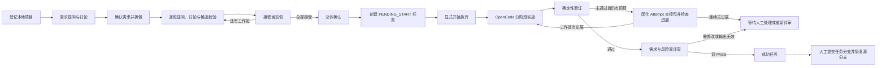

# OpenCode Loopper

[](https://github.com/wangyufengsky/opencode-loopper/actions/workflows/ci.yml)
[](LICENSE)

OpenCode Loopper 是一个在本机运行的 AI 编程控制台。它把自然语言需求转换为经过人工确认的分阶段 `LoopSpec`，让 OpenCode 在受控工作区中实施变更，并用确定性验证、独立双评审和可追溯证据闭合整个循环。

它适合希望继续使用本地项目、Git 和 OpenCode，同时又需要明确执行边界、失败恢复与交付审计的开发者或小型团队。

> 当前版本：`0.1.73`。Loopper 默认只监听 `127.0.0.1`，面向单机本地使用，不是多租户远程执行平台。

## 目录

- [核心能力](#核心能力)
- [工作方式](#工作方式)
- [技术组成](#技术组成)
- [快速开始](#快速开始)
- [第一次使用](#第一次使用)
- [功能页面](#功能页面)
- [LoopSpec 与验证器](#loopspec-与验证器)
- [任务、恢复与发布](#任务恢复与发布)
- [配置](#配置)
- [Linux 与 Windows 部署](#linux-与-windows-部署)
- [数据、安全与备份](#数据安全与备份)
- [开发与验证](#开发与验证)
- [MCP 接入](#mcp-接入)
- [常见问题](#常见问题)
- [更多文档](#更多文档)

## 核心能力

- **本地项目登记**：登记绝对路径，识别 Git 任务分支模式或无可用 Git HEAD 时的直接模式。
- **可讨论的只读多角色设计**：整体需求和每个工作包都先由 Designer 用 1–3 个选择题澄清，之后每轮保存完整 Markdown 替代稿；用户逐包讨论、查看 Compiler/Validator 候选并明确接受，最后再总体确认。Task Decomposer 与分包 LoopSpec Compiler 只输出紧凑的业务规划与证据意图，服务端生成状态、ID、引用、精确摘录、测试元数据和最终 LoopSpec 对象；原始机器 JSON 不进入聊天。确定性校验和人工确认完成前不写业务源码、不创建任务。
- **项目公约**：只读分析项目并生成或更新根目录 `AGENTS.md`，展示完整预览后才写入；Loopper 管理区块以外的人工内容会被保留。
- **分阶段执行循环**：按依赖顺序执行 Stage，每个阶段都携带目标、交付物、路径约束和可立即运行的验收规则。
- **循环降噪**：验证失败后固化 Attempt 交接包，并用失败签名和可靠工作区指纹识别无进展重试；连续停滞时转入人工确认，不继续烧预算。
- **实施 Todo 投影**：OpenCode 暴露 `todowrite` 时，实施 Session 可维护非权威 Todo；Loopper 有界同步并在任务详情展示，真实完成状态仍只由 Task、Stage、验证器和 Judge 决定。
- **原项目任务分支执行**：有 Git HEAD 的项目先检查登记目录；若存在未提交/未跟踪文件，任务进入人工处理弹窗，逐文件选择提交、stash 或移除，重新检查干净后再非交互 fetch 并切换到 `loopper/<任务名>` 分支。IDE 内 AgentBridge、OpenCode 和验证器因此共享同一目录与分支。其他项目在登记目录中直接执行，并保留私有基线用于差异检查。
- **确定性验收**：支持进程、文件、Git 差异、HTTP、JSON、JUnit、浏览器和 SQLite 查询等验证器。
- **独立双评审**：确定性验证通过后，由只读 Requirement Judge 和 Risk Judge 独立评审；两者都明确 `PASS` 才能成功。
- **人工待办**：集中处理 Designer 或任务 Session 提出的 Question、Permission 和安全阻断，不把人工输入伪装成普通任务状态。
- **失败恢复**：区分字段、验证、Session 和 Task 四层错误；可恢复的 Session 失败会创建新 Session，终止任务可派生 Recovery。
- **证据与洞察**：保留阶段、尝试、Session、验证结果、评审、用量、成本和状态迁移记录。
- **受控发布**：成功的 Git 任务分支可在人工确认后直接提交登记目录中的变更；有远端时普通推送，无远端时保留本地任务分支提交。
- **模板与自动化**：通过不可变 LoopSpec 模板版本创建手动、CRON、Git HEAD 变化或本机 Webhook 规则；新规则默认停用并需要评审。

## 工作方式



Loopper 把四类事实分开保存和展示：

1. **设计合同**：人工确认的 LoopSpec 和冻结的 Designer 设计上下文。
2. **执行过程**：Task、Stage、Attempt 和 OpenCode Session 的真实状态。
3. **验收证据**：命令输出、文件/差异结果、浏览器截图与 Judge 结论。
4. **发布结果**：本地提交、远端推送、合并请求入口或源项目同步记录。

## 技术组成

| 层次 | 主要技术 | 职责 |
| --- | --- | --- |
| Web 控制台 | Vue 3、TypeScript、Vite、Pinia、Element Plus | Designer、任务、证据、冲突处理和系统设置 |
| 本地控制面 | Java 21、Spring Boot 4、MyBatis、Flyway | 生命周期编排、权限边界、验证、恢复、发布和 API |
| 持久化 | SQLite（WAL） | 任务状态、审计事件、LoopSpec、交互和证据索引 |
| Agent Runtime | OpenCode loopback HTTP API | 只读设计、代码实施、独立 Judge 与模型目录 |
| 工作区与交付 | Git task branch / Direct | 原项目分支切换、差异、普通提交、推送和本地提交 |
| 验收 | 直接进程、Playwright + 本机 Chrome、文件/HTTP/SQLite 读取 | 生成可复查的确定性结果与二进制证据 |

## 快速开始

### 环境要求

| 依赖 | 要求 | 用途 |
| --- | --- | --- |
| JDK | 21 或更高 | 构建并运行 Spring Boot |
| Git | 可从 `PATH` 使用 | 原项目任务分支切换、差异与发布 |
| OpenCode CLI | 1.18.x 或兼容版本 | Designer、实施 Session 与 Judge |
| Node.js / npm | 仅前端热开发需要 | Maven 正式构建会准备固定版本的 Node/npm |
| Chrome / Chromium | 可选 | 只在使用 `BROWSER` 验证器时需要 |

先确认基础命令可用，并在 OpenCode 中完成所选模型提供方的认证：

```bash
java -version
git --version
opencode --version
```

macOS 如安装了多个 JDK，可显式选择 JDK 21：

```bash
export JAVA_HOME="$(/usr/libexec/java_home -v 21)"
```

### 从源码构建并运行

```bash
git clone https://github.com/wangyufengsky/opencode-loopper.git
cd opencode-loopper
./mvnw clean verify
java -jar target/opencode-loopper-0.1.73.jar
```

浏览器打开 [http://127.0.0.1:8080](http://127.0.0.1:8080)。健康检查地址为 [http://127.0.0.1:8080/actuator/health](http://127.0.0.1:8080/actuator/health)。

默认情况下，Loopper 会先探测配置的 loopback 地址；若没有可复用实例，则使用一个新分配的动态端口启动并管理本机 `opencode serve` 进程。`4096` 只是默认探测地址，不是受管进程的固定启动端口。

## 第一次使用

1. 打开 **设置**，确认 OpenCode CLI 路径；刷新模型列表并选择默认 Provider / Model。可选地设置“允许项目根”，限制可登记目录。
2. 打开 **运行环境**，确认服务端报告的 OpenCode Loopper 版本，并检查 OpenCode 状态、端点、版本、模型与进程所有权。
3. 打开 **项目**，登记项目名称和绝对根路径。登记本身不会启动 AI，也不会写入项目文件。项目卡片分别显示已确认的任务数和尚未确认的“待继续设计”数；后者会打开独立的 **历史设计** 页面。
4. 可选：在项目卡片中打开 **AGENTS.md 项目公约**，让只读 Session 生成建议，检查完整预览后再确认写入。
5. 打开 **设计器 / 循环规范**，选择项目并描述目标。该页只负责新建设计，不再平铺历史会话。先用问题卡回答整体设计选择，可一键采用全部推荐项；继续补充不会触发拆包，只有点击 **需求已明确，开始拆包** 才会冻结需求。已有未确认设计统一从 **历史设计** 页面继续、修改或归档，服务重启或浏览器恢复指针失效也不会丢失权威记录。
6. 沿工作包轨道逐包回答问题、讨论完整设计稿，并查看右侧只读候选的同步状态。候选通过 Compiler 和 Validator 后点击 **接受 WP-N 并继续**；重开已接受包会先列出所有将失效的传递依赖包。全部包接受后进入总体确认，此时才可编辑最终聚合 LoopSpec，并点击 **确认设计并创建任务**。Loopper 只创建 `PENDING_START` 任务，不进入队列、不占用写租约，也不创建或切换 Git 分支。
7. 进入任务详情并点击一次 **开始执行**。此时才会申请队列/写租约、检查工作区、获取远端更新并准备任务分支；一旦准入会自动继续执行，不需要在 `READY` 状态再次点击。执行期间可查看阶段进度、尝试、真实模型输出、待处理问题、验证证据和双 Judge 评审。
8. 任务成功后检查实际差异，再由人工提交任务分支；最终 Attempt 会无条件保存任务基线差异文件清单，不要求 LoopSpec 配置 `GIT_DIFF`。Loopper 随后恢复任务开始前的源分支，有排队任务时继续切到下一任务分支；差异预览、远端推送和合并请求继续显式引用已提交的任务分支。

## 功能页面

| 页面 | 主要用途 |
| --- | --- |
| 项目 | 登记本地目录、分别查看任务数与待继续设计数、进入历史设计、查看执行模式、生成/更新 `AGENTS.md`、取消项目管理 |
| 设计器 / 循环规范 | 新建设计，或从明确的历史设计链接恢复会话；完成需求提问、逐包讨论/接受、候选同步和总体确认；只有最终聚合阶段可编辑 LoopSpec |
| 历史设计 | 按项目、状态、归档范围筛选未确认设计，按更新时间排序，并执行继续、修改、归档或恢复 |
| 任务 | 查看当前和历史任务、状态与归档；符合保护条件时可二次确认删除历史记录 |
| 任务详情 | 启动或取消尚未申请工作区的任务、取消排队/等待输入任务、查看 Stage/Attempt/Session、实施 Todo 投影、验证证据、双评审、设计历史与发布入口 |
| 待处理中心 | 回答 Question，按一次/Session 范围处理 Permission，或拒绝请求 |
| 质量与用量 | 查看最终有效尝试的质量、历史失败证据、Token/成本与预算信息 |
| 模板与自动化 | 管理不可变模板版本、自动化规则、导入导出与运行记录 |
| Recovery Studio | 从失败或取消任务派生恢复任务，保留父子关系和工作区指纹 |
| 运行环境 | 查看当前 Loopper/OpenCode 版本、原生 agent 与 JSON Schema 能力；可重启 Loopper 管理的 Runtime，外部 Runtime 只重新检测 |
| 设置 | 配置 CLI、允许项目根、默认模型、任务尝试上限和单次超时；可启用演示数据，并随时退出以重新加载真实 API 数据 |

取消项目管理只会移除登记关系；不会删除项目目录、历史任务、Designer 对话、LoopSpec 或执行证据。

演示数据只用于界面预览。启用后，设置页按钮会切换为 **退出演示数据**；退出时会清空演示投影并立即重新读取本地服务中的项目、任务和 Runtime 状态。演示模式本身不作为 Runtime 错误展示。

## LoopSpec 与验证器

LoopSpec 是执行前必须人工确认的结构化合同。核心字段包括：

- `projectId`、`goal` 和补充 `context`；
- 一个或多个 `stages`；
- 每个阶段的 `objective`、`implementationKind`、`deliverables`、可观察 `acceptanceCriteria`、允许/禁止路径和 `verifiers`；
- 尝试次数、停滞阈值、总时长、单次尝试、验证超时和可选 Token/成本预算；
- 可选模型、Session 重试策略和下一次 Attempt 的服务端提示模板。

下面是一个最小示例。实际使用时由 Designer 生成 Markdown 设计，再由独立 LoopSpec Compiler 编译，最后在 Review Gate 中可视化检查和修改。Review Gate 会无损保存模型、全部限制、Session 策略和下一轮提示模板，不会在确认前恢复成默认值：

```json
{
  "schemaVersion": "v2",
  "projectId": "替换为已登记项目 ID",
  "goal": "为服务增加健康检查并补充测试",
  "context": "保持现有 API 兼容，不修改部署端口",
  "stages": [
    {
      "objective": "实现健康检查并验证行为",
      "implementationKind": "JAVA_PRODUCTION",
      "allowedPaths": ["src/**", "README.md"],
      "forbiddenPaths": ["data/**"],
      "deliverables": ["健康检查端点", "自动化测试", "使用说明"],
      "acceptanceCriteria": [
        {
          "id": "AC-1",
          "description": "聚焦测试验证健康检查返回 UP",
          "verificationMode": "BOTH",
          "judgeRubric": "结合实现差异与测试证据评审端点语义、兼容性和边界行为"
        }
      ],
      "verifiers": [
        {
          "type": "PROCESS",
          "processPurpose": "TEST",
          "command": ["./mvnw", "-Dtest=HealthControllerTest", "test"],
          "testTargets": ["HealthControllerTest"],
          "criterionIds": ["AC-1"]
        },
        {
          "type": "GIT_DIFF",
          "requireChanges": true,
          "allowedPaths": ["src/**", "README.md"],
          "forbidDeletes": true
        }
      ]
    }
  ]
}
```

新建草稿、导入和模板新版本必须使用 `schemaVersion: "v2"`。每个条件通过 `verificationMode` 选择 `MACHINE`、`JUDGE` 或 `BOTH`：`MACHINE`/`BOTH` 必须由至少一个 `BEHAVIOR` 验证器通过 `criterionIds` 提供机器覆盖；`JUDGE`/`BOTH` 必须填写 `judgeRubric`；仅 `JUDGE` 还要填写 `judgeOnlyReason`，说明为何无法可靠地确定性验证。每个 Stage 无论采用哪种模式，都至少保留一个阻断性的确定性验证器。Review Gate 会分别显示机器覆盖与“AI 计划评审”，不会把尚未执行的 Judge 计划标成已通过。已持久化但未写模式的 v2 条件默认 `MACHINE`；v1 草稿、模板、Automation、任务和 Recovery 保持旧合同。

每个 v2 Stage 必须显式声明 `implementationKind`：`JAVA_PRODUCTION` 表示新增或修改生产 Java，`JAVA_TEST_ONLY` 表示需求本身只改测试，`NON_JAVA` 表示不涉及生产 Java。`JAVA_PRODUCTION` 必须在同一 Stage 配置未跳过的聚焦 Maven/Gradle `PROCESS TEST`、明确 `testTargets`，并让该测试通过 `criterionIds` 覆盖每个 `MACHINE`/`BOTH` 业务条件；测试命令是业务条件的证据，不应另建“测试全部通过”这种元验收项。安全的全量测试仍可保留为不映射业务条件的阻断性补充报告，但不能替代聚焦测试。计划中的测试类可以由本阶段新增，设计时不要求已经存在。禁止通过 `surefire.failIfNoSpecifiedTests=false` 等参数让不存在的目标假通过。

执行时，Loopper 会在 Stage 首次启动前冻结生产 Java 路径和内容哈希，并在验证阶段复核 Git 或 Direct 工作区中的新增、修改和重命名。实际生产 Java 变化与声明不符时以 `JAVA_CHANGE_CLASSIFICATION_MISMATCH` 阻断；缺少本阶段已通过的聚焦 Maven/Gradle 测试时以 `JAVA_UNIT_TEST_ACCEPTANCE_REQUIRED` 阻断。测试目录、`target/`、`build/` 和仅删除 Java 文件不触发这项新增代码门禁，仍受原有范围与风险规则约束。旧 v1 保持兼容；旧 v2 缺少该字段仍可查看，但再次保存、发布模板或确认前必须补齐。

`PROCESS.command` 是参数数组，不是 shell 字符串；请写 `['./mvnw', 'test']` 这一类直接命令，不要写 `sh -c`、`cmd /c`、管道、重定向或 `java -e`。这些限制在草稿保存和实际运行时共用同一策略。v2 `PROCESS` 还要声明 `processPurpose`：`BUILD` 不形成行为覆盖；映射业务条件的 `TEST` 必须是未跳过测试的 Maven/Gradle/npm 测试命令并列出 `testTargets`；不映射条件的安全全量测试只算补充报告；`SELF_CHECK` 必须配置明确的 `outputContains` 成功标记。Linux/macOS 保持操作系统原生 argv 解析；Windows 解析包装器和 `PATH`/`PATHEXT`。能够无歧义拆分的 Maven 合并参数仍会被规范化，歧义输入进入只读纠正。`GIT_DIFF` 只证明改动范围。

REST/JSON/浏览器条件使用阶段 `verificationRuntime` 启动本次代码：`startCommand` 是无 shell argv，只允许 `{{LOOPPER_PORT}}` 和 `{{LOOPPER_TEMP}}`，readiness 成功后才运行网络验证器。验收 URL 必须使用 `http://127.0.0.1:{{LOOPPER_PORT}}/...` 才能覆盖 criterion；固定 loopback 服务只可作为补充检查。Loopper 在成功、失败、暂停、取消和重启恢复时按 PID 启动身份清理完整进程树，无法确认停止时保留写租约并阻止重叠执行。

### 可用验证器

| 类型 | 验证内容 | 关键限制 |
| --- | --- | --- |
| `PROCESS` | 直接启动命令并检查退出码/输出 | v2 分类为 `BUILD`、`TEST` 或 `SELF_CHECK`；argv 形式；禁止 shell；有超时和输出上限 |
| `FILE_EXISTS` / `FILE_NOT_EXISTS` | 记录文件存在性 | 路径必须位于执行根目录内；`FILE_EXISTS` 仅保留为非阻断审计提示，`FILE_NOT_EXISTS` 才是阻断性安全检查 |
| `GIT_DIFF` | 是否有改动、允许/禁止路径、禁止删除 | 必须在 LoopSpec 中显式声明 |
| `HTTP_STATUS` | HTTP 状态码 | 仅 loopback URL；支持受限方法 |
| `JSON_PATH` | loopback JSON 响应中的值 | 使用受限 JSONPath 和匹配模式 |
| `FILE_CONTENT` | 文件内容精确或包含匹配 | 路径 containment 与大小受限；保留期望文本的尾随换行和空白 |
| `FILE_HASH` | 文件 SHA-256 | 需要 64 位十六进制摘要 |
| `JUNIT_XML` | JUnit XML 中的失败/错误 | 本地 XML 文件 |
| `BROWSER` | CSS 选择器存在、可见、文本、数量或属性 | 仅 loopback；不允许任意 JavaScript；保存截图和 trace |
| `DATABASE_QUERY` | 本地 SQLite 查询结果 | 仅只读 `SELECT` / `WITH` |

路径允许/禁止规则会作为 Agent 指导；只有显式 `GIT_DIFF` 验证器才构成强制的差异验收门槛。v2 LoopSpec 在 Compiler 规划冻结、草稿保存和人工确认时使用与运行期一致的 `/` 与 glob 语义预检路径策略：非法 glob，或被某条 `forbiddenPaths` 完整覆盖、因而不可能接受任何路径的 `allowedPaths` 规则，会先退回 Compiler 修复或阻止保存/确认，不创建 Task、Attempt 或可写 Session。宽允许范围配合更窄的敏感目录排除仍然有效。普通可写任务会在每个 Stage 首次 Attempt/Session 前冻结独立工作区基线，因此 `allowedPaths`、`forbiddenPaths`、`forbidDeletes` 和 `requireChanges` 只评估该 Stage 之后的变化：前置包已经交付的文件不会被下一包误判为越界或“已有修改”，但下一包再次修改、删除或重命名这些文件仍会被发现。Stage 重试与服务重启复用同一基线；证据中的 `baselineScope`/`stageId` 可区分 Stage 与 Task 范围。

最终 Attempt 自动保存的任务基线差异快照仍覆盖整个任务，只回答“总共改了什么”，不属于 LoopSpec 验证器，也不会参与 v2 条件覆盖计算。`VERIFY_ONLY` Recovery 同样保留任务级基线。旧活动 Stage 如果已经产生 Attempt 却没有 Stage 基线，会以 `STAGE_WORKSPACE_BASELINE_MISSING` 关闭并提示从失败阶段创建 Recovery，不会在当前工作区补建基线或启动新 Session。`POST /api/loop-drafts/validate` 与 MCP `validate_loop_spec` 返回同一份分类、错误和条件覆盖矩阵。

## 任务、恢复与发布

### 两种执行模式

| 模式 | 触发条件 | 执行位置 | 发布方式 |
| --- | --- | --- | --- |
| Git 任务分支 | 项目有可用 Git HEAD | 已登记的原项目目录；脏文件先进入人工处理弹窗，清理后非交互 fetch 当前远端分支并切换到 `loopper/<任务名>`，同名时追加 `(第N次)` | 成功后人工提交；有远端则正常推送，无远端则保留本地提交 |
| Direct | 没有可用 Git HEAD | 已登记的原项目目录 | 不提供自动发布或原地回滚；使用私有基线做差异和删除检查 |

Loopper 不会因为任务成功就自动提交、推送或合并。确认计划只创建 `PENDING_START` Task，不创建队列项、不申请写租约，也不 fetch、创建或切换任务分支。用户点击“开始执行”后，服务端才原子登记执行请求并竞争写租约；被接纳的任务随后完成工作区准备并自动开始首个 Stage，被阻塞的任务停在 `QUEUED`。每个登记目录通过持久化 FIFO 写租约串行执行；前一个任务仍有未提交改动时，后一个任务不会切换分支。Task、Queue 和 Lease 保持独立状态域，由统一协调器在写入者已确认停止、目录指纹一致、工作区干净且分支可安全恢复时，原子完成旧队列项并按 FIFO 转移租约。终态 holder 实际阻塞等待者时每 10 秒自动检查一次，任务详情也可手动触发；任何安全条件不满足都保留 holder，不会自动 stash、提交、删除或强制切分支。用户确认提交后，Loopper 把改动提交到任务分支并恢复任务开始前的源分支；有排队任务时再从源分支进入下一任务分支。开始执行时的 fetch 只更新 remote-tracking refs；任务分支在人工发布前仍是本地分支，不会提前出现在 GitLab/GitHub。

处于 `PENDING_START` 的任务可在详情页二次确认后直接取消；此时尚无队列项、写租约、任务分支、执行目录或 OpenCode Session，取消只把 Task 转为 `CANCELLED`。`READY` 只作为开始请求已经接纳后的短暂内部准备状态，前端不会要求再次点击“开始执行”。处于 `QUEUED` 的任务也可直接取消；取消只移除该任务的排队资格并将其转为 `CANCELLED`，不会释放或切换当前执行任务持有的项目写租约。排队详情同时显示 holder 标题、状态、归档状态、租约状态和最近阻塞原因；“重新检查并释放”只让服务端重新执行安全检查，不接收客户端指定的 holder。持有活动租约或仍为 `ADMITTED` 的终态任务必须先完成安全释放，才能归档或永久删除。

任务开始前发现脏工作区时，任务会停在 `WAITING_INPUT`，详情页自动弹出具体文件列表。每个文件必须明确选择“提交到当前源分支”“暂存到 Git stash”或“移除/丢弃改动”，再点击“重新检查并继续”。处理请求绑定当前 Git 状态快照；期间文件、索引、HEAD 或分支有变化时会拒绝旧决定并刷新列表，避免把过期选择用于新内容。提交只生成本地提交，不自动推送；stash 只包含选择的路径；移除未跟踪文件或丢弃跟踪文件改动前还会二次确认。外部 Git 操作不是数据库事务，若中途某一步失败，已成功的 Git 操作不会伪装回滚，弹窗会按最新状态重新列出剩余文件。处理完成后，历史错误仍作为审计证据保留，任务会从准备状态自动继续执行，详情页不再显示“检测到未提交文件”的活动红色告警。点击“取消并标记任务失败”会保留全部现有文件并直接终止任务。远端认证失败或本地/远端历史分叉仍会失败关闭。分支切换使用 10 分钟有界超时，并为 Windows 命令局部启用 Git 长路径支持。

### 错误层级

| 层级 | 含义 | 默认结果 |
| --- | --- | --- |
| `FIELD` | 请求或 LoopSpec 字段无效 | 原地提示，不改变运行状态 |
| `VERIFICATION` | 当前 Attempt 没有满足验收 | 保留证据，在预算内进入下一次尝试 |
| `SESSION` | OpenCode Session 失败或断开 | 关闭当前 Attempt，在安全确认后创建新 Session |
| `TASK` | 已无法安全继续或预算耗尽 | 终止子工作并进入 `FAILED` |

当旧的可写 Session 无法确认终止时，Loopper 会失败关闭，拒绝创建第二个并发写入者。远端终止状态未知会显示为 `DISCONNECTED`，不会伪装成 `ABORTED`。

确定性验证失败后，Loopper 会把失败摘要、验证事实、变更路径和工作区内容指纹保存为不可变 `ATTEMPT_HANDOFF` 证据。只有完整且可靠的指纹才参与停滞判断；读取过程按实际字节计数，路径过多、文件读取异常、总内容超过 16 MiB 或文件在读取期间变化时都会标记为不可比较，避免误判。相同失败签名和工作区指纹连续达到 `stagnationLimit` 后，任务进入 `WAITING_INPUT` 并显示“继续一轮”，不会自动创建更多 Session。

任务详情只根据服务端返回的当前等待原因决定是否显示“继续一轮”，不会被历史停滞错误误导。用户确认后，服务端先验证并解析最新结构化 handoff，再记录 `LOOP_STAGNATION_OVERRIDE`，并使用与自动重试相同的模板渲染创建全新 Attempt 和全新可写 Session；handoff 缺失或损坏时保持 `WAITING_INPUT`。验证失败后的下一轮不会复用旧 Session 对话；若 `createFreshOnVerifierFailure=false`，任务会直接等待人工确认。`nextAttemptPromptTemplate` 只支持 `${attemptOrdinal}`、`${failureSummary}`、`${verificationSummary}`、`${changedPaths}` 和 `${workspaceFingerprint}` 五个有界占位符，替换后的完整交接提示最多 12,000 字符。

### Recovery

只有 `FAILED` 或 `CANCELLED` 任务可以创建派生 Recovery：

- `FROM_FAILED_STAGE`：从失败阶段继续；
- `ALL_STAGES`：重新执行全部阶段；
- `VERIFY_ONLY`：只重新验证，不创建可写 Session。

Recovery 会保留父任务、来源阶段和工作区指纹。Direct 指纹同时使用规范路径、目录文件键和创建时间，避免 Linux 立即复用 inode 时把重建目录误认成原工作区；指纹不一致或旧写入者状态不明时会返回冲突并停止。已释放且没有写入者的租约会在下一次准入时安全刷新指纹。

### 成功任务发布

Git 任务分支达到 `SUCCEEDED` 后：

1. Loopper 根据任务和实际差异建议提交说明；用户必须输入四位数字工单号，最终格式为 `#1234_subject`。
2. 用户检查并确认后，Loopper 使用普通 Git 提交，并在工作区干净后恢复任务开始前记录的源分支。
3. 如果存在排队任务，写租约随即转交并切换到下一任务分支；否则项目停留在恢复后的源分支。
4. 存在远端时，Loopper 使用明确的本地任务分支引用执行非强制推送；推送和重试都不会切换当前项目分支。
5. 推送成功后，点击普通的 **创建合并请求** 按钮会直接打开参数确认对话框；确认后打开预填的 GitHub Pull Request 或 GitLab Merge Request 创建页。它只引用任务分支，最终创建与合并仍由托管平台确认。SSH remote 默认生成 HTTPS Web 地址；`LOOPPER_PUBLICATION_HTTP_WEB_HOSTS` 中精确列出的主机改用 HTTP。成品启动脚本默认加入 `gitlab.spdb.com`，不改变 SSH 推送协议。
6. 任务执行状态和远端交付状态彼此独立：`已成功` 之后依次记录 `已提交 → 已推送 → 合并请求已创建/已关闭 → 已合并`。进入详情页或从 GitLab 返回时会在 30 秒冷却下自动核对，也可以手工检查。只有 GitLab API 精确匹配任务提交后才能写入不可逆的“已合并”；删除源分支不会被误判为合并。
7. 如果仓库没有远端，本地提交只保留在任务分支并记录证据，不会把提交快进或覆盖到恢复后的源分支。

### 归档与删除

- 归档只改变任务在列表中的可见状态，不删除证据或源码；归档前会先做一次安全协调，活动租约未释放时返回 `TASK_ARCHIVE_WORKSPACE_LEASE_ACTIVE` 并保持任务可见。
- 历史删除是终止操作，需要二次确认。
- 正在运行、未归档、仍有派生子任务、仍为 `ADMITTED` 或持有活动租约的记录受保护，不能删除；删除路径不会直接清空 lease holder。
- 删除历史记录不会删除源文件、Git 分支或旧版本遗留的 worktree。

## 配置

### 常用环境变量

| 环境变量 | 默认值 | 说明 |
| --- | --- | --- |
| `LOOPPER_DATA_DIR` | `./data` | SQLite、证据、二进制工件、Direct 私有基线和旧版 worktree 兼容数据 |
| `SERVER_PORT` | `8080` | Loopper HTTP 端口；监听地址固定为 loopback |
| `LOOPPER_OPENCODE_MODE` | `auto` | `auto` 复用或启动本机服务；`http` 只连接；`fake` 仅用于测试 |
| `OPENCODE_BASE_URL` | `http://127.0.0.1:4096` | 要探测或复用的 OpenCode loopback 端点 |
| `OPENCODE_USERNAME` | 空 | 外部 OpenCode 的 Basic Auth 用户名 |
| `OPENCODE_PASSWORD` | 空 | Basic Auth 密码；只从进程环境读取，不持久化 |
| `OPENCODE_EXECUTABLE` | 从 `PATH` 查找 | 受管 `auto` 模式使用的 OpenCode 可执行文件 |
| `OPENCODE_MODEL` | OpenCode 默认值 | 可选的 `provider/model` 默认模型 |
| `LOOPPER_CHROME_EXECUTABLE` | 自动检测 | `BROWSER` 验证器使用的 Chrome/Chromium 绝对路径 |
| `LOOPPER_MCP_BEARER_TOKEN` | 每次启动随机生成 | `/api/mcp-streamable` 和 `/api/mcp` 的 Bearer Token |
| `LOOPPER_JAVA_HOME` | Linux 脚本默认 `/opt/jdk-21`；Windows 依次回退到 `JAVA_HOME`、`PATH` | 启动脚本使用的 JDK 目录 |
| `LOOPPER_JAR_PATH` | 自动查找当前版本 JAR | Linux/Windows 启动脚本使用的成品 JAR 路径 |
| `LOOPPER_PUBLICATION_HTTP_WEB_HOSTS` | 成品启动脚本包含 `gitlab.spdb.com`；直接运行 JAR 时为空 | 逗号分隔的精确 Git 主机白名单；仅让没有显式 Web 协议的 SSH remote 生成 HTTP MR 地址 |
| `LOOPPER_GITLAB_HOST` | 成品启动脚本为 `gitlab.spdb.com` | 允许自动核对合并状态的精确 GitLab 主机 |
| `LOOPPER_GITLAB_API_BASE_URL` | 成品启动脚本为 `http://gitlab.spdb.com/api/v4` | GitLab API v4 基础地址；主机必须与 `LOOPPER_GITLAB_HOST` 完全一致 |
| `LOOPPER_GITLAB_PRIVATE_TOKEN` | 空 | GitLab 只读 API Token；仅通过环境变量提供，不写入数据库、日志或前端响应 |
| `LOOPPER_OPEN_BROWSER` | `true` | 启动后是否自动打开浏览器；设为 `false` 可关闭 |

更多尝试次数、超时和监控间隔可通过 Spring Boot 外部配置覆盖 `loopper.*` 属性；默认值见 [`src/main/resources/application.yml`](src/main/resources/application.yml)。生产环境默认启用 `loopper.scheduling.enabled` 和 `loopper.startup-recovery.enabled`，后者统一恢复中断任务、本地同步与自动化状态。UI 中的设置保存在本地 SQLite，并应用于新建 Session。

### OpenCode 运行模式

- `auto`：先检查配置的 loopback 端点；健康则复用，否则启动一个 Loopper 拥有的本机 OpenCode 进程。只有受管进程可以从 UI 重启。
- `http`：只连接已有的 OpenCode 服务，Loopper 不启动也不终止它。出于本地安全边界，只接受 loopback 端点。
- `fake`：确定性测试适配器，不应在真实任务中使用。

## Linux 与 Windows 部署

正式 JAR 已包含前端静态资源和运行所需的 SQLite JDBC 原生库。运行成品不需要 Maven、Node 或 npm。

### Linux / 内网

将下面两个文件复制到同一个可写目录：

- `target/opencode-loopper-0.1.73.jar`
- `scripts/start-linux.sh`

然后以前台方式启动：

```bash
chmod +x start-linux.sh
LOOPPER_JAVA_HOME=/opt/java/jdk-21 ./start-linux.sh
```

脚本也允许误用 `sh start-linux.sh`，它会先切换到 Bash。JDK 选择顺序是 `LOOPPER_JAVA_HOME`，然后是脚本内的 `DEFAULT_JAVA_HOME=/opt/jdk-21`；脚本故意忽略继承的 `JAVA_HOME`，避免旧 JDK 8 覆盖指定版本。

Linux 启动脚本不再固定 OpenCode 端口。未设置 `OPENCODE_BASE_URL` 时，它会先识别当前主机的 OpenCode 进程，再读取命令行中的显式 `--port`，并通过 `lsof` 或 `ss` 解析该进程实际监听的 TCP 端口，因此也能覆盖直接运行 `opencode` 的 TUI 和 `opencode web` 所启动的动态端口。Linux 对非特权用户隐藏 socket 的 PID/进程名时，脚本会把本机 TCP 监听端口作为有界候选逐个检查；候选只有在 loopback `/global/health` 精确返回 `healthy=true` 后才会被识别为 OpenCode。发现后以 `http` 模式复用；没有可复用实例时使用 `auto` 模式。脚本会先把 `opencode` 解析为确定的可执行文件路径，找不到或不可执行时直接报错；通过检查后，Loopper 才在动态 loopback 端口启动并管理 OpenCode。

受管进程启动失败时，运行环境页会显示明确的“OpenCode 自动启动失败”、失败原因和本次实际尝试的动态地址，不再把默认探测地址 `127.0.0.1:4096` 显示成正在监听的地址。失败后不会因页面刷新或普通状态读取反复启动进程；点击“启动 OpenCode 并检查连接”会执行一次明确的本地 Auto 启动，并且只有 `/global/health` 验证通过后才显示连接成功。

若 OpenCode 使用 Basic Auth，请在启动 Loopper 时保留相同的官方环境变量 `OPENCODE_SERVER_USERNAME`、`OPENCODE_SERVER_PASSWORD`；脚本会自动映射为 Loopper 连接凭据。显式地址仍可覆盖自动发现，`0.0.0.0` 或 `[::]` 监听地址会转换为对应 loopback 连接地址：

```bash
export LOOPPER_OPENCODE_MODE=http
export OPENCODE_BASE_URL=http://127.0.0.1:51234
# 如 OpenCode 开启密码：export OPENCODE_SERVER_PASSWORD='与 OpenCode 启动时一致'
./start-linux.sh
```

因此应先在同一台机器启动并配置兼容的 OpenCode 服务。Loopper 与 OpenCode 都应保持 loopback，项目绝对路径必须在这台主机上可见。

### Windows

从同一个 GitHub Release 下载并放在同一目录：

- `opencode-loopper-0.1.73.jar`
- `start-windows.bat`

确认 JDK 21、Git 和 OpenCode CLI 已安装并可被脚本找到，然后双击 `start-windows.bat`，或在 CMD 中运行：

```bat
start-windows.bat
```

PowerShell 默认不会从当前目录搜索命令，必须带 `./` 或 `.\`：

```powershell
.\start-windows.bat
```

脚本按 `LOOPPER_JAVA_HOME`、`JAVA_HOME`、`PATH` 的顺序查找 Java，并拒绝低于 21 的版本。未显式设置 `OPENCODE_BASE_URL` 时，它通过 Windows 进程信息读取正在运行的 `opencode serve --port ...` 候选端口，优先复用最新且 `/global/health` 返回 `healthy=true` 的 loopback 实例。若没有可复用实例，则使用 `auto` 模式，由 Loopper 在动态 loopback 端口启动并管理 OpenCode，不再把 4096 写死为启动端口。

需要固定路径或端口时，可先设置环境变量：

```bat
set "LOOPPER_JAVA_HOME=C:\Program Files\Java\jdk-21"
set "OPENCODE_EXECUTABLE=C:\Tools\opencode.exe"
set "SERVER_PORT=8080"
start-windows.bat
```

若显式设置了 `OPENCODE_BASE_URL`，脚本只连接该地址；该地址离线时会直接报错。发现需要认证的已有实例时，同时设置 `OPENCODE_USERNAME` 和 `OPENCODE_PASSWORD`，否则健康检查不会把它当成可复用端点。设置 `LOOPPER_OPEN_BROWSER=false` 可禁止自动打开页面。由 `auto` 模式启动的 OpenCode 归 Loopper 管理，Loopper 退出时会停止该进程；外部已运行实例不会被停止。

其他注意事项：

- 服务端无桌面时，直接在 UI 输入项目绝对路径；原生目录选择按钮需要图形会话及 `zenity`、`kdialog` 或 `yad`。
- `BROWSER` 验证器需要本机 Chrome/Chromium；非标准位置请设置 `LOOPPER_CHROME_EXECUTABLE`。
- 图形环境中，脚本会在健康检查通过后尝试打开浏览器；无头环境只输出访问 URL。
- 内网首次从源码构建仍需要 Maven 与 npm 依赖缓存；只运行已打包 JAR 不需要访问这些仓库。

可检查 JAR 是否包含当前前端：

```bash
jar tf target/opencode-loopper-0.1.73.jar \
  | rg 'BOOT-INF/classes/static/(index.html|assets/)'
```

## 数据、安全与备份

### 数据目录

默认 `./data` 中包含：

- `loopper.db` 及 SQLite WAL 相关文件；
- `worktrees/`：旧版本或历史任务的 Git worktree 兼容目录；新任务直接切换登记目录的任务分支；
- `direct-baselines/`：Direct 任务的私有比较基线；
- `stage-baselines/`：每个任务共享对象库、每个 Stage 独立索引的私有验收基线；
- `artifacts/`：浏览器截图、trace 等二进制证据；
- `publication-patches/`、`local-sync-conflicts/`：发布与同步冲突材料。

要迁移或备份，先正常停止 Loopper，再整体复制 `LOOPPER_DATA_DIR`。被登记的源项目不在数据目录内，需要按项目自己的 Git/备份策略单独保护。恢复时应同时保持源项目路径和 Git 历史可用。

### 安全边界

- Loopper HTTP、受管 OpenCode 与验证器网络访问都限制在 loopback。
- 项目根和执行路径会 canonicalize，并进行目录 containment 与符号链接检查。
- OpenCode 创建 Session 后必须返回与请求一致的规范执行目录；缺失或不一致时在提示模型前停止。执行策略不可批准 `git commit`、引用/分支变更、fetch/pull/push、外部路径、危险删除或 hard reset；发布是成功后单独的人机确认流程。
- 进程验证器使用参数数组启动，不进行 shell 插值；它不是操作系统沙箱，不应运行不可信的恶意二进制。
- 密码和 MCP Token 不写入 SQLite、日志或证据。
- 任务取消会停止执行并保留目录、分支与证据；Loopper 不自动丢弃文件改动，也不删除旧版 worktree。
- 自动化同样经过队列、权限、验证器和双 Judge，不会绕过人工或安全门槛。

## 开发与验证

### 热开发

macOS / Linux：

```bash
./scripts/dev.sh
```

Windows PowerShell：

```powershell
.\scripts\dev.ps1
```

热开发同时启动 Spring Boot 和 Vite。此时需要系统中已有 npm。

### IntelliJ IDEA

选择仓库自带的 **Loopper Full Stack** Run Configuration。它会在 Spring Boot 启动前执行 Maven `process-resources`，把当前 Vue 构建复制到 `target/classes/static`，然后由同一个 `8080` 服务提供 SPA 与 API。需要 Vite HMR 时改用开发脚本。

### 完整验证

```bash
./scripts/verify.sh
```

它执行 `./mvnw clean verify`，包括：

- Java 编译与测试；
- 固定 Node.js `v22.14.0` 和 npm `10.9.2` 工具链准备；
- `npm ci`、Vue/TypeScript 类型检查、Vitest 与 Vite 正式构建；
- 将 `frontend/dist` 复制到 JAR 的静态资源目录。

`mvn clean` 会先清理 Maven 管理的前端工具链与静态资源，避免新 JAR 意外携带旧前端。真实 OpenCode/模型端到端结果与 mock/契约测试应分别判断。

### 版本发布

每个可交付的新 JAR 必须使用一个未发布过且递增的 SemVer 版本。版本号需要同时更新 Maven、前端 package、MCP 配置、README、`AGENTS.md`、Linux 与 Windows 启动脚本，然后在该版本下重新执行完整验证。

推送与 Maven 版本完全一致的 `v<version>` 标签会触发 [Release 工作流](.github/workflows/release.yml)。工作流在标签提交上使用 JDK 21 重新执行 `clean verify`，拒绝 SNAPSHOT 或标签不匹配的构建，并自动发布：

- `opencode-loopper-<version>.jar`；
- `start-linux.sh`；
- `start-windows.bat`；
- `SHA256SUMS`。

例如发布下一版本：

```bash
VERSION=0.1.73
git tag "v$VERSION"
git push origin main
git push origin "v$VERSION"
```

标签必须指向已经包含全部版本修改的提交，且不得复用或强制移动已发布标签。

常用的独立前端命令：

```bash
npm --prefix frontend ci
npm --prefix frontend run typecheck
npm --prefix frontend run test
npm --prefix frontend run build
npm --prefix frontend run test:e2e
```

## MCP 接入

Loopper 通过 Spring AI Streamable HTTP MCP 暴露六个工具：

| 工具 | 作用 |
| --- | --- |
| `get_project_context` | 只读获取已登记项目上下文 |
| `propose_loop_spec` | 校验并同步当前只读 Designer Session 绑定的草稿 |
| `validate_loop_spec` | 校验完整 LoopSpec，或校验指定版本的持久化草稿 |
| `create_task` | 为已人工确认的草稿创建唯一任务，不会自动确认草稿 |
| `start_task` | 为 `PENDING_START` 任务申请执行：进入队列并在准入后自动准备工作区和启动实施 |
| `get_task_status` | 读取任务、阶段、尝试、验证与分层错误状态 |

端点：

- 标准 Streamable HTTP：`http://127.0.0.1:8080/api/mcp-streamable`
- 兼容 JSON-RPC：`http://127.0.0.1:8080/api/mcp`

外部客户端必须配置固定 Token，并发送 `Authorization: Bearer <token>`：

```bash
export LOOPPER_MCP_BEARER_TOKEN='请替换为足够长的随机值'
java -jar target/opencode-loopper-0.1.73.jar
```

MCP 只开放 tools capability，不开放 resources、prompts 或 completions。Designer 仍是只读流程，`propose_loop_spec` 不能替代人工确认。

## 常见问题

### 页面刷新或 SSE 断线会终止正在运行的任务吗

不会。浏览器 SSE 只是实时展示通道；刷新页面、网络断开、响应超时或 Tomcat 已关闭对应 `AsyncContext` 时，服务端只移除失效订阅，不会把展示层异常升级为 OpenCode Session 错误，也不会终止任务。任务事件已持久化，页面重连时会使用 `Last-Event-ID` 补放；Designer 则重新读取最新快照。

### 页面打不开或显示“本地 API 不可用”

先检查：

```bash
curl --fail http://127.0.0.1:8080/actuator/health
lsof -nP -iTCP:8080 -sTCP:LISTEN
```

如果端口已被占用，可用 `SERVER_PORT=8081` 启动，并访问相应端口。

### Runtime 显示离线

检查 `opencode --version`、OpenCode 的模型认证、`OPENCODE_BASE_URL` 和 `/global/health`。Linux 自动发现直接运行的 TUI/`opencode web` 动态端口时还需要 `lsof` 或 `ss` 至少一个可用；`http` 模式不会替你启动 OpenCode，`auto` 模式需要能从 `PATH` 或 `OPENCODE_EXECUTABLE` 找到 CLI。`0.1.21` 起，Linux 脚本会在启动 Loopper 前输出实际使用的 OpenCode CLI 路径；若子进程仍启动失败，运行环境页会显示退出码或超时原因及本次动态尝试地址。`0.1.22` 起，Auto 启动阶段的单次健康请求最多等待 1 秒并持续重试，避免通用 30 秒请求超时吞掉完整的 15 秒启动预算。`0.1.23` 起，失败卡片提供“启动 OpenCode 并检查连接”，成功标准是服务端完成受认证的 `/global/health` 检查，而不是仅创建了进程。

### Windows 中 `mvn -v` 正常，但 PROCESS 报 `CreateProcess error=2`

Windows 的 CMD 会依据 `PATHEXT` 把 `mvn` 解析为 `mvn.cmd`，Java 直接启动裸命令时不会始终得到同样的解析结果。`0.1.26` 起，Loopper 在启动 PROCESS 前使用自身进程的 `PATH` 和 `PATHEXT` 定位真实入口，并把实际绝对路径写入证据；`./mvnw` 和 `./gradlew` 也会在任务目录中选择 Windows 包装器。更新 JAR 后必须重启 Loopper，使它继承最新环境变量。仍失败时在启动 Loopper 的同一个 CMD 中检查：

```bat
where mvn
where mvn.cmd
echo %PATH%
echo %PATHEXT%
```

如果 `where` 只能在另一个新开的终端中成功，说明正在运行的 Loopper 仍持有旧环境；重启即可。Linux/macOS 不使用 `PATHEXT`，应检查 `command -v mvn`、脚本 shebang 和可执行位。

### Windows 提交任务时停在 `Updating files` 后报 `WORKTREE_CREATE_FAILED`

`0.1.11` 起，Loopper 不再用 30 秒短检查超时限制大仓库检出，并会隐藏 Git checkout 进度噪音、保留尾部真正的 `fatal` 诊断，同时命令局部启用 `core.longpaths=true`。旧版本失败可能留下 `$LOOPPER_DATA_DIR/worktrees/<taskId>` 和对应 `loopper/*` 分支；先用 `git worktree list` 精确确认残留，确认它确实属于失败任务后再手工清理。`0.1.12` 起可使用 Release 附带的 `start-windows.bat`；`0.1.13` 修复了 OpenCode 已成功监听但脚本因遗留 `%ERRORLEVEL%` 误报启动失败的问题；`0.1.14` 起新任务不再创建隐藏 worktree，而是把登记的原项目目录直接切到任务分支，使 IDEA AgentBridge、OpenCode 和验证器使用同一目录；`0.1.15` 起等待输入的任务可在详情页直接确认取消；`0.1.16` 起任务提交后恢复开始前的源分支，推送和合并请求仅按任务分支引用操作；`0.1.18` 起 Linux/Windows 启动器自动发现当前健康 OpenCode 的真实端口，找不到时使用动态端口自启；`0.1.19` 起 Linux 还会按 OpenCode PID 解析实际监听端口，覆盖 TUI 与 `opencode web` 未在命令行暴露端口的情形；`0.1.20` 起即使 Linux 对非特权进程隐藏 socket 归属，也会对本机监听端口执行严格健康验真，并兼容 OpenCode 官方 Basic Auth 环境变量；`0.1.21` 起 Linux auto 模式会锁定真实 CLI 路径，并在受管启动失败时显示实际尝试端口和失败原因，不再误显示默认探测端口 4096；`0.1.22` 起启动健康探测使用短请求循环，单次请求不再耗尽整个启动预算；`0.1.23` 起 Auto 启动失败后可从 Runtime 页明确启动并检查连接；`0.1.27` 起最终 Attempt 无条件保存任务基线差异快照，切回源分支后仍按任务分支预览，创建合并请求入口改为单击普通按钮；`0.1.28` 起新草稿使用 LoopSpec v2 的条件覆盖合同，并支持动态端口托管 HTTP/JSON/BROWSER 验收。PowerShell 中请使用 `.\start-windows.bat`。

`0.1.29` 起，成品启动脚本默认把 `gitlab.spdb.com` 加入 HTTP Web 主机白名单；它只影响 SSH remote 推导出的 MR 网页协议，不改变 Git 的 SSH 推送协议。直接运行 JAR 时可通过 `LOOPPER_PUBLICATION_HTTP_WEB_HOSTS` 配置逗号分隔的精确主机列表。

`0.1.30` 起，GitLab 任务拥有独立持久化的交付状态。启动脚本只设置主机和 API 地址；如需自动确认合并，请另外设置 `LOOPPER_GITLAB_PRIVATE_TOKEN`。Token 缺失、认证失败、超时或候选不唯一时保留原状态并显示诊断；GitHub 暂时只保留 Pull Request 创建入口。

`0.1.32` 起，LoopSpec v2 可为每个条件选择机器验证、最终 AI Judge 评审或双重验收。新增 Java 行为默认推荐同阶段生产代码加聚焦单元测试，并由两类证据共同验收；Designer 保存前和实际执行时都会拒绝 shell 包装、`java -e` 及测试目标假通过参数，同时保留 Windows 等平台带空格的直接可执行路径。

`0.1.34` 起，`PROCESS TEST` 只接受精确的 Maven/Gradle/npm 可执行文件名，并在真正启动进程前再次拒绝拆分形式的跳过参数和 npm 可选脚本绕过。最终双 Judge 使用覆盖全部成功阶段的 v2 验证摘要；确认合同超过 96 KiB 或完整提示超过 128 KiB 时会在模型调用前停止并等待人工处理。Runtime 的启动和重启动作都要求本地 UI 标识，编辑器的启动/停止超时与阶段尝试次数上限与后端合同一致。

`0.1.35` 起，每轮最终评审会先构造并校验本轮全部待启动角色的完整提示。Requirement 或 Risk 任一提示超过 128 KiB 时，整批评审都不会创建 Judge 记录、只读 Session 或发起模型调用，任务直接进入 `WAITING_INPUT`；本地 UI 发起的双评审重试遵循同一批次边界。

`0.1.37` 修复真实环境发现的三个兼容性问题：OpenCode 的 canonical `directory` 查询值使用 URI 模板变量百分号编码，包含 `+` 的合法项目路径不再被解释为空格；`FILE_CONTENT EXACT` 保存并比较未裁剪的期望文本，包括尾随换行；扩展名为空的深层未知前端路由返回打包 SPA 并由 Vue Router 处理，同时 `/api`、`/actuator` 和静态资源缺失仍保持 404。

`0.1.40` 在 Designer 之前增加独立只读 `Task Decomposer / 任务拆解器`。每个完整需求版本先确定单包直达或拆成 2–6 个纵向工作包，再按包严格串行执行 `Designer → LoopSpec Compiler → Deterministic Validator`；所有包完成后由服务端确定性聚合一个 LoopSpec，人工确认后仍只创建一个 Task、一个任务分支和一次发布。每个需求版本最多 24 次自动模型调用，草稿并发变化、超大任务、拆解歧义和重试耗尽都会停止并等待人工处理。执行期 Stage 按工作包串行，每包使用独立尝试池，全部 Stage 通过后只启动一次 Requirement/Risk 双 Judge。历史、Recovery、Review Gate 和任务详情均保留完整需求、拆解计划、包设计、编译摘要和包级执行进度。

`0.1.41` 为 `QUEUED` 任务补充详情页确认取消入口。取消只终止该任务的排队记录，不影响当前持有项目写租约的执行任务；任务转为 `CANCELLED` 后可继续使用既有归档和受保护的永久删除流程。

`0.1.42` 修复弱模型下 LoopSpec Compiler 连续输出错误 JSON 类型的问题。首次编译和每次修复都会收到同一份完整机器合同及生产 Java 标准信封，明确 `verifiers`、`command`、`criterionIds`、`testTargets`、`verificationRuntime` 和 `designGaps` 的对象、数组或空值边界；服务端确定性校验规则和重试上限保持不变。

`0.1.43` 将 Task Decomposer 与分包 LoopSpec Compiler 升级为两轮智能编译：同一独立只读 Session 先完成“规划与证据映射”，服务端确定性校验并冻结该中间结果，再生成最终拆解或 CompiledPackage JSON。最终 JSON 不得改变已冻结的工作包边界、Stage、验收来源、测试命令和交接摘要；格式、字段或映射错误仍在原角色内修复。V23 持久化每次规划和当前步骤，刷新或重启可恢复；状态条显示“规划与证据映射 / JSON 生成 / JSON 修复”，中间及最终原始 JSON 都不会进入聊天区。六包无重试基础链路需要 20 次模型调用，因此每个完整需求版本的总上限由 24 调整为 32。

`0.1.44` 根据真实弱模型链路把规划格式修复与最终 JSON 修复拆成两个独立的 2 次预算，并分别持久化、展示计数；规划阶段即使用完两次修复，成功冻结后仍保留最终 JSON 的完整修复机会。V24 为 Decomposer 与 Compiler 增加规划修复计数，并补齐 Decomposer 在最终校验阶段耗尽预算时进入可人工恢复终态的状态转换，避免停留在 `VALIDATING`。

`0.1.45` 把 Compiler 的可执行性校验从最终 JSON 前移到“证据映射”阶段：规划合同必须携带 `contractVersion=2`、完整 `VerifierSpec` 蓝图和可选 `verificationRuntime`，服务端立即用与 Review Gate 相同的验证器/覆盖策略校验并冻结。shell、无效行为覆盖、缺失聚焦 Java 测试或错误运行时绑定不会再成为“已通过的规划”；最终 JSON 只能逐字段复制已验证蓝图。弱模型因此先修正证据设计，再处理纯 JSON 编码，避免把两次最终修复浪费在一个本就不可执行的规划上。

`0.1.46` 当时加固了弱模型的 Decomposer marker 丢失兼容：允许完整裸 JSON 或独立 `json` 代码块进入同一套确定性校验；这一历史边界已由 `0.1.70` 的共享包容性提取器取代。运行环境页同时展示由服务端 Runtime API 返回的 OpenCode Loopper 版本，避免把前端包版本或 OpenCode CLI 版本误当成当前服务版本。

`0.1.47` 修正分包 Compiler 对严格串行依赖的误判：Designer/Compiler 看到的是执行前仓库基线，前置包 `COMPLETED` 后会把冻结目标、编译摘要和交接合同注入后续包；后续 Compiler 不再因当前基线尚无前置交付物而返回 `MISSING_SCOPE`。服务端同时接管验收 ID 连续编号、唯一可恢复的 Designer 精确原文片段，以及证据映射到同命令 TEST 验证器的 `criterionIds`/`testTargets` 传播；Stage、业务验收、测试命令与证据语义仍由 AI Compiler 规划，规范化后仍执行原有 LoopSpec v2 硬校验。

`0.1.49` 修复分包 LoopSpec 在 Review Gate 往返时被扁平化的问题：前端读取、编辑、保存和确认完整保留每个 Stage 的 `workPackageId`；服务端禁止删除、改写或重排已经聚合的包映射，并在确认前校验所有已完成工作包仍按依赖顺序映射到 Stage。任务详情因此能稳定展示包级进度与独立尝试池，执行器也会继续使用包级尝试预算和冻结设计上下文，而不会静默退回旧的全局 Stage 语义。

`0.1.50` 将普通可写 Stage 的显式 `GIT_DIFF` 与 Attempt handoff 改为 Stage 首次执行前的私有工作区基线。后续包不再把前置包文件误判为 `outside allowed paths`，前置包改动也不能错误满足 `requireChanges=true`；当前 Stage 再次触碰前置文件仍会被准确拦截。重试和重启复用同一 V25 基线，旧活动 Stage 缺失基线时 fail closed；`VERIFY_ONLY` 与最终任务差异继续使用任务基线，保留完整累计审计。

`0.1.51` 修复终态任务仍占用登记目录写租约时，后续任务永久停留在 `QUEUED` 的活性问题。统一协调器复用在取消清理、Session 清理、启动恢复、10 秒后台检查、手动检查和归档前置检查中；只有写入者确认停止、指纹一致、工作区干净且分支安全时，才完成旧 `ADMITTED` 队列项并严格按 FIFO 转移租约。任务详情显示“当前在排谁”及稳定阻塞原因；活动 holder 不能归档或永久删除。

`0.1.52` 修复首批审查问题：Task 创建、Session/Judge 清理轮询、设置模型发现和验证器外部 I/O 不再持有 SQLite 写事务；项目公约写入新增可恢复的 `APPLYING` 状态；发布与本地同步改用固定条带锁消除锁对象移除竞态；`VERIFYING` 继续受 Task 总时限约束；损坏的 `DECOMPOSITION_CONTEXT` 在创建写 Session 前以 `DECOMPOSITION_CONTEXT_INVALID` 失败关闭。仓库重新跟踪 main/PR 三平台 `ci.yml`，并把 CI/Release 使用的官方 Actions 固定到完整 commit SHA。

`0.1.53` 修复恢复三平台 CI 后发现的 Windows 可移植性问题：本地同步的 Git NUL 输出不再被 CRLF 安全警告污染，Stage 私有基线清理可删除 Windows 只读 Git 对象，浏览器二进制证据路径统一持久化为 `/` 分隔；Linux 启动脚本与依赖 POSIX 权限的测试只在受支持平台执行，Git fixture 固定换行策略，避免测试环境的全局 `core.autocrlf` 改变精确文本合同。

`0.1.54` 完成 Windows CI 夹具隔离：所有会检出或合并精确文本的临时 Git 仓库都显式关闭 `core.autocrlf`，不再继承 runner 的全局换行策略；直接通过 `ProcessBuilder("mvn")` 执行裸 Maven 命令的 CupXml2Java 合并夹具限定在 POSIX，Windows 产品命令解析继续由专门的 executable resolver 测试覆盖。

`0.1.55` 修正首次 clone 早于仓库本地配置生效的 Windows 夹具边界：远端基线测试在 clone 命令本身固定 `core.autocrlf=false`，本地同步测试仓库用 `.gitattributes` 固定 README 的 LF 文本合同，避免首次检出已转换后再改配置造成脏工作树或伪冲突。

`0.1.56` 扩大了本地同步自动合并夹具中两处独立修改的间距，用于排除 Git/xdiff hunk 边界差异；Windows CI 随后证明剩余失败来自源文件模式识别，而不是文本合并算法。

`0.1.57` 修正 Windows 源文件模式识别：NTFS ACL 的“可执行”结果不再被误当成 Git `100755` 位；已跟踪文件从源仓库 Git index 读取模式，未跟踪普通文件默认 `100644`，POSIX 仍读取真实执行位。这样源侧未改、任务侧删除的文件可确定性自动接受删除，同时保留真实模式冲突与文本冲突的人工处理边界。

`0.1.70` 为 Decomposer、Compiler、Judge 和项目公约引入共享的包容性输出提取。原生 structured payload 与角色 marker 仍优先，同时可接受代码块、说明文字或整段响应中的唯一标准 JSON object；等价候选去重，冲突候选、非标准/残缺 JSON、数组根和歧义补齐仍拒绝。确定性字段、集合、枚举、Maven/Gradle argv 与唯一聚焦测试证据规范化不消耗格式修复次数，V28 只记录短纠正类别而不保存原文。连续 3 次相同工具调用会提前 abort，并且每个角色步骤最多使用一次持久化、无工具 finalizer；安全命令、路径、业务覆盖、Java 聚焦测试和运行时门禁保持严格。纯“全量测试通过/构建成功”不再生成业务验收项，安全全量测试只可作为补充报告。前端以普通信息样式显示规范化和恢复提示。0.1.68/0.1.69 候选分别因发布脚本 JAR 名和最新迁移断言未同步而未交付，修正后按版本规则递增。

`0.1.73` 修复弱模型把代码风格、源码/注解/装配形态和交付卫生误写成业务验收条件后，逐项耗尽 Compiler 语义修复预算的问题。服务端现在确定性降级未被聚焦测试显式覆盖的工程元条件，重排证据映射；同一 Java Stage 只有一个聚焦测试候选时，可补齐剩余业务条件的测试关联。一次预检会汇总全部合同缺口并返回精确 JSON Pointer，要求同一补丁修完；`grep`/`rg` 等源码搜索继续不能充当行为 `SELF_CHECK`。真实业务覆盖、明确测试选择器、危险命令、路径和运行时门禁保持严格。

`0.1.72` 将 Decomposer/Compiler 改为轻量语义合同：AI 只决定目标、纵向工作包、Stage、业务条件和证据意图，服务端推导 `DIRECT_DESIGN/DECOMPOSED`、GC/WP/AC ID、需求引用、依赖、Designer 精确来源、测试目标和验证器关联，并直接编译最终对象，不再发起 final JSON 抄写调用。单包固定减少 2 次、六包固定减少 7 次模型调用。V30 分开持久化格式/语义修复计数和服务端编译标识；语义失败只允许有界补丁，补丁后仍执行完整安全、路径、业务覆盖、Java 聚焦测试和运行时校验。Judge 同时接受唯一明确的中英文判定/理由标签。运行时权威合同见 `docs/ai-role-contracts.md`。

`0.1.67` 将 Designer 改为可恢复的多轮评审流程。整体需求在明确确认前只讨论、不拆包；需求与每个工作包的初稿/人工修订都强制先回答 1–3 个设计问题，每轮持久化完整 Markdown、决策和最后有效候选。工作包经 Compiler/Validator 后进入 `REVIEWING`，只有人工接受才处理下一包；重开上游包只使传递依赖包失效。全部包接受后才确定性聚合并开放最终编辑，确认只创建 `PENDING_START`。每包人工修改最多 5 轮，每个需求版本总模型调用上限为 96；正常评审使用 `REVIEWING`/讨论阶段，不再伪装成 `WAITING_INPUT`。V27 同时保证应用重启后可从项目或 Designer 页找回未确认设计，并把历史未确认 `COMPLETED` 包迁移为待人工确认。

`0.1.66` 修复 OpenCode 异步 Schema 已受理后仍在后台失控循环的问题。异步 2xx 只表示请求进入队列，不再记为结构化能力成功；机器角色在 OpenCode 仍报告 `busy` 时同步检查消息，发现 Schema 解码 400、`StructuredOutput` 工具错误或超过 24 步就立即停止当前路径。已实测存在消息解码缺陷的 OpenCode 1.18.12–1.18.18 会直接使用 marker 兼容模式，后续版本恢复 Schema 探测；DeepSeek 机器角色同时使用关闭 Thinking、零温度和禁止重复工具调用的有界 agent。marker 输出仍执行同一套确定性 JSON、语义和 Review Gate 校验。

`0.1.65` 阻止 v2 Compiler 生成自相矛盾的路径合同。Stage 和显式 `GIT_DIFF` 的 glob 使用与运行期一致的规范化、有界策略预检；非法 glob，或被单条禁止规则完整覆盖的允许规则，会进入 Compiler 规划修复，并在草稿保存和确认时再次 fail closed，不创建 Task、Attempt 或可写 Session。宽允许范围配合更窄的敏感目录排除继续有效。

`0.1.64` 修复 Designer 结构化角色在 OpenCode 瞬态重连和消息读取失败下的生命周期错判。Decomposer/Compiler 遇到 OpenCode `RETRY` 时保持原 Session 运行，不再消耗唯一一次全新 Session 重试；Implementation 与 Judge 保留既有失败升级行为。读取 structured messages 时若 OpenCode 以 Schema 兼容性 400 拒绝，会进入既有全新 marker Session 回退。所有结构化终态失败都会尽力 abort 远端 Session；Loopper 托管的 Decomposer、Compiler 和 Judge 还使用最多 24 个 agentic steps 的私有只读 agent，避免 UI 已停止后仍无限读取仓库。

`0.1.62` 修复 DeepSeek Thinking 与 OpenCode JSON Schema 强制工具选择冲突。Decomposer、Compiler 和最终 Requirement/Risk Judge 显式关闭 Thinking；Loopper 管理的 DeepSeek Runtime 为当前配置模型注入并选择 `loopper-no-thinking` 私有 variant。Markdown Designer 与实施 Session 不受影响，外部 OpenCode 仍由操作者负责配置同名 variant，并保留现有 marker 回退。

`0.1.61` 将计划确认与执行资源申请彻底分离。确认只创建无队列、无租约、无执行目录、无任务分支的 `PENDING_START` 任务；点击一次“开始执行”后才记录 `REQUEST_START`、进入 FIFO 队列并准备 Git/Direct 工作区，准入后自动经过短暂的 `READY` 继续到 `RUNNING`。待开始任务可直接取消且不会触碰工作区，排队准入、脏文件处理、重启恢复和自动化也沿用同一份已请求执行语义。

`0.1.60` 为 `READY` 待执行任务补充详情页确认取消入口。任务无需先启动 OpenCode Session 即可取消；确认文案明确尚未开始执行，并保留任务分支、执行目录与已有证据，随后复用既有终态安全检查恢复源分支和释放自身写租约。

`0.1.59` 复用 OpenCode 的角色权限、JSON Schema 结构化输出、agent/tool 能力发现和实施 Todo。Decomposer、Designer、Compiler、Judge 与 Implementation 使用独立权限模板；五类机器 JSON 合同优先走结构化输出，并只在明确不支持或返回缺失/格式错误时使用全新只读 Session 回退到原 marker 修复路径。Runtime 页展示原生 agent、plan 可用性和结构化输出观测，但 Designer 暂不接管原生 plan agent。只有实施 Session 探测到 `todowrite` 才注入 Todo 提示并每两秒有界同步；Todo 是非权威进度投影，不改变 Task/Stage/Attempt/Verifier/Judge 生命周期。

`0.1.58` 稳定 Direct 根目录身份的跨平台验收：NTFS 会在短时间同名重建时隧道化 creation time，并可能让 Java 暴露相同 file key；测试检测到这种元数据碰撞时显式设置不同的临时目录创建时间，再验证 Loopper 的 `canonical path + file key + creation time` 指纹合同。产品仍以操作系统实际返回的稳定元数据为边界，不向用户目录写身份标记。

`0.1.48` 强化 Compiler 的 Java 单测证据合同：Designer 已明确写出的聚焦 Maven/Gradle 命令和测试类会作为强制证据清单进入首次规划与修复提示；服务端从安全的 `-Dtest`、`-Dit.test`、`--tests` 参数提取测试目标，并在同一 Java Stage 只有一个无歧义匹配时补齐遗漏的 `testCommand`、`testTargets`、`criterionIds` 或等价 TEST 验证器。服务端不从普通描述或全量测试命令猜测测试，也不在多个候选间擅自选择；真正缺失或存在歧义时仍由权威校验阻断并消耗原修复预算。

生产 Java 单元测试硬门禁继续逐 Stage 生效：`JAVA_PRODUCTION` 必须配置未跳过的聚焦 Maven/Gradle `PROCESS TEST`、明确 `testTargets`，并覆盖该 Stage 的全部机器业务验收项；真实生产 Java 变化与声明不一致或缺少聚焦测试时均阻断当前 Attempt。

### 一直显示 remote busy / Agent 正在思考

先区分三个层面：Loopper 健康、OpenCode 健康、模型 Provider 响应。项目列表和任务 API 很快但模型输出很慢，通常应检查 Provider、网关、模型配置和配额；Designer 的轮询状态本身不代表失败。查看 **运行环境** 与 Session 的真实状态和输出，不要仅凭浏览器动画判断。

### Designer 没有创建任务

Designer 只负责输出完整 Markdown，不直接创建 LoopSpec。独立 Compiler 返回的结构化结果只有在来源片段、项目、草稿版本、字段、验证器和覆盖关系全部通过服务端校验后才同步草稿。编译错误会回送 Compiler；设计缺口会要求 Designer 输出完整替代稿。自动重试耗尽后可使用“重新编译当前设计”或“让 Designer 重新设计”，整个过程不会写源码或创建任务。

### 验证通过但任务仍未成功

确定性验证和 Judge 结论是两个独立门槛。Requirement/Risk Judge 返回 `REVISE`、`BLOCKED`、互相冲突或输出无法解析时，任务会进入等待处理状态；已有验证证据仍然保留，可以修复后继续或发起独立重新评审。

### 成功任务为什么不能发布

自动发布仅适用于满足发布前提的 Git 任务分支。提交前检查任务是否为 Direct 模式、登记目录是否仍在该任务分支以及是否有可提交差异；提交后状态、推送和合并请求按任务分支引用判断，不要求项目继续停留在旧任务分支。没有远端并不阻止发布；Loopper 会保留本地任务分支提交并恢复任务开始前的源分支。

### BROWSER 验证器找不到浏览器

安装 Google Chrome 或 Chromium，或设置：

```bash
export LOOPPER_CHROME_EXECUTABLE=/absolute/path/to/chrome
```

显式路径无效时验证会失败关闭，不会静默改用未知浏览器。未配置显式路径时，先按进程 `PATH` 查找，再回退到操作系统标准安装位置，确保 CI 与实际运行环境使用一致的发现顺序。

## 更多文档

- [架构与状态边界](docs/architecture.md)
- [UI 设计合同](docs/design-contract.md)
- [OpenCode 适配契约与实测证据](docs/opencode-contract.md)
- [Recovery、交互、验证器与自动化合同](docs/seven-feature-contract.md)
- [Apache License 2.0](LICENSE)

## 许可证

本项目采用 [Apache License 2.0](LICENSE)。
