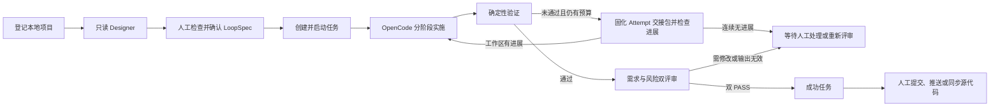

# OpenCode Loopper

[](https://github.com/wangyufengsky/opencode-loopper/actions/workflows/ci.yml)
[](LICENSE)

OpenCode Loopper 是一个在本机运行的 AI 编程控制台。它把自然语言需求转换为经过人工确认的分阶段 `LoopSpec`，让 OpenCode 在受控工作区中实施变更，并用确定性验证、独立双评审和可追溯证据闭合整个循环。

它适合希望继续使用本地项目、Git 和 OpenCode，同时又需要明确执行边界、失败恢复与交付审计的开发者或小型团队。

> 当前版本：`0.1.12`。Loopper 默认只监听 `127.0.0.1`，面向单机本地使用，不是多租户远程执行平台。

## 目录

- [核心能力](#核心能力)
- [工作方式](#工作方式)
- [技术组成](#技术组成)
- [快速开始](#快速开始)
- [第一次使用](#第一次使用)
- [功能页面](#功能页面)
- [LoopSpec 与验证器](#loopspec-与验证器)
- [任务、恢复与发布](#任务恢复与发布)
- [配置](#配置)
- [Linux 与 Windows 部署](#linux-与-windows-部署)
- [数据、安全与备份](#数据安全与备份)
- [开发与验证](#开发与验证)
- [MCP 接入](#mcp-接入)
- [常见问题](#常见问题)
- [更多文档](#更多文档)

## 核心能力

- **本地项目登记**：登记绝对路径，识别 Git 隔离模式或无可用 Git HEAD 时的直接模式。
- **只读 Designer**：先读取代码库与项目约定，再通过对话生成、纠正和确认 LoopSpec；设计阶段不写业务源码。
- **项目公约**：只读分析项目并生成或更新根目录 `AGENTS.md`，展示完整预览后才写入；Loopper 管理区块以外的人工内容会被保留。
- **分阶段执行循环**：按依赖顺序执行 Stage，每个阶段都携带目标、交付物、路径约束和可立即运行的验收规则。
- **循环降噪**：验证失败后固化 Attempt 交接包，并用失败签名和可靠工作区指纹识别无进展重试；连续停滞时转入人工确认，不继续烧预算。
- **隔离执行**：有 Git HEAD 的项目先非交互 fetch 当前分支远端，再使用 `loopper/<任务名>` 分支和专用 worktree；远端线性领先时以最新远端提交为基线，但不移动原工作目录的分支。任务 worktree 必须位于原项目之外；OpenCode 必须回报相同规范目录，否则不会收到实施提示。其他项目在登记目录中直接执行，并保留私有基线用于差异检查。
- **确定性验收**：支持进程、文件、Git 差异、HTTP、JSON、JUnit、浏览器和 SQLite 查询等验证器。
- **独立双评审**：确定性验证通过后，由只读 Requirement Judge 和 Risk Judge 独立评审；两者都明确 `PASS` 才能成功。
- **人工待办**：集中处理 Designer 或任务 Session 提出的 Question、Permission 和安全阻断，不把人工输入伪装成普通任务状态。
- **失败恢复**：区分字段、验证、Session 和 Task 四层错误；可恢复的 Session 失败会创建新 Session，终止任务可派生 Recovery。
- **证据与洞察**：保留阶段、尝试、Session、验证结果、评审、用量、成本和状态迁移记录。
- **受控发布**：成功的 Git 隔离任务可在人工确认后提交并推送；无远端仓库可安全同步回源项目，并在冲突中心逐文件解决三方合并。
- **模板与自动化**：通过不可变 LoopSpec 模板版本创建手动、CRON、Git HEAD 变化或本机 Webhook 规则；新规则默认停用并需要评审。

## 工作方式



Loopper 把四类事实分开保存和展示：

1. **设计合同**：人工确认的 LoopSpec 和冻结的 Designer 设计上下文。
2. **执行过程**：Task、Stage、Attempt 和 OpenCode Session 的真实状态。
3. **验收证据**：命令输出、文件/差异结果、浏览器截图与 Judge 结论。
4. **发布结果**：本地提交、远端推送、合并请求入口或源项目同步记录。

## 技术组成

| 层次 | 主要技术 | 职责 |
| --- | --- | --- |
| Web 控制台 | Vue 3、TypeScript、Vite、Pinia、Element Plus | Designer、任务、证据、冲突处理和系统设置 |
| 本地控制面 | Java 21、Spring Boot 4、MyBatis、Flyway | 生命周期编排、权限边界、验证、恢复、发布和 API |
| 持久化 | SQLite（WAL） | 任务状态、审计事件、LoopSpec、交互和证据索引 |
| Agent Runtime | OpenCode loopback HTTP API | 只读设计、代码实施、独立 Judge 与模型目录 |
| 工作区与交付 | Git branch/worktree | 隔离执行、差异、普通提交、推送和本地三方同步 |
| 验收 | 直接进程、Playwright + 本机 Chrome、文件/HTTP/SQLite 读取 | 生成可复查的确定性结果与二进制证据 |

## 快速开始

### 环境要求

| 依赖 | 要求 | 用途 |
| --- | --- | --- |
| JDK | 21 或更高 | 构建并运行 Spring Boot |
| Git | 可从 `PATH` 使用 | worktree 隔离、差异与发布 |
| OpenCode CLI | 1.18.x 或兼容版本 | Designer、实施 Session 与 Judge |
| Node.js / npm | 仅前端热开发需要 | Maven 正式构建会准备固定版本的 Node/npm |
| Chrome / Chromium | 可选 | 只在使用 `BROWSER` 验证器时需要 |

先确认基础命令可用，并在 OpenCode 中完成所选模型提供方的认证：

```bash
java -version
git --version
opencode --version
```

macOS 如安装了多个 JDK，可显式选择 JDK 21：

```bash
export JAVA_HOME="$(/usr/libexec/java_home -v 21)"
```

### 从源码构建并运行

```bash
git clone https://github.com/wangyufengsky/opencode-loopper.git
cd opencode-loopper
./mvnw clean verify
java -jar target/opencode-loopper-0.1.12.jar
```

浏览器打开 [http://127.0.0.1:8080](http://127.0.0.1:8080)。健康检查地址为 [http://127.0.0.1:8080/actuator/health](http://127.0.0.1:8080/actuator/health)。

默认情况下，Loopper 会先复用 `http://127.0.0.1:4096` 上健康的 OpenCode；若没有可复用实例，则尝试启动并管理本机 `opencode serve` 进程。

## 第一次使用

1. 打开 **设置**，确认 OpenCode CLI 路径；刷新模型列表并选择默认 Provider / Model。可选地设置“允许项目根”，限制可登记目录。
2. 打开 **运行环境**，确认 OpenCode 状态为在线，并检查当前端点、版本、模型与进程所有权。
3. 打开 **项目**，登记项目名称和绝对根路径。登记本身不会启动 AI，也不会写入项目文件。
4. 可选：在项目卡片中打开 **AGENTS.md 项目公约**，让只读 Session 生成建议，检查完整预览后再确认写入。
5. 打开 **设计器 / 循环规范**，选择项目并描述目标。推荐让非简单任务拆成 2–6 个依赖有序的阶段，每阶段配置可直接执行的功能验收。
6. 检查 Designer 对话和右侧 LoopSpec，必要时继续追问或手工修订。保存并确认后，Loopper 才会创建任务。
7. 进入任务详情并点击 **开始执行**。执行期间可查看阶段进度、尝试、真实模型输出、待处理问题、验证证据和双 Judge 评审。
8. 任务成功后检查实际差异，再由人工选择提交/推送、创建合并请求，或将无远端分支安全同步回源项目。

## 功能页面

| 页面 | 主要用途 |
| --- | --- |
| 项目 | 登记本地目录、查看执行模式、生成/更新 `AGENTS.md`、取消项目管理 |
| 设计器 / 循环规范 | 与只读 OpenCode Designer 对话，编辑、验证并确认 LoopSpec |
| 任务 | 查看当前和历史任务、状态与归档；符合保护条件时可二次确认删除历史记录 |
| 任务详情 | 启停任务、查看 Stage/Attempt/Session、验证证据、双评审、设计历史与发布入口 |
| 待处理中心 | 回答 Question，按一次/Session 范围处理 Permission，或拒绝请求 |
| 质量与用量 | 查看最终有效尝试的质量、历史失败证据、Token/成本与预算信息 |
| 模板与自动化 | 管理不可变模板版本、自动化规则、导入导出与运行记录 |
| Recovery Studio | 从失败或取消任务派生恢复任务，保留父子关系和工作区指纹 |
| 运行环境 | 查看或重启 Loopper 管理的 OpenCode Runtime；外部 Runtime 只重新检测 |
| 设置 | 配置 CLI、允许项目根、默认模型、任务尝试上限和单次超时 |

取消项目管理只会移除登记关系；不会删除项目目录、历史任务、Designer 对话、LoopSpec 或执行证据。

## LoopSpec 与验证器

LoopSpec 是执行前必须人工确认的结构化合同。核心字段包括：

- `projectId`、`goal` 和补充 `context`；
- 一个或多个 `stages`；
- 每个阶段的 `objective`、`deliverables`、允许/禁止路径和 `verifiers`；
- 尝试次数、停滞阈值、总时长、单次尝试、验证超时和可选 Token/成本预算；
- 可选模型、Session 重试策略和下一次 Attempt 的服务端提示模板。

下面是一个最小示例。实际使用时通常由 Designer 生成，再在 Review Gate 中可视化检查和修改。Review Gate 会无损保存模型、全部限制、Session 策略和下一轮提示模板，不会在确认前恢复成默认值：

```json
{
  "schemaVersion": "v1",
  "projectId": "替换为已登记项目 ID",
  "goal": "为服务增加健康检查并补充测试",
  "context": "保持现有 API 兼容，不修改部署端口",
  "stages": [
    {
      "objective": "实现健康检查并验证行为",
      "allowedPaths": ["src/**", "README.md"],
      "forbiddenPaths": ["data/**"],
      "deliverables": ["健康检查端点", "自动化测试", "使用说明"],
      "verifiers": [
        {
          "type": "PROCESS",
          "command": ["./mvnw", "test"],
          "outputContains": "BUILD SUCCESS"
        },
        {
          "type": "GIT_DIFF",
          "requireChanges": true,
          "allowedPaths": ["src/**", "README.md"],
          "forbidDeletes": true
        }
      ]
    }
  ]
}
```

`PROCESS.command` 是参数数组，不是 shell 字符串；请写 `['./mvnw', 'test']` 这一类直接命令，不要写 `sh -c`、管道或重定向。为兼容 Designer 偶尔把 Maven 参数合并到同一数组项的情况，Loopper 会在不启动 shell 的前提下自动拆分能够无歧义解析的 Maven 参数；引号未闭合等无法安全解析的输入仍会触发只读 Designer 自动纠正。`GIT_DIFF` 只证明改动范围，不能作为一个阶段唯一的功能验收。

### 可用验证器

| 类型 | 验证内容 | 关键限制 |
| --- | --- | --- |
| `PROCESS` | 直接启动命令并检查退出码/输出 | argv 形式；禁止 shell 启动器；有超时和输出上限 |
| `FILE_EXISTS` / `FILE_NOT_EXISTS` | 记录文件存在性 | 路径必须位于执行根目录内；`FILE_EXISTS` 仅保留为非阻断审计提示，`FILE_NOT_EXISTS` 才是阻断性安全检查 |
| `GIT_DIFF` | 是否有改动、允许/禁止路径、禁止删除 | 必须在 LoopSpec 中显式声明 |
| `HTTP_STATUS` | HTTP 状态码 | 仅 loopback URL；支持受限方法 |
| `JSON_PATH` | loopback JSON 响应中的值 | 使用受限 JSONPath 和匹配模式 |
| `FILE_CONTENT` | 文件内容精确或包含匹配 | 路径 containment 与大小受限 |
| `FILE_HASH` | 文件 SHA-256 | 需要 64 位十六进制摘要 |
| `JUNIT_XML` | JUnit XML 中的失败/错误 | 本地 XML 文件 |
| `BROWSER` | CSS 选择器存在、可见、文本、数量或属性 | 仅 loopback；不允许任意 JavaScript；保存截图和 trace |
| `DATABASE_QUERY` | 本地 SQLite 查询结果 | 仅只读 `SELECT` / `WITH` |

路径允许/禁止规则会作为 Agent 指导；只有显式 `GIT_DIFF` 验证器才构成强制的差异验收门槛。

## 任务、恢复与发布

### 两种执行模式

| 模式 | 触发条件 | 执行位置 | 发布方式 |
| --- | --- | --- | --- |
| Git worktree | 项目有可用 Git HEAD | 原项目之外的 `$LOOPPER_DATA_DIR/worktrees/<taskId>`，分支为 `loopper/<任务名>`；创建前非交互 fetch 当前远端分支，同名时追加 `(第N次)` | 成功后人工提交；有远端则正常推送，无远端则受控同步回源项目 |
| Direct | 没有可用 Git HEAD | 已登记的原项目目录 | 不提供自动发布或原地回滚；使用私有基线做差异和删除检查 |

Loopper 不会因为任务成功就自动提交、推送、合并或删除 worktree。任务创建时的 fetch 只更新 remote-tracking refs；任务分支在人工发布前仍是本地分支，不会提前出现在 GitLab/GitHub。远端认证失败或本地/远端历史分叉时，任务会失败关闭并要求先处理 Git 状态，不会退回过期基线继续实施。大仓库的 worktree 检出使用独立的 10 分钟有界超时，并为 Windows 命令局部启用 Git 长路径支持。

### 错误层级

| 层级 | 含义 | 默认结果 |
| --- | --- | --- |
| `FIELD` | 请求或 LoopSpec 字段无效 | 原地提示，不改变运行状态 |
| `VERIFICATION` | 当前 Attempt 没有满足验收 | 保留证据，在预算内进入下一次尝试 |
| `SESSION` | OpenCode Session 失败或断开 | 关闭当前 Attempt，在安全确认后创建新 Session |
| `TASK` | 已无法安全继续或预算耗尽 | 终止子工作并进入 `FAILED` |

当旧的可写 Session 无法确认终止时，Loopper 会失败关闭，拒绝创建第二个并发写入者。远端终止状态未知会显示为 `DISCONNECTED`，不会伪装成 `ABORTED`。

确定性验证失败后，Loopper 会把失败摘要、验证事实、变更路径和工作区内容指纹保存为不可变 `ATTEMPT_HANDOFF` 证据。只有完整且可靠的指纹才参与停滞判断；读取过程按实际字节计数，路径过多、文件读取异常、总内容超过 16 MiB 或文件在读取期间变化时都会标记为不可比较，避免误判。相同失败签名和工作区指纹连续达到 `stagnationLimit` 后，任务进入 `WAITING_INPUT` 并显示“继续一轮”，不会自动创建更多 Session。

任务详情只根据服务端返回的当前等待原因决定是否显示“继续一轮”，不会被历史停滞错误误导。用户确认后，服务端先验证并解析最新结构化 handoff，再记录 `LOOP_STAGNATION_OVERRIDE`，并使用与自动重试相同的模板渲染创建全新 Attempt 和全新可写 Session；handoff 缺失或损坏时保持 `WAITING_INPUT`。验证失败后的下一轮不会复用旧 Session 对话；若 `createFreshOnVerifierFailure=false`，任务会直接等待人工确认。`nextAttemptPromptTemplate` 只支持 `${attemptOrdinal}`、`${failureSummary}`、`${verificationSummary}`、`${changedPaths}` 和 `${workspaceFingerprint}` 五个有界占位符，替换后的完整交接提示最多 12,000 字符。

### Recovery

只有 `FAILED` 或 `CANCELLED` 任务可以创建派生 Recovery：

- `FROM_FAILED_STAGE`：从失败阶段继续；
- `ALL_STAGES`：重新执行全部阶段；
- `VERIFY_ONLY`：只重新验证，不创建可写 Session。

Recovery 会保留父任务、来源阶段和工作区指纹。Direct 指纹同时使用规范路径、目录文件键和创建时间，避免 Linux 立即复用 inode 时把重建目录误认成原工作区；指纹不一致或旧写入者状态不明时会返回冲突并停止。已释放且没有写入者的租约会在下一次准入时安全刷新指纹。

### 成功任务发布

Git 隔离任务达到 `SUCCEEDED` 后：

1. Loopper 根据任务和实际差异建议提交说明；用户必须输入四位数字工单号，最终格式为 `#1234_subject`。
2. 用户检查并确认后，Loopper 使用普通 Git 提交；存在远端时执行非强制推送。
3. 推送成功后可打开预填的 GitHub Pull Request 或 GitLab Merge Request 创建页，最终创建与合并仍由托管平台确认。
4. 如果仓库没有远端，Loopper 会对任务基线、当前源项目和任务版本做三方比较；无冲突时同步回源项目，有冲突时进入冲突中心。
5. 冲突中心按文件展示 **源项目 / 合并结果 / 任务版本**，可选择一侧、手工编辑或请求仅供参考的 AI 建议。写回前会重新检查源项目版本并按原 LoopSpec 验证；失败会回滚本次同步涉及的任务路径。

### 归档与删除

- 归档只改变任务在列表中的可见状态，不删除证据或源码。
- 历史删除是终止操作，需要二次确认。
- 正在运行、未归档或仍有派生子任务的记录受保护，不能删除。
- 删除历史记录不会删除源文件、Git 分支或 worktree。

## 配置

### 常用环境变量

| 环境变量 | 默认值 | 说明 |
| --- | --- | --- |
| `LOOPPER_DATA_DIR` | `./data` | SQLite、证据、二进制工件、worktree 和 Direct 私有基线 |
| `SERVER_PORT` | `8080` | Loopper HTTP 端口；监听地址固定为 loopback |
| `LOOPPER_OPENCODE_MODE` | `auto` | `auto` 复用或启动本机服务；`http` 只连接；`fake` 仅用于测试 |
| `OPENCODE_BASE_URL` | `http://127.0.0.1:4096` | 要探测或复用的 OpenCode loopback 端点 |
| `OPENCODE_USERNAME` | 空 | 外部 OpenCode 的 Basic Auth 用户名 |
| `OPENCODE_PASSWORD` | 空 | Basic Auth 密码；只从进程环境读取，不持久化 |
| `OPENCODE_EXECUTABLE` | 从 `PATH` 查找 | 受管 `auto` 模式使用的 OpenCode 可执行文件 |
| `OPENCODE_MODEL` | OpenCode 默认值 | 可选的 `provider/model` 默认模型 |
| `LOOPPER_CHROME_EXECUTABLE` | 自动检测 | `BROWSER` 验证器使用的 Chrome/Chromium 绝对路径 |
| `LOOPPER_MCP_BEARER_TOKEN` | 每次启动随机生成 | `/api/mcp-streamable` 和 `/api/mcp` 的 Bearer Token |
| `LOOPPER_JAVA_HOME` | Linux 脚本默认 `/opt/jdk-21`；Windows 依次回退到 `JAVA_HOME`、`PATH` | 启动脚本使用的 JDK 目录 |
| `LOOPPER_JAR_PATH` | 自动查找当前版本 JAR | Linux/Windows 启动脚本使用的成品 JAR 路径 |
| `LOOPPER_OPEN_BROWSER` | `true` | 启动后是否自动打开浏览器；设为 `false` 可关闭 |

更多尝试次数、超时和监控间隔可通过 Spring Boot 外部配置覆盖 `loopper.*` 属性；默认值见 [`src/main/resources/application.yml`](src/main/resources/application.yml)。生产环境默认启用 `loopper.scheduling.enabled` 和 `loopper.startup-recovery.enabled`，后者统一恢复中断任务、本地同步与自动化状态。UI 中的设置保存在本地 SQLite，并应用于新建 Session。

### OpenCode 运行模式

- `auto`：先检查配置的 loopback 端点；健康则复用，否则启动一个 Loopper 拥有的本机 OpenCode 进程。只有受管进程可以从 UI 重启。
- `http`：只连接已有的 OpenCode 服务，Loopper 不启动也不终止它。出于本地安全边界，只接受 loopback 端点。
- `fake`：确定性测试适配器，不应在真实任务中使用。

## Linux 与 Windows 部署

正式 JAR 已包含前端静态资源和运行所需的 SQLite JDBC 原生库。运行成品不需要 Maven、Node 或 npm。

### Linux / 内网

将下面两个文件复制到同一个可写目录：

- `target/opencode-loopper-0.1.12.jar`
- `scripts/start-linux.sh`

然后以前台方式启动：

```bash
chmod +x start-linux.sh
LOOPPER_JAVA_HOME=/opt/java/jdk-21 ./start-linux.sh
```

脚本也允许误用 `sh start-linux.sh`，它会先切换到 Bash。JDK 选择顺序是 `LOOPPER_JAVA_HOME`，然后是脚本内的 `DEFAULT_JAVA_HOME=/opt/jdk-21`；脚本故意忽略继承的 `JAVA_HOME`，避免旧 JDK 8 覆盖指定版本。

Linux 启动脚本默认使用连接已有服务的模式：

```bash
export LOOPPER_OPENCODE_MODE=http
export OPENCODE_BASE_URL=http://127.0.0.1:4096
./start-linux.sh
```

因此应先在同一台机器启动并配置兼容的 OpenCode 服务。Loopper 与 OpenCode 都应保持 loopback，项目绝对路径必须在这台主机上可见。

### Windows

从同一个 GitHub Release 下载并放在同一目录：

- `opencode-loopper-0.1.12.jar`
- `start-windows.bat`

确认 JDK 21、Git 和 OpenCode CLI 已加入 `PATH`，然后双击 `start-windows.bat`，或在 CMD 中运行：

```bat
start-windows.bat
```

脚本按 `LOOPPER_JAVA_HOME`、`JAVA_HOME`、`PATH` 的顺序查找 Java 并拒绝低于 21 的版本。它先检查 `http://127.0.0.1:4096/global/health`；若默认端点离线，则从 `OPENCODE_EXECUTABLE` 或 `PATH` 查找 `opencode.exe` / `opencode.cmd`，执行 `opencode serve --hostname 127.0.0.1 --port 4096` 并最多等待 30 秒。健康检查通过后才启动 Loopper，避免把尚未启动的 OpenCode 误显示成离线。

需要固定路径或端口时，可先设置环境变量：

```bat
set "LOOPPER_JAVA_HOME=C:\Program Files\Java\jdk-21"
set "OPENCODE_EXECUTABLE=C:\Tools\opencode.exe"
set "SERVER_PORT=8080"
start-windows.bat
```

若显式设置了非默认 `OPENCODE_BASE_URL`，脚本只连接该地址，不会擅自启动另一个端点；该地址离线时会直接报错。设置 `LOOPPER_OPEN_BROWSER=false` 可禁止自动打开页面。脚本启动的 OpenCode 服务是独立本机进程，Loopper 退出后不会终止它；再次启动时会复用健康的现有服务。

其他注意事项：

- 服务端无桌面时，直接在 UI 输入项目绝对路径；原生目录选择按钮需要图形会话及 `zenity`、`kdialog` 或 `yad`。
- `BROWSER` 验证器需要本机 Chrome/Chromium；非标准位置请设置 `LOOPPER_CHROME_EXECUTABLE`。
- 图形环境中，脚本会在健康检查通过后尝试打开浏览器；无头环境只输出访问 URL。
- 内网首次从源码构建仍需要 Maven 与 npm 依赖缓存；只运行已打包 JAR 不需要访问这些仓库。

可检查 JAR 是否包含当前前端：

```bash
jar tf target/opencode-loopper-0.1.12.jar \
  | rg 'BOOT-INF/classes/static/(index.html|assets/)'
```

## 数据、安全与备份

### 数据目录

默认 `./data` 中包含：

- `loopper.db` 及 SQLite WAL 相关文件；
- `worktrees/`：Git 隔离任务工作区；
- `direct-baselines/`：Direct 任务的私有比较基线；
- `artifacts/`：浏览器截图、trace 等二进制证据；
- `publication-patches/`、`local-sync-conflicts/`：发布与同步冲突材料。

要迁移或备份，先正常停止 Loopper，再整体复制 `LOOPPER_DATA_DIR`。被登记的源项目不在数据目录内，需要按项目自己的 Git/备份策略单独保护。恢复时应同时保持源项目路径和 Git 历史可用。

### 安全边界

- Loopper HTTP、受管 OpenCode 与验证器网络访问都限制在 loopback。
- 项目根和执行路径会 canonicalize，并进行目录 containment 与符号链接检查。
- OpenCode 创建 Session 后必须返回与请求一致的规范执行目录；缺失或不一致时在提示模型前停止。执行策略不可批准 `git commit`、引用/分支变更、fetch/pull/push、外部路径、危险删除或 hard reset；发布是成功后单独的人机确认流程。
- 进程验证器使用参数数组启动，不进行 shell 插值；它不是操作系统沙箱，不应运行不可信的恶意二进制。
- 密码和 MCP Token 不写入 SQLite、日志或证据。
- 任务取消会停止执行并保留目录与证据；Loopper 不自动删除已完成 worktree。
- 自动化同样经过队列、权限、验证器和双 Judge，不会绕过人工或安全门槛。

## 开发与验证

### 热开发

macOS / Linux：

```bash
./scripts/dev.sh
```

Windows PowerShell：

```powershell
.\scripts\dev.ps1
```

热开发同时启动 Spring Boot 和 Vite。此时需要系统中已有 npm。

### IntelliJ IDEA

选择仓库自带的 **Loopper Full Stack** Run Configuration。它会在 Spring Boot 启动前执行 Maven `process-resources`，把当前 Vue 构建复制到 `target/classes/static`，然后由同一个 `8080` 服务提供 SPA 与 API。需要 Vite HMR 时改用开发脚本。

### 完整验证

```bash
./scripts/verify.sh
```

它执行 `./mvnw clean verify`，包括：

- Java 编译与测试；
- 固定 Node.js `v22.14.0` 和 npm `10.9.2` 工具链准备；
- `npm ci`、Vue/TypeScript 类型检查、Vitest 与 Vite 正式构建；
- 将 `frontend/dist` 复制到 JAR 的静态资源目录。

`mvn clean` 会先清理 Maven 管理的前端工具链与静态资源，避免新 JAR 意外携带旧前端。真实 OpenCode/模型端到端结果与 mock/契约测试应分别判断。

### 版本发布

每个可交付的新 JAR 必须使用一个未发布过且递增的 SemVer 版本。版本号需要同时更新 Maven、前端 package、MCP 配置、README、`AGENTS.md`、Linux 与 Windows 启动脚本，然后在该版本下重新执行完整验证。

推送与 Maven 版本完全一致的 `v<version>` 标签会触发 [Release 工作流](.github/workflows/release.yml)。工作流在标签提交上使用 JDK 21 重新执行 `clean verify`，拒绝 SNAPSHOT 或标签不匹配的构建，并自动发布：

- `opencode-loopper-<version>.jar`；
- `start-linux.sh`；
- `start-windows.bat`；
- `SHA256SUMS`。

例如发布下一版本：

```bash
VERSION=0.1.12
git tag "v$VERSION"
git push origin main
git push origin "v$VERSION"
```

标签必须指向已经包含全部版本修改的提交，且不得复用或强制移动已发布标签。

常用的独立前端命令：

```bash
npm --prefix frontend ci
npm --prefix frontend run typecheck
npm --prefix frontend run test
npm --prefix frontend run build
npm --prefix frontend run test:e2e
```

## MCP 接入

Loopper 通过 Spring AI Streamable HTTP MCP 暴露六个工具：

| 工具 | 作用 |
| --- | --- |
| `get_project_context` | 只读获取已登记项目上下文 |
| `propose_loop_spec` | 校验并同步当前只读 Designer Session 绑定的草稿 |
| `validate_loop_spec` | 校验完整 LoopSpec，或校验指定版本的持久化草稿 |
| `create_task` | 为已人工确认的草稿创建唯一任务，不会自动确认草稿 |
| `start_task` | 启动已准备好工作区和合同的任务 |
| `get_task_status` | 读取任务、阶段、尝试、验证与分层错误状态 |

端点：

- 标准 Streamable HTTP：`http://127.0.0.1:8080/api/mcp-streamable`
- 兼容 JSON-RPC：`http://127.0.0.1:8080/api/mcp`

外部客户端必须配置固定 Token，并发送 `Authorization: Bearer <token>`：

```bash
export LOOPPER_MCP_BEARER_TOKEN='请替换为足够长的随机值'
java -jar target/opencode-loopper-0.1.12.jar
```

MCP 只开放 tools capability，不开放 resources、prompts 或 completions。Designer 仍是只读流程，`propose_loop_spec` 不能替代人工确认。

## 常见问题

### 页面刷新或 SSE 断线会终止正在运行的任务吗

不会。浏览器 SSE 只是实时展示通道；刷新页面、网络断开、响应超时或 Tomcat 已关闭对应 `AsyncContext` 时，服务端只移除失效订阅，不会把展示层异常升级为 OpenCode Session 错误，也不会终止任务。任务事件已持久化，页面重连时会使用 `Last-Event-ID` 补放；Designer 则重新读取最新快照。

### 页面打不开或显示“本地 API 不可用”

先检查：

```bash
curl --fail http://127.0.0.1:8080/actuator/health
lsof -nP -iTCP:8080 -sTCP:LISTEN
```

如果端口已被占用，可用 `SERVER_PORT=8081` 启动，并访问相应端口。

### Runtime 显示离线

检查 `opencode --version`、OpenCode 的模型认证、`OPENCODE_BASE_URL` 和 `/global/health`。`http` 模式不会替你启动 OpenCode；`auto` 模式需要能从 `PATH` 或 `OPENCODE_EXECUTABLE` 找到 CLI。

### Windows 提交任务时停在 `Updating files` 后报 `WORKTREE_CREATE_FAILED`

`0.1.11` 起，Loopper 不再用 30 秒短检查超时限制大仓库检出，并会隐藏 Git checkout 进度噪音、保留尾部真正的 `fatal` 诊断，同时命令局部启用 `core.longpaths=true`。升级后请重新提交任务。旧版本失败可能留下 `$LOOPPER_DATA_DIR/worktrees/<taskId>` 和对应 `loopper/*` 分支；先用 `git worktree list` 精确确认残留，确认它确实属于失败任务后再手工清理，不要删除仍在使用或已完成任务的 worktree。`0.1.12` 起可使用 Release 附带的 `start-windows.bat`，由脚本先确认或启动默认 OpenCode loopback 服务，再启动 Loopper。

### 一直显示 remote busy / Agent 正在思考

先区分三个层面：Loopper 健康、OpenCode 健康、模型 Provider 响应。项目列表和任务 API 很快但模型输出很慢，通常应检查 Provider、网关、模型配置和配额；Designer 的轮询状态本身不代表失败。查看 **运行环境** 与 Session 的真实状态和输出，不要仅凭浏览器动画判断。

### Designer 没有创建任务

Designer 只有在模型返回可解析、项目匹配且通过验证的 LoopSpec 后才会同步草稿。自动纠正仍失败时，Session 会保留错误，且不会写源码或创建任务。修复 Review Gate 中指出的字段或验证器后重新保存、确认。

### 验证通过但任务仍未成功

确定性验证和 Judge 结论是两个独立门槛。Requirement/Risk Judge 返回 `REVISE`、`BLOCKED`、互相冲突或输出无法解析时，任务会进入等待处理状态；已有验证证据仍然保留，可以修复后继续或发起独立重新评审。

### 成功任务为什么不能发布

自动发布仅适用于满足发布前提的 Git 隔离任务。检查任务是否为 Direct 模式、worktree/任务分支是否仍匹配、是否有可提交差异以及远端配置。没有远端并不阻止本地同步；Loopper 会改走受控源项目同步流程。

### BROWSER 验证器找不到浏览器

安装 Google Chrome 或 Chromium，或设置：

```bash
export LOOPPER_CHROME_EXECUTABLE=/absolute/path/to/chrome
```

显式路径无效时验证会失败关闭，不会静默改用未知浏览器。未配置显式路径时，先按进程 `PATH` 查找，再回退到操作系统标准安装位置，确保 CI 与实际运行环境使用一致的发现顺序。

## 更多文档

- [架构与状态边界](docs/architecture.md)
- [UI 设计合同](docs/design-contract.md)
- [OpenCode 适配契约与实测证据](docs/opencode-contract.md)
- [Recovery、交互、验证器与自动化合同](docs/seven-feature-contract.md)
- [Apache License 2.0](LICENSE)

## 许可证

本项目采用 [Apache License 2.0](LICENSE)。
