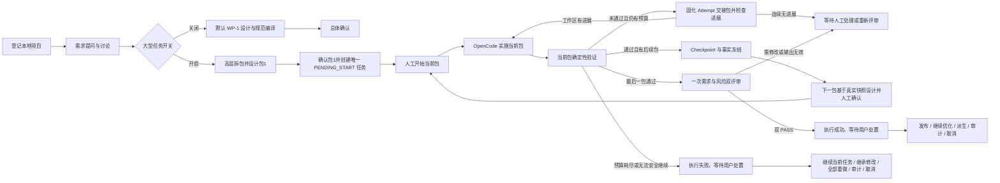

# OpenCode Loopper

[](https://github.com/wangyufengsky/opencode-loopper/actions/workflows/ci.yml)
[](LICENSE)

OpenCode Loopper 是一个在本机运行的 AI 编程控制台。它把自然语言需求转换为经过逐步人工确认或明确会话授权确认的分阶段 `LoopSpec`，让 OpenCode 在受控工作区中实施变更，并用确定性验证、独立双评审和可追溯证据闭合整个循环。

它适合希望继续使用本地项目、Git 和 OpenCode，同时又需要明确执行边界、失败恢复与交付审计的开发者或小型团队。

> 当前版本：`0.2.79`。Loopper 默认只监听 `127.0.0.1`，面向单机本地使用，不是多租户远程执行平台。

## 目录

- [核心能力](#核心能力)
- [工作方式](#工作方式)
- [技术组成](#技术组成)
- [快速开始](#快速开始)
- [第一次使用](#第一次使用)
- [功能页面](#功能页面)
- [LoopSpec 与验证器](#loopspec-与验证器)
- [任务、恢复与发布](#任务恢复与发布)
- [配置](#配置)
- [Linux 与 Windows 部署](#linux-与-windows-部署)
- [数据、安全与备份](#数据安全与备份)
- [开发与验证](#开发与验证)
- [MCP 接入](#mcp-接入)
- [常见问题](#常见问题)
- [更多文档](#更多文档)

## 核心能力

- **本地项目登记**：登记绝对路径，识别 Git 任务分支模式或无可用 Git HEAD 时的直接模式；新登记项目同时建立有界的模块级技术栈基线，已经受管的老项目在第一次更新公约或创建新设计时按需分析，项目列表本身不会逐个扫描文件系统。
- **中文极简界面**：页面只保留完成当前操作所需的信息，状态、角色、验证器和错误统一显示中文；任务错误仍完整保留为审计历史，但红色当前告警只跟随服务端权威等待原因或当前失败轮次，任务重新排队、准备或运行后不会继续展示旧轮次告警；内部枚举码与任务、会话、尝试等记录 ID 不在普通页面回显，项目卡片支持长名称和路径自然换行。
- **普通单包与大型任务设计**：软件任务默认固定一个 `WP-1`，包内仍由 Designer/Compiler 形成 1–6 个 Stage，按“需求讨论 → 单包设计 → 规范编译”推进。只有画像冻结前显式打开“大型任务”才使用 2–6 个高层工作包，每包 1–3 个 Stage。对新建的大型软件任务，包1通过确定性设计校验并人工确认后即创建唯一 `PENDING_START` Task；之后每包按“基于上一事实点详细设计 → 人工确认设计 → 人工开始执行 → 机器验收 → Checkpoint 与事实冻结”闭环。已冻结包不会被重写，需要修改时只能追加修正包；所有包冻结后才运行一次 Requirement/Risk 双评审并进入一次任务级发布。普通单包、大型文档和升级前 Designer/Task 保持旧聚合流程。
- **可讨论的只读多角色设计**：普通软件任务只在需求讨论时由设计师用 1–3 个选择题澄清；回答后服务端把原始需求、后续补充和最终回答按时间原样组装为 24 KiB 内的权威需求快照，忽略 AI 自由正文，WP-1 初稿、反馈修订和重新设计都直接输出不设固定字节上限的完整替代设计而不再提问。大型任务仍保留 AI 完整需求预设计和逐包提问/接受。需求讨论按服务端快照或设计消息的精确位置固定，不会被后续消息推到列表底部；需求快照作为独立只读卡片展示，其审计来源消息不重复进入“系统消息”折叠条。任务规划师与规范工程师只输出紧凑的业务规划与证据意图，服务端生成状态、ID、引用、精确摘录、测试元数据和最终 LoopSpec 对象；原始机器 JSON 不进入聊天。确定性校验和人工确认完成前不写业务源码、不创建任务。
- **动态任务画像与专属流程**：服务端先从 Maven/Gradle、`package.json`、Python、Go 和 Rust 证据建立结构化组件画像，再用需求中的相对路径、模块名和明确技术词约束到真实组件。Router 是单次快速分类器：不发现或调用内置/MCP 工具，不搜索仓库、不做设计或方案推演；受管运行时使用单步、零温度和非思考专用 Agent，只返回任务意图、一个主要制品和 SIMPLE/PACKAGED 三项闭集标签。技术栈、组件和置信度完全由服务端证据与标签一致性计算，失败或降级时页面显示“识别置信度 未产生”，不再把占位值展示成 `0%`。任务设置识别只在尚未建立远端 Session 时保留 240 秒连接等待；连接成功后一直等待真实终态。运行弹窗只显示真实已用时间、远端状态、最新安全活动和 Provider Token，不显示超时上限、估算百分比或原始 Router JSON，并提供“取消识别，手动设置”；服务端确认远端 Session 已取消后直接打开人工选择控件，全自动模式也不会采用该结果。Router 固定使用安全 marker 信封和同一服务端闭集校验，不再向 OpenCode 持久化会触发部分桌面版本加载错误的 JSON Schema 响应格式。普通模式在中文结果页明确选择“确认并进入设计 / 重新识别 / 手动修改”，决定前不会创建需求 Designer Session；重新识别只使用服务端保存的同一需求快照。单栈自动选择；明确跨组件使用混合栈；多栈但无法定位、分析不完整，或无 Manifest 且需求未明确技术时必须确认，不再默认 Java。页面统一称为“任务设置”，只在多栈歧义时展示组件选择器。画像仍按 `ROUTING / NEEDS_CONFIRMATION / CONFIRMED / FROZEN` 投影；确认后同时冻结画像指纹和组件键，普通 WP-1、Stage 与 Recovery 复用该快照，后续项目重析不能改写老任务。安全判定按动作对象和否定作用域区分外部写入/发版与进程内领域事件、消息或通知；执行轨迹的发布/可观测语义、事件总线“监听器注册、发布、按类型分发”、生命周期 `started/succeeded/failed/compensated` 事件示例与受控的 `CHAIN_STARTED/SUCCEEDED/FAILED/COMPENSATED` 事件常量保持为软件领域行为，“发布器/发布者/发布-订阅器”按组件名词处理，“进程内同步发布”按事件投递上下文处理；同句“重复/再次/重新发布”仅可继承前一个已证明的业务事件对象，普通第二次裸发布不继承。版本、制品、镜像、环境、提交推送和无法判定的裸发布仍失败关闭，单纯声明“不伪造外部系统结果”不会被当成写请求。“可配置”、“不新增依赖”等软件约束或“某类维护调用身份/MDC”等源码职责描述不会把开发任务降级为本地维护，完整设计中的人工评审点、只读 getter 或验收复核措辞也不会把明确的软件交付改路由为只读报告；只有任务级评审/诊断请求才进入 Reviewer 或形成读写冲突。只有 Manifest 指纹、组件选择、意图和流程均不变时，完整需求重算才能继承原确认。
- **实时活动与可终止设计会话**：Designer 页面在消息列表现有的“当前角色正在处理”卡片中，每 1.2 秒用 Markdown 样式替换展示一条最新活动，不单独放置顶部面板，也不保留活动历史。卡片内的纯数字窗口按服务端权威投影累计当前设计全部模型 Session 的 Token，正增量短暂显示 `+xxx`，不显示额度、成本或说明文案。交互设计师可显示最新文字、思考和普通/MCP 工具调用；任务设置 Router 在专用弹窗展示有界思考、文字和工具片段，但一旦检测到 marker 或结构化对象就统一替换为“正在整理任务设置识别结果”；任务规划师、规范工程师等其他结构化角色仍只显示最新工具活动和权威步骤。“清理并重新开始”先进入 `STOPPING`，停止该设计下全部远端角色 Session，全部成功后才进入 `CANCELLED` 并归档，失败时保留工作区供重试。确认设计并获得 Task 后会清除当前设计工作区并直接打开任务详情，再点左侧“设计”从新建页开始。
- **Role Pack v6、验收事实 v7 与按需 Compiler**：技术标签先归并为 Java、Python、Node 和 Other 软件族，JUnit/Jupiter/Surefire 等测试标签不会把 Java 任务误判为混合栈，工作包识别使用技术词边界，`ChainNodeInvoker` 等业务符号不会误触发 Node。当前 v7 Designer 使用“阶段 / 目标 / 负责路径 / 包含场景/评审/交付 / 前置阶段”，把阶段写入责任与验收/交付分组分开；冻结 v6 四列表格继续兼容。新软件包把冻结需求与正向设计交付中的显式仓库相对必改路径连同来源和 SHA-256 写入 v7 不可变事实快照；唯一 `负责路径` 声明、精确义务来源、恰好一个现有 Stage 路径规则、旧设计中只命中一个阶段目标的精确文件/类/末尾路径符号，或单 Stage 的精确写入/移动目标，均可由服务端形成 Stage、focused test 和 `GIT_DIFF` 的同一路径合同。旧格式符号恢复只做完整 token 匹配，不做模糊猜测。真实多 Stage 候选保留为具体 `DESIGN_INCOMPLETE` 并显示候选 Stage 中文名，不交给弱模型选择。路径缺口时相同设计修订不能原样重编译；页面保持当前包输入框和“恢复当前包设计”，由服务端把全部未归属路径/候选阶段放进完整替代设计提示。包级范围、全局事实、技术栈、模糊标题、目录词和最后 Stage 不能冒充归属证明。遗漏路径、删除、移动源端、正负冲突或禁区交集直接形成具体缺口；项目根外路径在创建编译记录前收束，不会被误当成模型传输失败。上述缺口不会等执行期才以 `outside allowed paths` 失败，也不会放宽运行期验证器。当前 v7 的普通 `WP-1`、大型任务包和滚动执行当前包在事实与能力均可确定时，都由服务端完成全局能力求解、EARS 条件与 LoopSpec v2 lowering，不创建 Compiler Session 或消耗模型调用；一个事实有多个候选并不自动算歧义，只有全部业务评分维度真实同分才调用一次无工具 Compiler。该 Session 使用 v7 最小闭集 Schema，只选择服务端列出的事实归属和能力；路径义务不进入模型输入输出，阶段拓扑始终锁定。弱模型的可逆别名、单项集合、`null` 集合和无害说明字段会被机械规范化并审计，不消耗修复轮次；命令、路径、测试目标、拓扑和安全字段仍在规范化前阻断。非法输出保留冻结事实和已完成绑定，不丢弃为空建议或降级成通用单阶段；Schema 不支持时只在全新零工具 marker Session 中回退一次，不扩大预算。V44 记录服务端直编、AI 消歧或历史来源；冻结 v4/v5 及 v6 事实快照保持原语义兼容。
- **可选的 Designer 全自动模式**：新建设计和进行中会话均可单独授权，默认关闭。开启后只自动采用已成功且通过服务端安全校验的任务设置，再选择推荐答案和确认整体需求；普通任务继续按原合同推进。逐包闭环任务中，全自动最多完成 Router、拆包和只读候选设计，不能确认包设计，也不能开始包执行。Router 未连接超时、运行失败、安全冲突或必须选择组件时仍停在人工确认门。执行期问题、危险权限、异常恢复、结果确认、提交、推送和发布仍保持人工边界。
- **项目公约**：点击“AI 更新 Loopper 公约”会先在事务外强制刷新技术栈画像，再启动只读 AI 重新生成“技术栈与模块 / 构建与测试 / 目录与边界”。只读 Session 连接成功后不再按无进展或总时长自动终止，而是持续展示最新思考、工具或输出以及 Provider 权威 Token，直到远端真实完成/失败或用户显式点击“停止生成”；界面不展示超时上限，远端终止确认前保持“正在停止”。服务端拒绝无项目证据的技术；完整预览经用户确认后才写入，写前同时复核原 `AGENTS.md` 哈希和 Manifest 指纹。首次追加管理区块，后续只替换该区块，区块外人工内容始终保留。
- **分阶段执行循环**：按依赖顺序执行 Stage，每个阶段都携带目标、交付物、路径约束和可立即运行的验收规则。
- **循环降噪**：验证失败后固化 Attempt 交接包，并用失败签名和可靠工作区指纹识别无进展重试；连续停滞时转入人工确认，不继续烧预算。
- **实施 Todo 投影**：OpenCode 暴露 `todowrite` 时，实施 Session 可维护非权威 Todo；Loopper 有界同步并在任务详情展示。桌面端进度卡固定在会话输出滚动区顶部，长清单在卡内有界滚动；窄屏回到正常文档流。真实完成状态仍只由 Task、Stage、验证器和 Judge 决定。
- **原项目任务分支执行**：有 Git HEAD 的项目先检查登记目录；若存在未提交/未跟踪文件，任务进入人工处理弹窗，逐文件选择提交、stash 或移除，重新检查干净后再非交互 fetch 并切换到 `loopper/<任务名>` 分支。IDE 内 AgentBridge、OpenCode 和验证器因此共享同一目录与分支。其他项目在登记目录中直接执行，并保留私有基线用于差异检查。
- **确定性验收**：支持进程、文件、Git 差异、HTTP、JSON、JUnit、浏览器和 SQLite 查询等验证器。
- **按任务选择验收**：统一 `TestFrameworkPolicy` 识别 Maven、Gradle、npm、pytest 和 unittest 的聚焦目标与跳过参数。Java 生产代码继续强制聚焦测试；已有测试框架的软件变更或用户明确要求测试时使用 `PROCESS TEST`；无测试体系的独立 Python 脚本可使用 `SELF_CHECK` 加原生文件/数据断言；文档和一次性数据转换不生成 `PROCESS TEST`，分别使用 `DOCUMENT_STRUCTURE` 和 `TABULAR_DATA`。
- **独立双评审**：确定性验证通过后，由只读需求评审员和风险评审员独立评审；两者都明确 `PASS` 才能成功。
- **人工待办**：集中处理 Designer 或任务 Session 提出的 Question、Permission 和安全阻断，不把人工输入伪装成普通任务状态。
- **失败恢复**：区分字段、验证、Session 和 Task 四层错误；可恢复的 Session 失败会创建新 Session，终止任务可派生 Recovery。
- **证据与洞察**：保留阶段、尝试、Session、验证结果、评审、用量、成本和状态迁移记录。
- **受控发布**：成功的 Git 任务分支可在人工确认后直接提交登记目录中的变更；有远端时普通推送，无远端时保留本地任务分支提交。
- **模板与自动化**：通过不可变 LoopSpec 模板版本创建手动、CRON、Git HEAD 变化或本机 Webhook 规则；新规则默认停用并需要评审。

## 工作方式



Loopper 把四类事实分开保存和展示：

1. **设计合同**：逐步人工确认或按会话明确授权确认的 LoopSpec，以及冻结的 Designer 设计上下文。
2. **执行过程**：Task、Stage、Attempt 和 OpenCode Session 的真实状态。
3. **验收证据**：命令输出、文件/差异结果、浏览器截图与 Judge 结论。
4. **发布结果**：本地提交、远端推送、合并请求入口或源项目同步记录。

## 技术组成

| 层次 | 主要技术 | 职责 |
| --- | --- | --- |
| Web 控制台 | Vue 3、TypeScript、Vite、Pinia、Element Plus | Designer、任务、证据、冲突处理和系统设置 |
| 本地控制面 | Java 21、Spring Boot 4、MyBatis、Flyway | 生命周期编排、权限边界、验证、恢复、发布和 API |
| 持久化 | SQLite（WAL） | 任务状态、审计事件、LoopSpec、交互和证据索引 |
| Agent Runtime | OpenCode loopback HTTP API | 只读设计、代码实施、独立 Judge 与模型目录 |
| 工作区与交付 | Git task branch / Direct | 原项目分支切换、差异、普通提交、推送和本地提交 |
| 验收 | 直接进程、Playwright + 本机 Chrome、文件/HTTP/SQLite 读取 | 生成可复查的确定性结果与二进制证据 |

## 快速开始

### 环境要求

| 依赖 | 要求 | 用途 |
| --- | --- | --- |
| JDK | 21 或更高 | 构建并运行 Spring Boot |
| Git | 可从 `PATH` 使用 | 原项目任务分支切换、差异与发布 |
| OpenCode CLI | 1.18.x 或兼容版本 | Designer、实施 Session 与 Judge |
| Node.js / npm | 仅前端热开发需要 | Maven 正式构建会准备固定版本的 Node/npm |
| Chrome / Chromium | 可选 | 只在使用 `BROWSER` 验证器时需要 |

先确认基础命令可用，并在 OpenCode 中完成所选模型提供方的认证：

```bash
java -version
git --version
opencode --version
```

macOS 如安装了多个 JDK，可显式选择 JDK 21：

```bash
export JAVA_HOME="$(/usr/libexec/java_home -v 21)"
```

### 从源码构建并运行

```bash
git clone https://github.com/wangyufengsky/opencode-loopper.git
cd opencode-loopper
./mvnw clean verify
java -jar target/opencode-loopper-0.2.79.jar
```

浏览器打开 [http://127.0.0.1:8080](http://127.0.0.1:8080)。健康检查地址为 [http://127.0.0.1:8080/actuator/health](http://127.0.0.1:8080/actuator/health)。

默认情况下，Loopper 会先探测配置的 loopback 地址；若没有可复用实例，则使用一个新分配的动态端口启动并管理本机 `opencode serve` 进程。`4096` 只是默认探测地址，不是受管进程的固定启动端口。

## 第一次使用

1. 打开 **设置**，确认 OpenCode CLI 路径；刷新模型列表并选择默认 Provider / Model。可选地设置“允许项目根”，限制可登记目录。
2. 打开 **运行环境**，确认服务端报告的 OpenCode Loopper 版本，并检查 OpenCode 状态、端点、版本、模型与进程所有权。
3. 打开 **项目**，登记项目名称和绝对根路径。登记会自动生成结构化技术栈基线，但不会启动 AI 或写入项目文件；项目卡片显示 Java、Node、Python、混合栈、待分析、分析不完整或分析失败，以及组件数量。已经受管的老项目保持“待分析”，不会在启动或列表加载时批量扫描。
4. 可选：在项目卡片中打开 **AGENTS.md 项目公约**。该动作会强制重析项目并让只读 Session 重新生成管理区块；检查完整预览后再确认写入。若分析失败，不会启动 AI；证据不完整时预览会显示复核警告。
5. 打开 **设计 / 循环规范**，选择项目并描述目标。创建新设计前会检查 Manifest 指纹并在变化时刷新画像；刷新失败或组件歧义会进入可见的任务设置确认，不会伪装为 Java。提交后保持在当前设计页，画像计算完成会自动继续，不需要到历史设计手工恢复。软件任务默认关闭“大型任务”，因此采用一个 `WP-1`；只有确实需要多个纵向业务包时才在画像冻结前打开开关。普通模式先回答唯一一轮需求问题，服务端随后显示原样需求快照；继续补充会产生新的需求问题和替代快照，但不会启动工作包。OpenCode 提供原生 `question` 时页面显示选项卡；能力探测不到时页面显示“对话回答模式”，设计师用普通消息提问，输入框即使在全自动模式下也会开放给用户直接作答。显式确认后 WP-1 直接设计，不会再出现包级问题卡。已有未确认设计仍可从 **历史设计** 页面继续、修改或归档，服务重启后会从服务端恢复同一模式和快照。
6. 普通任务在 WP-1 内完成 1–6 个 Stage 的设计、编译和确定性校验后直接进入总体确认，不显示工作包轨道；需要修改时点击 **重新讨论设计**。新建大型软件任务在 Designer 确认包1后立即创建唯一 `PENDING_START` Task 并进入任务工作台，此时仍无 Queue/Lease/执行目录；后续包的设计确认和执行开始是两个独立人工按钮。顶部只显示“已冻结 N/M 包”，右侧分开展示机器证明、已接受合同和非证据导航摘要。Git 任务包间释放租约并从 Checkpoint 精确恢复，Direct 任务直到完成或取消前持续占用登记目录。
7. 进入任务详情并点击一次 **开始执行**。此时才会申请队列/写租约、检查工作区、获取远端更新并准备任务分支；一旦准入会自动继续执行，不需要在 `READY` 状态再次点击。排队及其他非终态任务的取消入口由服务端能力字段决定；轻量详情响应缺少关键能力字段时会回退完整详情读取，不会把缺字段静默当成“不可取消”。执行期间可查看阶段进度、尝试、真实模型输出、待处理问题、验证证据和双 Judge 评审；模型输出区的纯数字窗口累计该 Task 全部实施与 Judge Session 的 Token，并以 `+xxx` 展示每次权威增量。实施 Session 的 OpenCode 进度卡在桌面输出滚动区保持可见，但只投影 Todo，不代表 Stage 或 Task 已通过。
8. 任务成功后检查实际差异，再由人工提交任务分支；最终 Attempt 会无条件保存任务基线差异文件清单，不要求 LoopSpec 配置 `GIT_DIFF`。Loopper 随后恢复任务开始前的源分支，有排队任务时继续切到下一任务分支；差异预览、远端推送和合并请求继续显式引用已提交的任务分支。

## 功能页面

| 页面 | 主要用途 |
| --- | --- |
| 项目 | 登记本地目录、查看模块技术栈状态与组件数、分别查看任务数与待继续设计数、进入历史设计、查看执行模式、强制重析并生成/更新 `AGENTS.md`、查看公约 AI 实时活动/Token 或停止远端生成、取消项目管理 |
| 设计 / 循环规范 | 新建设计，或从明确的历史设计链接恢复会话；确认任务设置和歧义组件、查看设计师实时活动、完成需求提问、逐包讨论/接受、候选同步和总体确认；只有最终聚合阶段可编辑 LoopSpec |
| 历史设计 | 按项目、状态、归档范围筛选全部设计并按更新时间排序；未确认设计可继续、修改、归档或恢复，已确认设计只读查看 |
| 任务 | 查看当前和历史任务、状态与归档；符合保护条件时可二次确认删除历史记录 |
| 任务详情 | 启动任务，取消排队/准备/执行/验证/评审/等待输入任务并确认远端停止，查看 Stage/Attempt/Session、动态 Token 累计窗口、顶部固定的实施 Todo 投影、验证证据、双评审、含重做来源对话的设计历史与发布入口 |
| 待处理中心 | 回答 Question，按一次/Session 范围处理 Permission，或拒绝请求 |
| 质量与用量 | 查看最终有效尝试的质量、历史失败证据、Token/成本与预算信息 |
| 模板与自动化 | 管理不可变模板版本、自动化规则、导入导出与运行记录 |
| Recovery Studio | 从失败或取消任务派生恢复任务，保留父子关系和工作区指纹 |
| 运行环境 | 查看当前 Loopper/OpenCode 版本、监听地址、进程所有权和模型；可重启 Loopper 管理的 Runtime，外部 Runtime 只重新检测 |
| 设置 | 配置 CLI、允许项目根、默认模型、任务尝试上限和单次超时；可启用演示数据，并随时退出以重新加载真实 API 数据 |

取消项目管理只会移除登记关系；不会删除项目目录、历史任务、Designer 对话、LoopSpec 或执行证据。

演示数据只用于界面预览。启用后，设置页按钮会切换为 **退出演示数据**；退出时会清空演示投影并立即重新读取本地服务中的项目、任务和 Runtime 状态。演示模式本身不作为 Runtime 错误展示。

## LoopSpec 与验证器

LoopSpec 是执行前必须逐步人工确认或按 Designer 会话明确授权确认的结构化合同。核心字段包括：

- `projectId`、`goal` 和补充 `context`；
- 一个或多个 `stages`；
- 每个阶段的 `objective`、`implementationKind`、`deliverables`、可观察 `acceptanceCriteria`、允许/禁止路径和 `verifiers`；
- 尝试次数、停滞阈值、总时长、单次尝试、验证超时和可选 Token/成本预算；
- 可选模型、Session 重试策略和下一次 Attempt 的服务端提示模板。

下面是一个最小示例。实际使用时由 Designer 生成 Markdown 设计，再由独立 LoopSpec Compiler 编译，最后在 Review Gate 中可视化检查和修改。Review Gate 会无损保存模型、全部限制、Session 策略和下一轮提示模板，不会在确认前恢复成默认值：

```json
{
  "schemaVersion": "v2",
  "projectId": "替换为已登记项目 ID",
  "goal": "为服务增加健康检查并补充测试",
  "context": "保持现有 API 兼容，不修改部署端口",
  "stages": [
    {
      "objective": "实现健康检查并验证行为",
      "implementationKind": "JAVA_PRODUCTION",
      "allowedPaths": ["src/**", "README.md"],
      "forbiddenPaths": ["data/**"],
      "deliverables": ["健康检查端点", "自动化测试", "使用说明"],
      "acceptanceCriteria": [
        {
          "id": "AC-1",
          "description": "聚焦测试验证健康检查返回 UP",
          "verificationMode": "BOTH",
          "judgeRubric": "结合实现差异与测试证据评审端点语义、兼容性和边界行为"
        }
      ],
      "verifiers": [
        {
          "type": "PROCESS",
          "processPurpose": "TEST",
          "command": ["./mvnw", "-Dtest=HealthControllerTest", "test"],
          "testTargets": ["HealthControllerTest"],
          "criterionIds": ["AC-1"]
        },
        {
          "type": "GIT_DIFF",
          "requireChanges": true,
          "allowedPaths": ["src/**", "README.md"],
          "forbidDeletes": true
        }
      ]
    }
  ]
}
```

新建草稿、导入和模板新版本必须使用 `schemaVersion: "v2"`。每个条件通过 `verificationMode` 选择 `MACHINE`、`JUDGE` 或 `BOTH`：`MACHINE`/`BOTH` 必须由至少一个 `BEHAVIOR` 验证器通过 `criterionIds` 提供机器覆盖；`JUDGE`/`BOTH` 必须填写 `judgeRubric`；仅 `JUDGE` 还要填写 `judgeOnlyReason`，说明为何无法可靠地确定性验证。每个 Stage 无论采用哪种模式，都至少保留一个阻断性的确定性验证器。Review Gate 会分别显示机器覆盖与“AI 计划评审”，不会把尚未执行的 Judge 计划标成已通过。已持久化但未写模式的 v2 条件默认 `MACHINE`；v1 草稿、模板、Automation、任务和 Recovery 保持旧合同。

每个 v2 Stage 必须显式声明 `implementationKind`：`JAVA_PRODUCTION` 表示新增或修改生产 Java，`JAVA_TEST_ONLY` 表示需求本身只改测试，`NON_JAVA` 表示不涉及生产 Java。`JAVA_PRODUCTION` 必须在同一 Stage 配置未跳过的聚焦 Maven/Gradle `PROCESS TEST`、明确 `testTargets`，并让该测试通过 `criterionIds` 覆盖每个 `MACHINE`/`BOTH` 业务条件；测试命令是业务条件的证据，不应另建“测试全部通过”这种元验收项。安全的全量测试仍可保留为不映射业务条件的阻断性补充报告，但不能替代聚焦测试。计划中的测试类可以由本阶段新增，设计时不要求已经存在。禁止通过 `surefire.failIfNoSpecifiedTests=false` 等参数让不存在的目标假通过。

执行时，Loopper 只为 `OPEN_CODE_IMPLEMENTATION` 软件 Stage 在首次启动前冻结生产 Java 路径和内容哈希，并在验证阶段复核 Git 或 Direct 工作区中的新增、修改和重命名；服务端 DOCX/Markdown 生成与一次性表格转换不创建 Java 基线，也不进入 Java focused-test 门禁。实际生产 Java 变化与声明不符时以 `JAVA_CHANGE_CLASSIFICATION_MISMATCH` 阻断；缺少本阶段已通过的聚焦 Maven/Gradle 测试时以 `JAVA_UNIT_TEST_ACCEPTANCE_REQUIRED` 阻断。测试目录、`target/`、`build/` 和仅删除 Java 文件不触发这项新增代码门禁，仍受原有范围与风险规则约束。旧 v1 保持兼容；旧 v2 缺少该字段仍可查看，但再次保存、发布模板或确认前必须补齐。

`PROCESS.command` 是参数数组，不是 shell 字符串；请写 `['./mvnw', 'test']` 这一类直接命令，不要写 `sh -c`、`cmd /c`、管道、重定向或 `java -e`。这些限制在草稿保存和实际运行时共用同一策略。v2 `PROCESS` 还要声明 `processPurpose`：`BUILD` 不形成行为覆盖；映射业务条件的 `TEST` 必须是未跳过测试的 Maven/Gradle/npm 测试命令并列出 `testTargets`；不映射条件的安全全量测试只算补充报告；`SELF_CHECK` 必须配置明确的 `outputContains` 成功标记。Linux/macOS 保持操作系统原生 argv 解析；Windows 解析包装器和 `PATH`/`PATHEXT`。能够无歧义拆分的 Maven 合并参数仍会被规范化，歧义输入进入只读纠正。`GIT_DIFF` 只证明改动范围。

REST/JSON/浏览器条件使用阶段 `verificationRuntime` 启动本次代码：`startCommand` 是无 shell argv，只允许 `{{LOOPPER_PORT}}` 和 `{{LOOPPER_TEMP}}`，readiness 成功后才运行网络验证器。验收 URL 必须使用 `http://127.0.0.1:{{LOOPPER_PORT}}/...` 才能覆盖 criterion；固定 loopback 服务只可作为补充检查。Loopper 在成功、失败、暂停、取消和重启恢复时按 PID 启动身份清理完整进程树，无法确认停止时保留写租约并阻止重叠执行。

### 可用验证器

| 类型 | 验证内容 | 关键限制 |
| --- | --- | --- |
| `PROCESS` | 直接启动命令并检查退出码/输出 | v2 分类为 `BUILD`、`TEST` 或 `SELF_CHECK`；argv 形式；禁止 shell；有超时和输出上限 |
| `FILE_EXISTS` / `FILE_NOT_EXISTS` | 记录文件存在性 | 路径必须位于执行根目录内；`FILE_EXISTS` 仅保留为非阻断审计提示，`FILE_NOT_EXISTS` 才是阻断性安全检查 |
| `GIT_DIFF` | 是否有改动、允许/禁止路径、禁止删除 | 必须在 LoopSpec 中显式声明 |
| `HTTP_STATUS` | HTTP 状态码 | 仅 loopback URL；支持受限方法 |
| `JSON_PATH` | loopback JSON 响应中的值 | 使用受限 JSONPath 和匹配模式 |
| `FILE_CONTENT` | 文件内容精确或包含匹配 | 路径 containment 与大小受限；保留期望文本的尾随换行和空白 |
| `FILE_HASH` | 文件 SHA-256 | 需要 64 位十六进制摘要 |
| `JUNIT_XML` | JUnit XML 中的失败/错误 | 本地 XML 文件 |
| `BROWSER` | CSS 选择器存在、可见、文本、数量或属性 | 仅 loopback；不允许任意 JavaScript；保存截图和 trace |
| `DATABASE_QUERY` | 本地 SQLite 查询结果 | 仅只读 `SELECT` / `WITH` |

路径允许/禁止规则会作为 Agent 指导；只有显式 `GIT_DIFF` 验证器才构成强制的差异验收门槛。v2 LoopSpec 在 Compiler 规划冻结、草稿保存和人工确认时使用与运行期一致的 `/` 与 glob 语义预检路径策略：非法 glob，或被某条 `forbiddenPaths` 完整覆盖、因而不可能接受任何路径的 `allowedPaths` 规则，会先退回 Compiler 修复或阻止保存/确认，不创建 Task、Attempt 或可写 Session。宽允许范围配合更窄的敏感目录排除仍然有效。普通可写任务会在每个 Stage 首次 Attempt/Session 前冻结独立工作区基线，因此 `allowedPaths`、`forbiddenPaths`、`forbidDeletes` 和 `requireChanges` 只评估该 Stage 之后的变化：前置包已经交付的文件不会被下一包误判为越界或“已有修改”，但下一包再次修改、删除或重命名这些文件仍会被发现。Stage 重试与服务重启复用同一基线；证据中的 `baselineScope`/`stageId` 可区分 Stage 与 Task 范围。

允许范围外的**新增文件**不会直接阻断任务，系统会自动放行并把路径写入验证证据；禁止路径仍然不会放行。允许范围外若修改、删除或重命名了**基线中已有的文件**，任务会暂停等待本地用户决定，而不是立即消耗一次失败尝试。任务详情弹窗逐文件展示旧/新行号、修改前红色内容、修改后绿色内容与 `@@` 修改位置，用户必须对每个文件选择“放行”或“拒绝”。决定与当前 Task 版本、Stage 基线和文件差异 SHA-256 绑定；文件随后变化会要求重新查看，拒绝才会形成正常的验证失败。`forbidDeletes`、`forbiddenPaths`、路径越界和缺失基线等安全门禁保持硬失败。

最终 Attempt 自动保存的任务基线差异快照仍覆盖整个任务，只回答“总共改了什么”，不属于 LoopSpec 验证器，也不会参与 v2 条件覆盖计算。`VERIFY_ONLY` Recovery 同样保留任务级基线。旧活动 Stage 如果已经产生 Attempt 却没有 Stage 基线，会以 `STAGE_WORKSPACE_BASELINE_MISSING` 关闭并提示从失败阶段创建 Recovery，不会在当前工作区补建基线或启动新 Session。`POST /api/loop-drafts/validate` 与 MCP `validate_loop_spec` 返回同一份分类、错误和条件覆盖矩阵。

## 任务、恢复与发布

### 两种执行模式

| 模式 | 触发条件 | 执行位置 | 发布方式 |
| --- | --- | --- | --- |
| Git 任务分支 | 项目有可用 Git HEAD | 已登记的原项目目录；脏文件先进入人工处理弹窗，清理后非交互 fetch 当前远端分支并切换到 `loopper/<任务名>`，同名时追加 `(第N次)` | 成功后人工提交；有远端则正常推送，无远端则保留本地提交 |
| Direct | 没有可用 Git HEAD | 已登记的原项目目录 | 不提供自动发布或原地回滚；使用私有基线做差异和删除检查 |

Loopper 不会因为任务成功就自动提交、推送或合并。确认计划只创建 `PENDING_START` Task，不创建队列项、不申请写租约，也不 fetch、创建或切换任务分支。用户点击“开始执行”后，服务端才原子登记执行请求并竞争写租约；被接纳的任务随后完成工作区准备并自动开始首个 Stage，被阻塞的任务停在 `QUEUED`。每个登记目录通过持久化 FIFO 写租约串行执行；前一个任务仍有未提交改动时，后一个任务不会切换分支。Task、Queue 和 Lease 保持独立状态域，由统一协调器在写入者已确认停止、目录指纹一致、工作区干净且分支可安全恢复时，原子完成旧队列项并按 FIFO 转移租约。终态 holder 实际阻塞等待者时每 10 秒自动检查一次，任务详情也可手动触发；遗留写入 Session 未确认停止时，手动动作会重新请求精确远端终止。OpenCode abort 返回的 `true` 或精确 Session 已不存在是正向停止证明；只有该证明或独立终态检查持久化成功后才继续释放，失败仍保留 holder。其他安全条件不满足时同样不会自动 stash、提交、删除或强制切分支。用户确认提交后，Loopper 把改动提交到任务分支并恢复任务开始前的源分支；有排队任务时再从源分支进入下一任务分支。开始执行时的 fetch 只更新 remote-tracking refs；任务分支在人工发布前仍是本地分支，不会提前出现在 GitLab/GitHub。

处于 `PENDING_START` 的任务可在详情页二次确认后直接取消；此时尚无队列项、写租约、任务分支、执行目录或 OpenCode Session。`READY` 只作为开始请求已经接纳后的短暂内部准备状态，前端不会要求再次点击“开始执行”。处于 `QUEUED` 的任务也可直接取消；取消只移除该任务的排队资格，不会释放或切换当前执行任务持有的项目写租约。所有未结束的执行态统一先持久化为 `STOPPING`，停止并复核当前 OpenCode Session、Judge Session 和托管验证器进程；全部确认终止后才把运行 Attempt/Stage 分别记为取消、把本轮 Execution Cycle 记为 `INTERRUPTED`，最后进入 `CANCELLED`。终止无法确认时保留 `STOPPING`、执行目录和租约，并允许“重试停止”，不会伪造终态。排队详情同时显示 holder 标题、状态、归档状态、租约状态和最近阻塞原因；普通阻断使用“重新检查并释放”，`SESSION_WRITER_UNCONFIRMED` 使用带二次确认的“终止遗留会话并释放”。两者都只提交 waiter ID，由服务端权威定位 holder，不能由客户端指定或强制转移。持有活动租约或仍为 `ADMITTED` 的终态任务必须先完成安全释放，才能归档或永久删除。

任务开始前发现脏工作区时，任务会停在 `WAITING_INPUT`，详情页自动弹出具体文件列表。每个文件必须明确选择“提交到当前源分支”“暂存到 Git stash”或“移除/丢弃改动”，再点击“重新检查并继续”。处理请求绑定当前 Git 状态快照；期间文件、索引、HEAD 或分支有变化时会拒绝旧决定并刷新列表，避免把过期选择用于新内容。提交只生成本地提交，不自动推送；stash 只包含选择的路径；移除未跟踪文件或丢弃跟踪文件改动前还会二次确认。外部 Git 操作不是数据库事务，若中途某一步失败，已成功的 Git 操作不会伪装回滚，弹窗会按最新状态重新列出剩余文件。处理完成后，历史错误仍作为审计证据保留，任务会从准备状态自动继续执行，详情页不再显示“检测到未提交文件”的活动红色告警。点击“取消任务并保留文件”后在当前弹窗内二次确认，不再叠加全局确认框；即使文件列表读取失败，取消入口仍可用。确认取消会保留全部现有文件，把本轮执行记为中断并将任务转为 `CANCELLED`，不再借用任务失败路径。远端认证失败或本地/远端历史分叉仍会失败关闭。分支切换使用 10 分钟有界超时，并为 Windows 命令局部启用 Git 长路径支持。

### 错误层级

| 层级 | 含义 | 默认结果 |
| --- | --- | --- |
| `FIELD` | 请求或 LoopSpec 字段无效 | 原地提示，不改变运行状态 |
| `VERIFICATION` | 当前 Attempt 没有满足验收 | 保留证据，在预算内进入下一次尝试 |
| `SESSION` | OpenCode Session 失败或断开 | 关闭当前 Attempt，在安全确认后创建新 Session |
| `TASK` | 当前执行轮次已无法安全继续或预算耗尽 | 终止子工作、冻结现场并进入 `AWAITING_DECISION`，等待用户处置 |

当旧的可写 Session 无法确认终止时，Loopper 会失败关闭，拒绝创建第二个并发写入者。远端终止状态未知会显示为 `DISCONNECTED`，不会伪装成 `ABORTED`。

确定性验证失败后，Loopper 会把失败摘要、验证事实、变更路径和工作区内容指纹保存为不可变 `ATTEMPT_HANDOFF` 证据。只有完整且可靠的指纹才参与停滞判断；读取过程按实际字节计数，路径过多、文件读取异常、总内容超过 16 MiB 或文件在读取期间变化时都会标记为不可比较，避免误判。相同失败签名和工作区指纹连续达到 `stagnationLimit` 后，任务进入 `WAITING_INPUT` 并显示“继续一轮”，不会自动创建更多 Session。

任务详情只根据服务端返回的当前等待原因决定是否显示“继续一轮”，不会被历史停滞错误误导。用户确认后，服务端先验证并解析最新结构化 handoff，再记录 `LOOP_STAGNATION_OVERRIDE`，并使用与自动重试相同的模板渲染创建全新 Attempt 和全新可写 Session；handoff 缺失或损坏时保持 `WAITING_INPUT`。验证失败后的下一轮不会复用旧 Session 对话；若 `createFreshOnVerifierFailure=false`，任务会直接等待人工确认。`nextAttemptPromptTemplate` 只支持 `${attemptOrdinal}`、`${failureSummary}`、`${verificationSummary}`、`${changedPaths}` 和 `${workspaceFingerprint}` 五个有界占位符，替换后的完整交接提示最多 12,000 字符。

### Recovery

新任务的执行成功或失败都先进入 `AWAITING_DECISION`，执行结果本身不是用户确认终态。失败后可选择继续当前 Task、新任务继承当前修改、新任务从原始基线全部重做、创建只读审计任务或取消；成功后还可发布、选择已有 Stage 继续优化，或在确实没有文件变化时显式接受结果。结果卡片的取消使用带 Task/Cycle 版本校验的专用处置接口，并复用 `STOPPING` 终止确认协议；确认全部 writer 已停止后进入 `CANCELLED`，已经结束的成功/失败 Execution Cycle 和 Stage 证据保持不变。继续当前 Task 会创建新的 Execution Cycle、Attempt 和 Session，并重新计算本轮预算；旧轮次、旧证据和旧用量保持不变。继承/重做后父任务进入 `SUPERSEDED`，子任务保持 `PENDING_START`，不会提前申请资源。子任务自己的冻结 LoopSpec 与父任务设计对话通过独立来源引用关联，任务“设计历史”会显示父任务原始需求、问答和多角色消息，不复制或改写历史记录。

历史 `FAILED` 或 `CANCELLED` 任务仍兼容原有派生 Recovery：

- `FROM_FAILED_STAGE`：从失败阶段继续；
- `ALL_STAGES`：重新执行全部阶段；
- `VERIFY_ONLY`：只重新验证，不创建可写 Session。

执行轮次结束时，Loopper 只有在旧 writer 已确认停止后，才会通过临时 Git index 把 tracked、deleted、untracked 修改冻结到私有 `refs/loopper/checkpoints/<taskId>/<cycleId>`，清理工作区、恢复源分支并释放 FIFO 租约。继续、继承或审计前会复核 root、分支、HEAD、ref、commit、tree 与文件清单；应用重启会幂等续接未完成的冻结/恢复步骤，现场不一致时安全阻断。私有 ref 与配套 stash 永不推送。Direct 指纹同时使用规范路径、目录文件键和创建时间，避免 Linux 立即复用 inode 时把重建目录误认成原工作区；Direct 模式不能安全冻结为 Git checkpoint，因此不提供继承修改或 Git 基线重做。

### 成功任务发布

Git 任务的最新 Execution Cycle 成功并处于 `AWAITING_DECISION` 或用户确认后的 `COMPLETED` 时（历史 `SUCCEEDED` 仍兼容）：

1. Loopper 根据任务和实际差异建议提交说明；用户必须输入四位数字工单号，最终格式为 `#1234_subject`。
2. 发布先以 `PUBLICATION` 来源按 FIFO 重新取得写租约，复核并恢复冻结代码；用户检查并确认后，Loopper 使用普通 Git 提交，并在工作区干净后恢复任务开始前记录的源分支。
3. 如果存在排队任务，写租约随即转交并切换到下一任务分支；否则项目停留在恢复后的源分支。
4. 存在远端时，Loopper 使用明确的本地任务分支引用执行非强制推送；推送和重试都不会切换当前项目分支。
5. 推送成功后，点击普通的 **创建合并请求** 按钮会直接打开参数确认对话框；确认后打开预填的 GitHub Pull Request 或 GitLab Merge Request 创建页。它只引用任务分支，最终创建与合并仍由托管平台确认。Web 地址默认沿用 HTTP/HTTPS remote 的显式协议，SSH remote 默认生成 HTTPS；但 `LOOPPER_PUBLICATION_HTTP_WEB_HOSTS` 中精确列出的主机始终改用 HTTP，即使 remote 写成显式 HTTPS。成品启动脚本默认加入 `gitlab.spdb.com`，且不会改写 remote 或改变推送协议。
6. Execution Cycle 结果、用户确认的 Task 终态和远端交付彼此独立：耐久本地提交或确认推送后 Task 进入 `COMPLETED`，交付轴继续记录 `已提交 → 已推送 → 合并请求已创建/已关闭 → 已合并`。进入详情页或从 GitLab 返回时会在 30 秒冷却下自动核对，也可以手工检查。只有 GitLab API 精确匹配任务提交后才能写入不可逆的“已合并”；删除源分支不会被误判为合并。
7. 如果仓库没有远端，本地提交只保留在任务分支并记录证据，不会把提交快进或覆盖到恢复后的源分支。

### 归档与删除

- 归档只改变任务在列表中的可见状态，不删除证据或源码；归档前会先做一次安全协调，活动租约未释放时返回 `TASK_ARCHIVE_WORKSPACE_LEASE_ACTIVE` 并保持任务可见。
- 历史删除是终止操作，需要二次确认。
- 正在运行、未归档、仍有派生子任务、仍为 `ADMITTED` 或持有活动租约的记录受保护，不能删除；删除路径不会直接清空 lease holder。
- 删除历史记录不会删除源文件、Git 分支或旧版本遗留的 worktree。

## 配置

### 常用环境变量

| 环境变量 | 默认值 | 说明 |
| --- | --- | --- |
| `LOOPPER_DATA_DIR` | `./data` | SQLite、证据、二进制工件、Direct 私有基线和旧版 worktree 兼容数据 |
| `SERVER_PORT` | `8080` | Loopper HTTP 端口；监听地址固定为 loopback |
| `LOOPPER_OPENCODE_MODE` | `auto` | `auto` 复用或启动本机服务；`http` 只连接；`fake` 仅用于测试 |
| `OPENCODE_BASE_URL` | `http://127.0.0.1:4096` | 要探测或复用的 OpenCode loopback 端点 |
| `OPENCODE_ENABLE_QUESTION_TOOL` | 成品启动脚本和受管 OpenCode 默认为 `true` | OpenCode v1.18.22 服务端注册原生 `question` 工具；已有外部进程必须在自身启动环境中带此变量并重启，Loopper 不能修改已运行进程的环境 |
| `OPENCODE_USERNAME` | 空 | 外部 OpenCode 的 Basic Auth 用户名 |
| `OPENCODE_PASSWORD` | 空 | Basic Auth 密码；只从进程环境读取，不持久化 |
| `OPENCODE_EXECUTABLE` | 从 `PATH` 查找 | 受管 `auto` 模式使用的 OpenCode 可执行文件 |
| `OPENCODE_MODEL` | OpenCode 默认值 | 可选的 `provider/model` 默认模型 |
| `LOOPPER_TASK_PROFILE_ROUTER_TIMEOUT` | `240s` | Router 尚未建立远端 Session 时的连接等待；连接成功后不再使用总时限，而是等待真实终态 |
| `LOOPPER_CHROME_EXECUTABLE` | 自动检测 | `BROWSER` 验证器使用的 Chrome/Chromium 绝对路径 |
| `LOOPPER_MCP_BEARER_TOKEN` | 每次启动随机生成 | `/api/mcp-streamable` 和 `/api/mcp` 的 Bearer Token |
| `LOOPPER_JAVA_HOME` | Linux 脚本默认 `/opt/jdk-21`；Windows 依次回退到 `JAVA_HOME`、`PATH` | 启动脚本使用的 JDK 目录 |
| `LOOPPER_JAR_PATH` | 自动查找当前版本 JAR | Linux/Windows 启动脚本使用的成品 JAR 路径 |
| `LOOPPER_PUBLICATION_HTTP_WEB_HOSTS` | 成品启动脚本包含 `gitlab.spdb.com`；直接运行 JAR 时为空 | 逗号分隔的精确 Git 主机白名单；命中后强制使用 HTTP MR/PR 网页地址，包括显式 HTTPS remote，但不改写 remote 或推送协议 |
| `LOOPPER_GITLAB_HOST` | 成品启动脚本为 `gitlab.spdb.com` | 允许自动核对合并状态的精确 GitLab 主机 |
| `LOOPPER_GITLAB_API_BASE_URL` | 成品启动脚本为 `http://gitlab.spdb.com/api/v4` | GitLab API v4 基础地址；主机必须与 `LOOPPER_GITLAB_HOST` 完全一致 |
| `LOOPPER_GITLAB_PRIVATE_TOKEN` | 空 | GitLab 只读 API Token；仅通过环境变量提供，不写入数据库、日志或前端响应 |
| `LOOPPER_OPEN_BROWSER` | `true` | 启动后是否自动打开浏览器；设为 `false` 可关闭 |
| `LOOPPER_RETRY_RATE_LIMIT_BASE` / `MAX` | `60s` / `300s` | 限流错误的指数退避起始值和上限 |
| `LOOPPER_RETRY_SESSION_BASE` / `MAX` | `10s` / `60s` | 普通 Session 错误的指数退避起始值和上限 |
| `LOOPPER_RETRY_VERIFICATION_BASE` / `MAX` | `5s` / `30s` | 验证失败后的指数退避起始值和上限 |

`/settings` 将非敏感设置按运行环境、OpenCode、执行上限、`RETRY_WAIT` 和发布网络分区。保存时，完整配置写入 SQLite，并原子生成 `${LOOPPER_DATA_DIR}/config/startup-overrides.properties`；数据库或文件任一步失败都会恢复旧文件，不应用半套配置。Linux/Windows 启动器只逐项读取固定白名单，不执行文件内容，优先级为“显式环境变量 > 页面保存值 > 脚本默认值”；未知键告警忽略，已知键格式非法则终止启动。启动器默认导出 `OPENCODE_ENABLE_QUESTION_TOOL=true`，受管 OpenCode 子进程也会被强制注入该值。数据目录、Java Home、JAR 路径、MCP/OpenCode/GitLab 密钥不进入页面或该文件，监听地址继续固定为 loopback。页面会分别标明立即生效、下一次 Session/Task 生效和重启生效，保存不会自动重启服务。

全局 Stage/Task/Session 次数和时长限制是安全上限，与 LoopSpec 明确值取较小值。生产环境默认启用 `loopper.scheduling.enabled` 和 `loopper.startup-recovery.enabled`，后者统一恢复中断任务、本地同步与自动化状态。

### OpenCode 运行模式

- `auto`：先检查配置的 loopback 端点；健康则复用，否则启动一个 Loopper 拥有的本机 OpenCode 进程。只有受管进程可以从 UI 重启。
- `http`：只连接已有的 OpenCode 服务，Loopper 不启动也不终止它。出于本地安全边界，只接受 loopback 端点。
- `fake`：确定性测试适配器，不应在真实任务中使用。

## Linux 与 Windows 部署

正式 JAR 已包含前端静态资源和运行所需的 SQLite JDBC 原生库。运行成品不需要 Maven、Node 或 npm。

### Linux / 内网

将下面两个文件复制到同一个可写目录：

- `target/opencode-loopper-0.2.79.jar`
- `scripts/start-linux.sh`

然后以前台方式启动：

```bash
chmod +x start-linux.sh
LOOPPER_JAVA_HOME=/opt/java/jdk-21 ./start-linux.sh
```

脚本也允许误用 `sh start-linux.sh`，它会先切换到 Bash。JDK 选择顺序是 `LOOPPER_JAVA_HOME`，然后是脚本内的 `DEFAULT_JAVA_HOME=/opt/jdk-21`；脚本故意忽略继承的 `JAVA_HOME`，避免旧 JDK 8 覆盖指定版本。

Linux 启动脚本不再固定 OpenCode 端口。未设置 `OPENCODE_BASE_URL` 时，它会先识别当前主机的 OpenCode 进程，再读取命令行中的显式 `--port`，并通过 `lsof` 或 `ss` 解析该进程实际监听的 TCP 端口，因此也能覆盖直接运行 `opencode` 的 TUI 和 `opencode web` 所启动的动态端口。Linux 对非特权用户隐藏 socket 的 PID/进程名时，脚本会把本机 TCP 监听端口作为有界候选逐个检查；候选只有在 loopback `/global/health` 精确返回 `healthy=true` 后才会被识别为 OpenCode。发现后以 `http` 模式复用；没有可复用实例时使用 `auto` 模式。脚本会先把 `opencode` 解析为确定的可执行文件路径，找不到或不可执行时直接报错；通过检查后，Loopper 才在动态 loopback 端口启动并管理 OpenCode。脚本和受管进程默认启用 `OPENCODE_ENABLE_QUESTION_TOOL=true`。若复用的是启动前已经存在的外部 OpenCode，该进程不会继承新环境；Loopper 会先自动降级为“设计师普通消息提问、用户在聊天框直接回答”，不会再报 `DESIGN_QUESTION_REQUIRED`。要恢复选项卡式原生提问，应在外部 OpenCode 自己的 systemd、容器或启动命令中设置该变量并重启它；仅重启 Loopper 不会改变外部进程环境。

受管进程启动失败时，运行环境页会显示明确的“OpenCode 自动启动失败”、失败原因和本次实际尝试的动态地址，不再把默认探测地址 `127.0.0.1:4096` 显示成正在监听的地址。失败后不会因页面刷新或普通状态读取反复启动进程；点击“启动 OpenCode 并检查连接”会执行一次明确的本地 Auto 启动，并且只有 `/global/health` 验证通过后才显示连接成功。

若 OpenCode 使用 Basic Auth，请在启动 Loopper 时保留相同的官方环境变量 `OPENCODE_SERVER_USERNAME`、`OPENCODE_SERVER_PASSWORD`；脚本会自动映射为 Loopper 连接凭据。显式地址仍可覆盖自动发现，`0.0.0.0` 或 `[::]` 监听地址会转换为对应 loopback 连接地址：

```bash
export LOOPPER_OPENCODE_MODE=http
export OPENCODE_BASE_URL=http://127.0.0.1:51234
# 如 OpenCode 开启密码：export OPENCODE_SERVER_PASSWORD='与 OpenCode 启动时一致'
./start-linux.sh
```

因此应先在同一台机器启动并配置兼容的 OpenCode 服务。Loopper 与 OpenCode 都应保持 loopback，项目绝对路径必须在这台主机上可见。

### Windows

从同一个 GitHub Release 下载并放在同一目录：

- `opencode-loopper-0.2.79.jar`
- `start-windows.bat`

确认 JDK 21、Git 和 OpenCode CLI 已安装并可被脚本找到，然后双击 `start-windows.bat`，或在 CMD 中运行：

```bat
start-windows.bat
```

PowerShell 默认不会从当前目录搜索命令，必须带 `./` 或 `.\`：

```powershell
.\start-windows.bat
```

脚本按 `LOOPPER_JAVA_HOME`、`JAVA_HOME`、`PATH` 的顺序查找 Java，并拒绝低于 21 的版本。未显式设置 `OPENCODE_BASE_URL` 时，它通过 Windows 进程信息读取正在运行的 `opencode serve --port ...` 候选端口，优先复用最新且 `/global/health` 返回 `healthy=true` 的 loopback 实例。若没有可复用实例，则使用 `auto` 模式，由 Loopper 在动态 loopback 端口启动并管理 OpenCode，不再把 4096 写死为启动端口。

需要固定路径或端口时，可先设置环境变量：

```bat
set "LOOPPER_JAVA_HOME=C:\Program Files\Java\jdk-21"
set "OPENCODE_EXECUTABLE=C:\Tools\opencode.exe"
set "SERVER_PORT=8080"
start-windows.bat
```

若显式设置了 `OPENCODE_BASE_URL`，脚本只连接该地址；该地址离线时会直接报错。发现需要认证的已有实例时，同时设置 `OPENCODE_USERNAME` 和 `OPENCODE_PASSWORD`，否则健康检查不会把它当成可复用端点。设置 `LOOPPER_OPEN_BROWSER=false` 可禁止自动打开页面。由 `auto` 模式启动的 OpenCode 归 Loopper 管理，Loopper 退出时会停止该进程；外部已运行实例不会被停止。

其他注意事项：

- 服务端无桌面时，直接在 UI 输入项目绝对路径；原生目录选择按钮需要图形会话及 `zenity`、`kdialog` 或 `yad`。
- `BROWSER` 验证器需要本机 Chrome/Chromium；非标准位置请设置 `LOOPPER_CHROME_EXECUTABLE`。
- 图形环境中，脚本会在健康检查通过后尝试打开浏览器；无头环境只输出访问 URL。
- 内网首次从源码构建仍需要 Maven 与 npm 依赖缓存；只运行已打包 JAR 不需要访问这些仓库。

可检查 JAR 是否包含当前前端：

```bash
jar tf target/opencode-loopper-0.2.79.jar \
  | rg 'BOOT-INF/classes/static/(index.html|assets/)'
```

## 数据、安全与备份

### 数据目录

默认 `./data` 中包含：

- `loopper.db` 及 SQLite WAL 相关文件；
- `worktrees/`：旧版本或历史任务的 Git worktree 兼容目录；新任务直接切换登记目录的任务分支；
- `direct-baselines/`：Direct 任务的私有比较基线；
- `stage-baselines/`：每个任务共享对象库、每个 Stage 独立索引的私有验收基线；
- `artifacts/`：浏览器截图、trace 等二进制证据；
- `publication-patches/`、`local-sync-conflicts/`：发布与同步冲突材料。

要迁移或备份，先正常停止 Loopper，再整体复制 `LOOPPER_DATA_DIR`。被登记的源项目不在数据目录内，需要按项目自己的 Git/备份策略单独保护。恢复时应同时保持源项目路径和 Git 历史可用。

### 安全边界

- Loopper HTTP、受管 OpenCode 与验证器网络访问都限制在 loopback。
- 项目根和执行路径会 canonicalize，并进行目录 containment 与符号链接检查。
- OpenCode 创建 Session 后必须返回与请求一致的规范执行目录；缺失或不一致时在提示模型前停止。执行策略不可批准 `git commit`、引用/分支变更、fetch/pull/push、外部路径、危险删除或 hard reset；发布是成功后单独的人机确认流程。
- 进程验证器使用参数数组启动，不进行 shell 插值；它不是操作系统沙箱，不应运行不可信的恶意二进制。
- 密码和 MCP Token 不写入 SQLite、日志或证据。
- 任务取消会停止执行并保留目录、分支与证据；Loopper 不自动丢弃文件改动，也不删除旧版 worktree。
- 自动化同样经过队列、权限、验证器和双 Judge，不会绕过人工或安全门槛。

## 开发与验证

### 热开发

macOS / Linux：

```bash
./scripts/dev.sh
```

Windows PowerShell：

```powershell
.\scripts\dev.ps1
```

热开发同时启动 Spring Boot 和 Vite。此时需要系统中已有 npm。

### IntelliJ IDEA

选择仓库自带的 **Loopper Full Stack** Run Configuration。它会在 Spring Boot 启动前执行 Maven `process-resources`，把当前 Vue 构建复制到 `target/classes/static`，然后由同一个 `8080` 服务提供 SPA 与 API。需要 Vite HMR 时改用开发脚本。

### 完整验证

```bash
./scripts/verify.sh
```

它执行 `./mvnw clean verify`，包括：

- Java 编译与测试；
- 固定 Node.js `v22.14.0` 和 npm `10.9.2` 工具链准备；
- `npm ci`、Vue/TypeScript 类型检查、Vitest 与 Vite 正式构建；
- 将 `frontend/dist` 复制到 JAR 的静态资源目录。

`mvn clean` 会先清理 Maven 管理的前端工具链与静态资源，避免新 JAR 意外携带旧前端。真实 OpenCode/模型端到端结果与 mock/契约测试应分别判断。

弱模型 Compiler v7 另有一个不会写 Designer/Task 状态的离线 corpus 与同输入只读 shadow 门禁：

```bash
./scripts/evaluate-weak-model-v7.sh
```

生成的脱敏 JSON 只落在 `target/`：corpus 报告仅记录版本化预期并明确 `authoritativeGate=false`；同一冻结输入经过生产编译链得到的只读 shadow 是权威实测，但明确不是完整资格；只有 22 个精确生产 guard、3 个补充指标 guard 与该实测共同通过，并校验它们发布的有界实际计数后，qualification 报告才可标记 `authoritativeGate=true`。三者都与真实弱模型/JAR 回放严格分开。样本范围、指标定义和失败条件见 [Compiler v7 评估合同](docs/weak-model-compiler-v7-evaluation.md)。

生产代码同时遵守 [代码设计契约](docs/code-design-contract.md)：单一职责、组合优先、策略/工厂/适配器只用于真实变化轴，生产 Java 文件默认不超过 600 行。`CodeStructureContractTest` 对仍在拆分的历史大类使用只能下降的上限；修改这些文件时必须同步降低上限，不能用扩大阈值让构建通过。

### 版本发布

每个可交付的新 JAR 必须使用一个未发布过且递增的 SemVer 版本。版本号需要同时更新 Maven、前端 package、MCP 配置、README、`AGENTS.md`、Linux 与 Windows 启动脚本，然后在该版本下重新执行完整验证。

推送与 Maven 版本完全一致的 `v<version>` 标签会触发 [Release 工作流](.github/workflows/release.yml)。工作流在标签提交上使用 JDK 21 重新执行 `clean verify`，拒绝 SNAPSHOT 或标签不匹配的构建，并自动发布：

- `opencode-loopper-<version>.jar`；
- `start-linux.sh`；
- `start-windows.bat`；
- `SHA256SUMS`。

例如发布下一版本：

```bash
VERSION=0.2.79
git tag "v$VERSION"
git push origin main
git push origin "v$VERSION"
```

标签必须指向已经包含全部版本修改的提交，且不得复用或强制移动已发布标签。

常用的独立前端命令：

```bash
npm --prefix frontend ci
npm --prefix frontend run typecheck
npm --prefix frontend run test
npm --prefix frontend run build
npm --prefix frontend run test:e2e
```

## MCP 接入

Loopper 通过 Spring AI Streamable HTTP MCP 暴露六个工具：

| 工具 | 作用 |
| --- | --- |
| `get_project_context` | 只读获取已登记项目上下文 |
| `propose_loop_spec` | 校验并同步当前只读 Designer Session 绑定的草稿 |
| `validate_loop_spec` | 校验完整 LoopSpec，或校验指定版本的持久化草稿 |
| `create_task` | 为已人工确认的草稿创建唯一任务，不会自动确认草稿 |
| `start_task` | 为 `PENDING_START` 任务申请执行：进入队列并在准入后自动准备工作区和启动实施 |
| `get_task_status` | 读取任务、阶段、尝试、验证与分层错误状态 |

端点：

- 标准 Streamable HTTP：`http://127.0.0.1:8080/api/mcp-streamable`
- 兼容 JSON-RPC：`http://127.0.0.1:8080/api/mcp`

外部客户端必须配置固定 Token，并发送 `Authorization: Bearer <token>`：

```bash
export LOOPPER_MCP_BEARER_TOKEN='请替换为足够长的随机值'
java -jar target/opencode-loopper-0.2.79.jar
```

MCP 只开放 tools capability，不开放 resources、prompts 或 completions。Designer 仍是只读流程，`propose_loop_spec` 不能替代人工确认。
Loopper 创建任何受管 OpenCode Session 前会读取项目作用域的 `GET /mcp`；发现成功后把每个已配置服务器的 `<server>_*` 工具权限加入对应角色。该能力同样适用于需求分析师、修复和收口角色，但不会解除内置 Bash、Git、写文件、外部目录或 Loopper 人工授权边界；发现失败会在发送提示前明确停止，本机用户的 OpenCode 配置不会被 Loopper 改写。

## 常见问题

### 页面刷新或 SSE 断线会终止正在运行的任务吗

不会。浏览器 SSE 只是实时展示通道；刷新页面、网络断开、响应超时或 Tomcat 已关闭对应 `AsyncContext` 时，服务端只移除失效订阅，不会把展示层异常升级为 OpenCode Session 错误，也不会终止任务。任务事件已持久化，页面重连时会使用 `Last-Event-ID` 补放；Designer 则重新读取最新快照。

### 页面打不开或显示“本地 API 不可用”

先检查：

```bash
curl --fail http://127.0.0.1:8080/actuator/health
lsof -nP -iTCP:8080 -sTCP:LISTEN
```

如果端口已被占用，可用 `SERVER_PORT=8081` 启动，并访问相应端口。

### Runtime 显示离线

检查 `opencode --version`、OpenCode 的模型认证、`OPENCODE_BASE_URL` 和 `/global/health`。Linux 自动发现直接运行的 TUI/`opencode web` 动态端口时还需要 `lsof` 或 `ss` 至少一个可用；`http` 模式不会替你启动 OpenCode，`auto` 模式需要能从 `PATH` 或 `OPENCODE_EXECUTABLE` 找到 CLI。`0.1.21` 起，Linux 脚本会在启动 Loopper 前输出实际使用的 OpenCode CLI 路径；若子进程仍启动失败，运行环境页会显示退出码或超时原因及本次动态尝试地址。`0.1.22` 起，Auto 启动阶段的单次健康请求最多等待 1 秒并持续重试，避免通用 30 秒请求超时吞掉完整的 15 秒启动预算。`0.1.23` 起，失败卡片提供“启动 OpenCode 并检查连接”，成功标准是服务端完成受认证的 `/global/health` 检查，而不是仅创建了进程。

### Windows 中 `mvn -v` 正常，但 PROCESS 报 `CreateProcess error=2`

Windows 的 CMD 会依据 `PATHEXT` 把 `mvn` 解析为 `mvn.cmd`，Java 直接启动裸命令时不会始终得到同样的解析结果。`0.1.26` 起，Loopper 在启动 PROCESS 前使用自身进程的 `PATH` 和 `PATHEXT` 定位真实入口，并把实际绝对路径写入证据；`./mvnw` 和 `./gradlew` 也会在任务目录中选择 Windows 包装器。更新 JAR 后必须重启 Loopper，使它继承最新环境变量。仍失败时在启动 Loopper 的同一个 CMD 中检查：

```bat
where mvn
where mvn.cmd
echo %PATH%
echo %PATHEXT%
```

如果 `where` 只能在另一个新开的终端中成功，说明正在运行的 Loopper 仍持有旧环境；重启即可。Linux/macOS 不使用 `PATHEXT`，应检查 `command -v mvn`、脚本 shebang 和可执行位。

### Windows 提交任务时停在 `Updating files` 后报 `WORKTREE_CREATE_FAILED`

`0.1.11` 起，Loopper 不再用 30 秒短检查超时限制大仓库检出，并会隐藏 Git checkout 进度噪音、保留尾部真正的 `fatal` 诊断，同时命令局部启用 `core.longpaths=true`。旧版本失败可能留下 `$LOOPPER_DATA_DIR/worktrees/<taskId>` 和对应 `loopper/*` 分支；先用 `git worktree list` 精确确认残留，确认它确实属于失败任务后再手工清理。`0.1.12` 起可使用 Release 附带的 `start-windows.bat`；`0.1.13` 修复了 OpenCode 已成功监听但脚本因遗留 `%ERRORLEVEL%` 误报启动失败的问题；`0.1.14` 起新任务不再创建隐藏 worktree，而是把登记的原项目目录直接切到任务分支，使 IDEA AgentBridge、OpenCode 和验证器使用同一目录；`0.1.15` 起等待输入的任务可在详情页直接确认取消；`0.1.16` 起任务提交后恢复开始前的源分支，推送和合并请求仅按任务分支引用操作；`0.1.18` 起 Linux/Windows 启动器自动发现当前健康 OpenCode 的真实端口，找不到时使用动态端口自启；`0.1.19` 起 Linux 还会按 OpenCode PID 解析实际监听端口，覆盖 TUI 与 `opencode web` 未在命令行暴露端口的情形；`0.1.20` 起即使 Linux 对非特权进程隐藏 socket 归属，也会对本机监听端口执行严格健康验真，并兼容 OpenCode 官方 Basic Auth 环境变量；`0.1.21` 起 Linux auto 模式会锁定真实 CLI 路径，并在受管启动失败时显示实际尝试端口和失败原因，不再误显示默认探测端口 4096；`0.1.22` 起启动健康探测使用短请求循环，单次请求不再耗尽整个启动预算；`0.1.23` 起 Auto 启动失败后可从 Runtime 页明确启动并检查连接；`0.1.27` 起最终 Attempt 无条件保存任务基线差异快照，切回源分支后仍按任务分支预览，创建合并请求入口改为单击普通按钮；`0.1.28` 起新草稿使用 LoopSpec v2 的条件覆盖合同，并支持动态端口托管 HTTP/JSON/BROWSER 验收。PowerShell 中请使用 `.\start-windows.bat`。

`0.1.29` 起，成品启动脚本默认把 `gitlab.spdb.com` 加入 HTTP Web 主机白名单；当前实现对命中白名单的主机强制生成 HTTP MR/PR 网页地址，即使 remote 显式写为 HTTPS，也不改写 remote 或改变 Git 推送协议。直接运行 JAR 时可通过 `LOOPPER_PUBLICATION_HTTP_WEB_HOSTS` 配置逗号分隔的精确主机列表。

`0.1.30` 起，GitLab 任务拥有独立持久化的交付状态。启动脚本只设置主机和 API 地址；如需自动确认合并，请另外设置 `LOOPPER_GITLAB_PRIVATE_TOKEN`。Token 缺失、认证失败、超时或候选不唯一时保留原状态并显示诊断；GitHub 暂时只保留 Pull Request 创建入口。

`0.1.32` 起，LoopSpec v2 可为每个条件选择机器验证、最终 AI Judge 评审或双重验收。新增 Java 行为默认推荐同阶段生产代码加聚焦单元测试，并由两类证据共同验收；Designer 保存前和实际执行时都会拒绝 shell 包装、`java -e` 及测试目标假通过参数，同时保留 Windows 等平台带空格的直接可执行路径。

`0.1.34` 起，`PROCESS TEST` 只接受精确的 Maven/Gradle/npm 可执行文件名，并在真正启动进程前再次拒绝拆分形式的跳过参数和 npm 可选脚本绕过。最终双 Judge 使用覆盖全部成功阶段的 v2 验证摘要；确认合同超过 96 KiB 或完整提示超过 128 KiB 时会在模型调用前停止并等待人工处理。Runtime 的启动和重启动作都要求本地 UI 标识，编辑器的启动/停止超时与阶段尝试次数上限与后端合同一致。

`0.1.35` 起，每轮最终评审会先构造并校验本轮全部待启动角色的完整提示。Requirement 或 Risk 任一提示超过 128 KiB 时，整批评审都不会创建 Judge 记录、只读 Session 或发起模型调用，任务直接进入 `WAITING_INPUT`；本地 UI 发起的双评审重试遵循同一批次边界。

`0.1.37` 修复真实环境发现的三个兼容性问题：OpenCode 的 canonical `directory` 查询值使用 URI 模板变量百分号编码，包含 `+` 的合法项目路径不再被解释为空格；`FILE_CONTENT EXACT` 保存并比较未裁剪的期望文本，包括尾随换行；扩展名为空的深层未知前端路由返回打包 SPA 并由 Vue Router 处理，同时 `/api`、`/actuator` 和静态资源缺失仍保持 404。

`0.1.40` 在 Designer 之前增加独立只读 `Task Decomposer / 任务拆解器`。每个完整需求版本先确定单包直达或拆成 2–6 个纵向工作包，再按包严格串行执行 `Designer → LoopSpec Compiler → Deterministic Validator`；所有包完成后由服务端确定性聚合一个 LoopSpec，人工确认后仍只创建一个 Task、一个任务分支和一次发布。每个需求版本最多 24 次自动模型调用，草稿并发变化、超大任务、拆解歧义和重试耗尽都会停止并等待人工处理。执行期 Stage 按工作包串行，每包使用独立尝试池，全部 Stage 通过后只启动一次 Requirement/Risk 双 Judge。历史、Recovery、Review Gate 和任务详情均保留完整需求、拆解计划、包设计、编译摘要和包级执行进度。

`0.1.41` 为 `QUEUED` 任务补充详情页确认取消入口。取消只终止该任务的排队记录，不影响当前持有项目写租约的执行任务；任务转为 `CANCELLED` 后可继续使用既有归档和受保护的永久删除流程。

`0.1.42` 修复弱模型下 LoopSpec Compiler 连续输出错误 JSON 类型的问题。首次编译和每次修复都会收到同一份完整机器合同及生产 Java 标准信封，明确 `verifiers`、`command`、`criterionIds`、`testTargets`、`verificationRuntime` 和 `designGaps` 的对象、数组或空值边界；服务端确定性校验规则和重试上限保持不变。

`0.1.43` 将 Task Decomposer 与分包 LoopSpec Compiler 升级为两轮智能编译：同一独立只读 Session 先完成“规划与证据映射”，服务端确定性校验并冻结该中间结果，再生成最终拆解或 CompiledPackage JSON。最终 JSON 不得改变已冻结的工作包边界、Stage、验收来源、测试命令和交接摘要；格式、字段或映射错误仍在原角色内修复。V23 持久化每次规划和当前步骤，刷新或重启可恢复；状态条显示“规划与证据映射 / JSON 生成 / JSON 修复”，中间及最终原始 JSON 都不会进入聊天区。六包无重试基础链路需要 20 次模型调用，因此每个完整需求版本的总上限由 24 调整为 32。

`0.1.44` 根据真实弱模型链路把规划格式修复与最终 JSON 修复拆成两个独立的 2 次预算，并分别持久化、展示计数；规划阶段即使用完两次修复，成功冻结后仍保留最终 JSON 的完整修复机会。V24 为 Decomposer 与 Compiler 增加规划修复计数，并补齐 Decomposer 在最终校验阶段耗尽预算时进入可人工恢复终态的状态转换，避免停留在 `VALIDATING`。

`0.1.45` 把 Compiler 的可执行性校验从最终 JSON 前移到“证据映射”阶段：规划合同必须携带 `contractVersion=2`、完整 `VerifierSpec` 蓝图和可选 `verificationRuntime`，服务端立即用与 Review Gate 相同的验证器/覆盖策略校验并冻结。shell、无效行为覆盖、缺失聚焦 Java 测试或错误运行时绑定不会再成为“已通过的规划”；最终 JSON 只能逐字段复制已验证蓝图。弱模型因此先修正证据设计，再处理纯 JSON 编码，避免把两次最终修复浪费在一个本就不可执行的规划上。

`0.1.46` 当时加固了弱模型的 Decomposer marker 丢失兼容：允许完整裸 JSON 或独立 `json` 代码块进入同一套确定性校验；这一历史边界已由 `0.1.70` 的共享包容性提取器取代。运行环境页同时展示由服务端 Runtime API 返回的 OpenCode Loopper 版本，避免把前端包版本或 OpenCode CLI 版本误当成当前服务版本。

`0.1.47` 修正分包 Compiler 对严格串行依赖的误判：Designer/Compiler 看到的是执行前仓库基线，前置包 `COMPLETED` 后会把冻结目标、编译摘要和交接合同注入后续包；后续 Compiler 不再因当前基线尚无前置交付物而返回 `MISSING_SCOPE`。服务端同时接管验收 ID 连续编号、唯一可恢复的 Designer 精确原文片段，以及证据映射到同命令 TEST 验证器的 `criterionIds`/`testTargets` 传播；Stage、业务验收、测试命令与证据语义仍由 AI Compiler 规划，规范化后仍执行原有 LoopSpec v2 硬校验。

`0.1.49` 修复分包 LoopSpec 在 Review Gate 往返时被扁平化的问题：前端读取、编辑、保存和确认完整保留每个 Stage 的 `workPackageId`；服务端禁止删除、改写或重排已经聚合的包映射，并在确认前校验所有已完成工作包仍按依赖顺序映射到 Stage。任务详情因此能稳定展示包级进度与独立尝试池，执行器也会继续使用包级尝试预算和冻结设计上下文，而不会静默退回旧的全局 Stage 语义。

`0.1.50` 将普通可写 Stage 的显式 `GIT_DIFF` 与 Attempt handoff 改为 Stage 首次执行前的私有工作区基线。后续包不再把前置包文件误判为 `outside allowed paths`，前置包改动也不能错误满足 `requireChanges=true`；当前 Stage 再次触碰前置文件仍会被准确拦截。重试和重启复用同一 V25 基线，旧活动 Stage 缺失基线时 fail closed；`VERIFY_ONLY` 与最终任务差异继续使用任务基线，保留完整累计审计。

`0.1.51` 修复终态任务仍占用登记目录写租约时，后续任务永久停留在 `QUEUED` 的活性问题。统一协调器复用在取消清理、Session 清理、启动恢复、10 秒后台检查、手动检查和归档前置检查中；只有写入者确认停止、指纹一致、工作区干净且分支安全时，才完成旧 `ADMITTED` 队列项并严格按 FIFO 转移租约。任务详情显示“当前在排谁”及稳定阻塞原因；活动 holder 不能归档或永久删除。

`0.1.52` 修复首批审查问题：Task 创建、Session/Judge 清理轮询、设置模型发现和验证器外部 I/O 不再持有 SQLite 写事务；项目公约写入新增可恢复的 `APPLYING` 状态；发布与本地同步改用固定条带锁消除锁对象移除竞态；`VERIFYING` 继续受 Task 总时限约束；损坏的 `DECOMPOSITION_CONTEXT` 在创建写 Session 前以 `DECOMPOSITION_CONTEXT_INVALID` 失败关闭。仓库重新跟踪 main/PR 三平台 `ci.yml`，并把 CI/Release 使用的官方 Actions 固定到完整 commit SHA。

`0.1.53` 修复恢复三平台 CI 后发现的 Windows 可移植性问题：本地同步的 Git NUL 输出不再被 CRLF 安全警告污染，Stage 私有基线清理可删除 Windows 只读 Git 对象，浏览器二进制证据路径统一持久化为 `/` 分隔；Linux 启动脚本与依赖 POSIX 权限的测试只在受支持平台执行，Git fixture 固定换行策略，避免测试环境的全局 `core.autocrlf` 改变精确文本合同。

`0.1.54` 完成 Windows CI 夹具隔离：所有会检出或合并精确文本的临时 Git 仓库都显式关闭 `core.autocrlf`，不再继承 runner 的全局换行策略；直接通过 `ProcessBuilder("mvn")` 执行裸 Maven 命令的 CupXml2Java 合并夹具限定在 POSIX，Windows 产品命令解析继续由专门的 executable resolver 测试覆盖。

`0.1.55` 修正首次 clone 早于仓库本地配置生效的 Windows 夹具边界：远端基线测试在 clone 命令本身固定 `core.autocrlf=false`，本地同步测试仓库用 `.gitattributes` 固定 README 的 LF 文本合同，避免首次检出已转换后再改配置造成脏工作树或伪冲突。

`0.1.56` 扩大了本地同步自动合并夹具中两处独立修改的间距，用于排除 Git/xdiff hunk 边界差异；Windows CI 随后证明剩余失败来自源文件模式识别，而不是文本合并算法。

`0.1.57` 修正 Windows 源文件模式识别：NTFS ACL 的“可执行”结果不再被误当成 Git `100755` 位；已跟踪文件从源仓库 Git index 读取模式，未跟踪普通文件默认 `100644`，POSIX 仍读取真实执行位。这样源侧未改、任务侧删除的文件可确定性自动接受删除，同时保留真实模式冲突与文本冲突的人工处理边界。

`0.1.70` 为 Decomposer、Compiler、Judge 和项目公约引入共享的包容性输出提取。原生 structured payload 与角色 marker 仍优先，同时可接受代码块、说明文字或整段响应中的唯一标准 JSON object；等价候选去重，冲突候选、非标准/残缺 JSON、数组根和歧义补齐仍拒绝。确定性字段、集合、枚举、Maven/Gradle argv 与唯一聚焦测试证据规范化不消耗格式修复次数，V28 只记录短纠正类别而不保存原文。连续 3 次相同工具调用会提前 abort，并且每个角色步骤最多使用一次持久化、无工具 finalizer；安全命令、路径、业务覆盖、Java 聚焦测试和运行时门禁保持严格。纯“全量测试通过/构建成功”不再生成业务验收项，安全全量测试只可作为补充报告。前端以普通信息样式显示规范化和恢复提示。0.1.68/0.1.69 候选分别因发布脚本 JAR 名和最新迁移断言未同步而未交付，修正后按版本规则递增。

`0.1.75` 让 Designer 已回答的问题继续作为服务端权威讨论记录展示。页面默认只显示折叠的“需求讨论”，展开后可查看原问题、完整选项及说明和用户最终回答；新决策日志保存完整问题结构，旧版只保存问题文本与答案的记录仍可恢复，刷新或进程重启后不依赖浏览器状态。

`0.1.80` 增加按 Designer 会话持久化、默认关闭的全自动模式。每次开启需确认风险，服务端以独立 V34 状态机和乐观锁每轮最多推进一个动作：Router 推荐画像、推荐答案、整体需求确认、逐包批准、最终确认、唯一任务创建和正式 Task Start；重启可继续，异常进入 `BLOCKED` 且不会高频重试。低置信或冲突画像在全自动授权下采用当前推荐并记录 `AUTO_RECOMMENDED`，不再要求人工覆盖；历史 `TASK_PROFILE_DECISION_REQUIRED` 阻断会恢复后执行同一动作。危险操作边界不能由画像推荐绕过。授权在请求启动 Task 后结束，执行期问题、危险权限、异常恢复、结果确认、提交、推送与发布继续人工处理。

`0.1.89` 同时收紧两处历史/并发读模型边界：工作包 Role Pack 只有在角色、执行策略和测试策略全部存在时才作为冻结快照读取，旧数据的空枚举不再使 Designer 轮询报错，并会在下一次权威使用时补齐；任务摘要和概览从重叠的 `CLAIMED` 与新活动重试计划中确定性选择一条，不再触发 MyBatis `selectOne` 多行异常。

`0.1.95` 系统审计并修复动态 Role Pack 到 Compiler 的完整链路。Role Pack v3 按软件族规范化 Java/Python/Node/Other 标签，避免 JavaScript 误入 Java、同族别名误入混合栈和未知单栈默认 Java；每个可编译角色使用栈原生规划示例与测试目标解析，非软件流程明确绕过 Compiler。当前输出默认进入紧凑 `outcome` 合同，历史 `status` 解析只接受明确旧信封；格式与语义修复改用全新无工具 Session，JSON Schema 分别匹配完整规划与补丁信封，非法补丁不会覆盖有效语义快照，直接软件 1–6 Stage 的 Schema 上限也与产品合同一致。

`0.2.0` 继续收缩历史 God Class：Designer 的紧凑包计划规范化、语义校验和可执行证据编译由独立确定性编译器负责，共享机器合同移出会话编排器；Task 的确认设计快照、验证汇总、Git diff 和 Judge 提示证据由独立证据服务负责。`DesignerSessionService` 与 `TaskService` 仍是待继续拆分的兼容编排器，结构门禁已同步下调，不把本次提取描述为债务清零。

`0.2.79` 修正 OpenCode 实施进度卡与视觉稿不一致的问题：桌面端把卡片放进会话工具栏与模型输出之间的独立布局行，模型输出在下方自己的滚动区中连续展示，卡片持续可见但不再以 sticky 覆盖输出；待回答问题时卡片回到输出文档流，继续让回答入口优先。清单内容、非权威语义和服务端状态均未改变。

`0.2.78` 重做任务详情中的两处高频操作界面：OpenCode 实施进度以“当前项、完成数/总数、分段状态、可折叠清单”表达非权威执行投影，待回答问题出现时取消固定以保证回答入口优先；范围外既有文件确认改为代码审阅布局，左侧导航并标记逐文件决定，右侧集中展示当前文件的旧/新行号与实际差异，底部持续汇总接受、拒绝和待决定数量。范围外新增文件继续自动接受并留审计，旧文件决定仍绑定当前 patch；没有放宽禁止路径、删除限制或验证/Judge 门禁。

`0.2.77` 调整显式 `GIT_DIFF` 的范围外处理：新增文件自动放行并保留审计证据，修改、删除或重命名已有文件时暂停到本地逐文件决策，不再立即判失败。任务详情自动弹出差异确认，并保留可重新打开的卡片；弹窗展示旧/新行号、修改前后内容和 hunk 位置，全部文件选择放行/拒绝后才继续。决定绑定 Task 版本、Stage 基线和 patch SHA-256，内容变化必须重新确认；禁止路径、删除限制、containment 和基线安全门仍失败关闭。

`0.2.76` 优化任务与设计进度展示：实施 Session 的 OpenCode Todo 卡在桌面会话输出滚动区顶部保持可见，长清单在卡内滚动，窄屏仍按自然文档流展示；Designer 验收意图卡只把当前未覆盖事实、未归属路径或失败状态显示为黄色警告，已成功归属的路径以绿色“当前有效”证明折叠展示，编译前的重复消歧原因去重后放入中性的“历史消歧说明”，避免把已完成编译误读为仍在失败。服务端 Review Gate、Todo 非权威语义和所有阻断条件保持不变。

`0.2.75` 优化单包多阶段的必改路径归属：新 v7 设计把“负责路径”从场景/交付分组中独立出来，服务端优先校验唯一显式责任；旧四列表格只在文件名、类名或末尾路径符号完整且仅命中一个阶段目标时兼容补齐，重复或模糊匹配继续阻断。路径缺口下相同设计修订不再允许原样重编译，页面开放定向包级反馈并保留“恢复当前包设计”，恢复提示包含全部未归属路径与候选阶段，要求生成完整替代设计。冻结 v5/v6 合同、focused-test、Judge、运行期路径和禁止路径门禁均未放宽。

`0.2.74` 修复逐包闭环在第一包事实冻结后卡在下一包 `DESIGNING` 的恢复空洞：工作台由服务端权威能力显示“继续当前包设计”，命令和重启恢复共用同一个幂等路径，复用活动远程 Session，仅在缺失或终态时重建；`package.*` 事件现在会刷新权威 Task/工作台快照，候选设计到达后不再留在旧按钮状态。同时任务列表使用独立摘要适配器，不再把精简 `/summaries` 响应当成任务详情并因缺少详情专属操作字段拒绝整个非空列表；详情操作仍严格依赖服务端能力，不在前端推断。

`0.2.73` 为弱模型 Compiler v7 增加版本化 25 样本 golden corpus、同一冻结输入的只读 v6/v7 shadow 和失败关闭的上线门；单 Stage 遗漏验收事实由服务端确定性归入唯一 Stage，无害的未列出阶段标签被审计丢弃，但同名事实歧义继续失败关闭，v5/v6 语义不变。语料逐项固定独立安全预期并精确执行 22 个生产算法 guard，手填预期不作为测量值送入门禁；生产 guard 另通过闭集 registry 发布有界实际计数，覆盖同输入端到端/Judge/focused、路径守恒与歧义硬缺口、唯一最优/真实同分路由、闭集选择工作流实际 prompt/Session 数、外部写阻断，以及配对大型包 v6/v7 Compiler 调用和重设计。未知证据 ID、指标或标记会失败关闭，硬缺口和危险授权均从 guard 实际结果推导。只有这些实测全部通过的 qualification 才是权威本地门禁。报告不保存需求正文、模型输出或路径值；无适用分母的比率显示为未产生而不是虚构 100%。新 `dynamic-v7` 设计继续使用 v7，冻结 v5/v6 永不迁移；真实弱模型/JAR 回放作为独立发布证据记录。

`0.2.70` 将当前 v7 验收 Compiler 收缩为真正的闭集选择：服务端对全部可覆盖事实求一个全局最优能力集合，唯一最优直接编译，只有业务评分完全同分才创建一次零工具 Session。v7 使用独立最小 Schema/marker 合同；可逆别名、单项集合、`null` 集合和无害说明字段被机械规范化并审计，不消耗语义修复，路径、命令、测试目标、Stage 拓扑及安全字段仍在规范化前失败关闭。非法输出保留冻结事实和已完成的服务端绑定；Schema 不兼容只沿全新 marker Session 回退一次。冻结 v5/v6 快照继续使用原合同，运行期路径、focused test 与 Judge 门禁未放宽。

`0.2.69` 修复逐包工作台“调整剩余拆包”按钮读取旧 Task 能力快照的问题。工作台接口现在把当前包、Task/包版本和完整命令能力一起返回，前端只使用这一份权威快照；当前包仍在设计、编译或校验，或存在活动 writer/verifier/Judge 时不会再错误显示调整入口。若点击瞬间发生并发变化，409 会自动刷新工作台。读模型与命令端共用同一持久化 owner/Checkpoint 事实构造，避免界面允许、服务端拒绝的状态漂移。

`0.2.68` 在 v7 路径守恒前增加确定性 Stage 归属：Stage 精确引用义务来源、恰好一个现有 Stage 路径规则可覆盖，或单 Stage 的精确写入/移动目标，均由服务端直接补入 Stage、focused test 与 `GIT_DIFF` 的同一路径合同，不创建 Compiler Session；该服务端直编路径同时覆盖普通包、大型任务包和滚动执行当前包。真实多 Stage 候选仍失败关闭，不交给弱模型选择，也不触发整份包设计自动重做；Designer 只展示待归属数量、项目相对路径、绑定理由和 Stage 中文名称，不泄露内部索引或原始 JSON。包级范围、技术栈、标题、目录词和最后 Stage 仍不能冒充归属证明，运行期 `VerifierEngine` 未放宽。

`0.2.67` 为当前软件验收事实引入 Role Pack `2026-08-dynamic-v7` 与 v7 路径守恒。服务端从冻结需求、受控正向交付和工作包 `scopeIn/deliverables` 生成带来源哈希、区分精确路径与路径规则的 Mutation Obligation；精确文件和有界 glob 才能证明 Stage 所有权，显式目录按子树规则处理，API 路由与业务符号不转成本地文件。来自需求、受控设计或冻结包字段的 catch-all 会保留为可审计义务并形成定点缺口，不能扩大权限。Stage lowering 前必须证明每条写入义务已有非技术 fallback 的路径所有者，并与 focused test、`GIT_DIFF` 共用路径集合。同句多路径的写入/删除/移动动作无法唯一绑定时直接阻断；遗漏、禁区、删除、移动源端、未分类作用域和项目根外正向写入均在设计期失败关闭。冻结 `dynamic-v6` 工作包仍采用 V6 的原路径选择语义，现有 V6 弱模型消歧 Schema 和运行期 `VerifierEngine` 保持不变。

`0.2.65` 统一前后端状态和命令能力：滚动工作包写操作与详情能力使用同一服务端策略，计划确认和包启动分别在单一事务中推进父 Task、包 Run、Queue 与 Lease；Task 取消在终态前收束 Designer、包 Run、Attempt、Stage 和 Cycle。任务列表改用服务端 `PROCESSING / SUCCESSFUL / TERMINATED` 分组与同范围 Facet，历史设计 `STOPPING` 只允许重试停止，公开状态集合和生命周期可达性由构建期契约校验。

`0.2.64` 修复执行结果确认卡片无法取消：带任务/轮次版本的专用处置接口不再回落到拒绝 `AWAITING_DECISION` 的通用取消命令，而是复用统一的 `STOPPING` 安全终止协议；已结束的执行轮次和阶段证据保持不变。若远端写入者尚未确认停止，页面明确显示“正在等待”，不提前宣称任务已经取消。

`0.2.63` 为新建 `FULL_PACKAGE_DESIGN` 软件任务引入逐包闭环。V45 将包计划、包运行、累计 TaskSpec 和三层事实快照拆成独立持久化轴；包1确认只创建唯一 `PENDING_START` Task，后续每包在机器验收后冻结 Checkpoint 和事实，再从真实快照开始下一包设计，全部包完成后只运行一批 Requirement/Risk 双评审。Git 项目包间安全释放租约，Direct 项目持续持锁并检测外部漂移；剩余未执行包既可人工编辑，也可让独立只读 AI 从原始需求、精确 Checkpoint 快照和分层事实异步生成可恢复建议，服务端展示新增、删除、拆分、合并、排序和依赖影响后仍须人工确认；已冻结行为只能追加修正包。任务详情新增桌面三栏和窄屏单列工作台，能力字段缺失或版本冲突时失败关闭。普通任务、大型文档及历史记录继续使用 `LEGACY_AGGREGATE`。

`0.2.61` 将任务错误的不可变审计历史与详情页当前告警分离。红色 `TASK` 告警只在 `WAITING_INPUT` 且错误码匹配当前等待原因、失败轮次正处于 `AWAITING_DECISION`，或历史 `FAILED` 终态时显示最新一条；任务释放租约并重新进入排队、准备、运行或验证后，不再把旧轮次的“任务已终止”错误继续显示为当前故障。

`0.2.60` 修复 0.2.59 仍无法释放的第二层根因：HTTP 适配器不再丢弃 OpenCode abort 的 boolean 回执，只有解析到 `true` 才把请求视为正向停止证明，404 作为精确 Session 已不存在；`false`、空响应和传输失败继续失败关闭。writer、Judge 与项目公约停止流程直接消费该回执，不再让 abort 后从活动状态表消失、但消息未写完成时间的 Session 被回退逻辑重新误判为运行中。

`0.2.59` 修复终态 holder 的遗留 writer 永久阻塞队列：重启恢复不再跳过 `DISCONNECTED`，终止确认成功后无论本地 Session 是否已进入终态都持久化正向清理证据；排队详情对该阻断提供二次确认的“终止遗留会话并释放”，服务端只按 waiter 的规范 root 定位终态 holder，重新核验 OpenCode Session 和托管验证进程后复用原安全协调器。任何确认、指纹、工作区或分支检查失败都继续保持 `RELEASE_PENDING`。

`0.2.58` 将新软件设计升级到 Role Pack `2026-08-dynamic-v6`：Designer 用精确标题阶段表表达 1–6 个阶段，服务端以 NFKC/空白/大小写规范化完成符号绑定、能力求解和 LoopSpec v2 lowering。完整普通 `WP-1` 不再创建 Compiler Session 或消耗模型调用；只有闭集事实或能力仍有歧义时才调用一次无工具规范工程师填洞，大型任务保留一次消歧与交接摘要但不能改写阶段拓扑。V44 持久化绑定来源，界面区分“服务端直接编译 / 规范工程师辅助消歧 / 历史编译”，无远程 Session 时不显示或轮询虚假活动。

`0.2.57` 修复 Designer 最终确认页双重验收矩阵的错列布局。验收条件使用可伸缩主列，模式、机器验收和 AI 评审合并为可换行状态组；长条件不再被压缩成逐字窄列，窄屏时状态组自动下移。发布契约测试同时改为从 Maven 版本派生脚本 JAR 名；0.2.56 候选因该测试仍硬编码旧版本而未交付，修正后按版本规则顺延。

`0.2.55` 将任务 Router 合同压缩为任务意图、一个主要制品和 SIMPLE/PACKAGED 三项标签；模型不再接收仓库画像，也不再生成技术栈、置信度或 signals。技术栈、组件和置信度改由服务端证据确定，旧 V1 额外字段只兼容解析；降级或失败结果在界面显示“识别置信度 未产生”，不再把内部占位值显示成 `0%`。

`0.2.53` 移除工作包设计稿及其 DesignFact 提取路径的 24 KiB 固定上限，完整 Designer 原文按原样持久化；需求原文快照的 24 KiB 防护仍保留。需求讨论现在可锚定到不直接显示的服务端需求快照位置，后续系统消息不会把它推到列表底部。脏工作区取消改为同一弹窗内二次确认，文件列表读取失败时也能取消并保留文件。

`0.1.99` 修复完整需求稿异步重算后画像确认丢失与按钮误放行：画像决策改为服务端 `decisionState + confirmationReady`，等价人工选择可安全继承，变化时直接展示新旧差异。确认设计后清理工作区并打开任务详情；清理设计会先停止全部远端角色 Session。所有角色在保留内置危险工具限制的同时可使用项目已配置 MCP；Designer 新增 1.2 秒活动面板，并统一使用需求分析师、任务规划师、设计师、规范工程师、评审员、验收工程师和开发工程师等称谓。

`0.1.98` 引入代码结构硬契约和只降不升的 God Class 债务门禁。Designer/Task 保留生命周期协调权，但提示构造、包级上下文、重试策略、执行提示、Judge 解析和状态持久化已经分离；OpenCode HTTP、Git、发布、本地同步和 MyBatis 聚合分别拆出策略、解析器、协议客户端和窄 Mapper。新增与修改必须继续遵守单一职责、组合优先和 600 行默认上限。

`0.1.96` 根据真实 DeepSeek 回归继续收紧 Java Stage 与语义补丁合同。每个 `JAVA_PRODUCTION` Stage 即使只有 Judge 条件也必须保留聚焦 Maven/Gradle TEST，FULL_TEST/BUILD 仍只作补充；Role Pack 明确禁止创建只有全量测试/构建的 Java 接线或演示 Stage。弱模型若把紧凑补丁字段 `evidence` 写成最终 DTO 字段 `verifiers`，或对尚未出现的对象字段使用 `replace`，服务端在唯一可逆范围内规范化并审计，随后重新执行完整安全、证据和验收校验。

`0.1.94` 将普通软件需求快照改为服务端确定性组装：原始输入、需求作用域补充和最终回答按时间原样保留，后写内容优先，AI 自由正文、仓库推断和任务画像不进入需求语义；普通 WP-1 初稿与修订不再重复提问。大型任务仍使用 AI 完整需求预设计及逐包问题。页面独立展示快照来源和讨论修订，超过 24 KiB UTF-8 时明确要求新建设计并精简，不截断或调用 AI 压缩；普通/大型双向切换会终止旧需求 Session 并按目标合同重建。

`0.1.93` 将 Designer 连续系统通知改为与“需求讨论”一致的整行折叠条，并按真实时间线连续性合并，不再因需求修订或需求/工作包作用域元数据变化拆成多个空白图标行；用户、设计师、讨论和确定性校验仍保持明确分组边界，错误组继续保留警示状态。

`0.1.82` 将 OpenCode Provider 瞬态 `RETRY` 的同 Session 恢复语义扩展到全部调用路径。Designer、Decomposer、Compiler、Implementation、Judge、项目公约、提交建议和本地同步都保留原远端 Session 继续轮询；`RETRY` 不再创建新 Attempt/Judge、消耗 Loopper 重试预算、写入 Session 错误或证明旧 writer 已停止。既有角色/操作超时仍是硬边界，只有远端真实终态失败或本地超时才进入原有失败升级。

`0.1.81` 修正 Designer 对 OpenCode Provider 瞬态 `RETRY` 的终态误判。整体需求、工作包及兼容 Designer 轮询现在都会保持原远端 Session 和 `RUNNING` 状态继续等待；`system cpu overloaded` 等 Provider 自恢复状态只作为可见进度，不再写入 `WAITING_INPUT` 或阻断全自动模式。Provider 恢复为 `COMPLETED` 后沿原设计上下文继续推进，真正的失败、超时和中止仍按既有人工边界处理。

`0.1.78` 调整 Designer 时间线：每个作用域和讨论修订使用独立、默认收起的“需求讨论”卡，并固定显示在对应设计稿之前；不同设计稿的讨论不再合并。所有确定性校验记录合并为一个默认收起的卡片，展开后仍按顺序展示每条状态、时间和内容。

`0.1.77` 修正已确认完成任务的发布入口：任务详情页对 `COMPLETED + SUCCEEDED` 结果实际挂载发布组件，GitLab 合并状态核对也接受状态未变化的成功 `COMPLETED` 任务，因此已推送但尚未合并的任务继续显示“创建合并请求”。

`0.1.76` 继续使用 SQLite + WAL，并将控制台读取改为有界读模型：任务与历史设计默认按 50 条稳定游标分页，任务详情先显示轻量 overview，再后台读取 audit 元数据，证据、错误、Judge 原始输出和制品正文只在展开时按 Task 归属加载。项目计数、历史最新会话、洞察、模板版本和自动化运行记录改为批量聚合；V33 增加热点索引，项目 Git 检测使用 5 秒缓存与最多 4 路并发。页面不再在应用启动时全局读取任务和 Runtime，SSE 分区合并刷新，2 KiB 以上 JSON/文本启用压缩，Inbox 支持 ETag。本版本同时包含内网 HTTP Web 主机白名单和已确认设计只读历史修复。

`0.1.74` 增加持久化设置与分类 `RETRY_WAIT`，将成功或失败后的用户决策从执行轮次结果中分离，并为失败任务提供继续当前任务、继承修改派生、从原始基线重做、只读审计和取消等恢复路径。设置页可管理启动覆盖、运行上限、OpenCode 与发布网络配置，重试等待在重启及暂停恢复后仍保持原到期时间。Runtime 页精简为服务和受管进程信息，设置页超时控件统一对齐。机器角色只在实际使用 `JSON_SCHEMA` 时关闭 Thinking；`TEXT_MARKER` 的初始、重试、Schema 回退和 finalizer Session 保留模型配置或 Provider 默认 Thinking，同时继续执行同一套确定性提取、校验与审计。

`0.1.73` 修复弱模型把代码风格、源码/注解/装配形态和交付卫生误写成业务验收条件后，逐项耗尽 Compiler 语义修复预算的问题。服务端现在确定性降级未被聚焦测试显式覆盖的工程元条件，重排证据映射；同一 Java Stage 只有一个聚焦测试候选时，可补齐剩余业务条件的测试关联。一次预检会汇总全部合同缺口并返回精确 JSON Pointer，要求同一补丁修完；`grep`/`rg` 等源码搜索继续不能充当行为 `SELF_CHECK`。真实业务覆盖、明确测试选择器、危险命令、路径和运行时门禁保持严格。

`0.1.72` 将 Decomposer/Compiler 改为轻量语义合同：AI 只决定目标、纵向工作包、Stage、业务条件和证据意图，服务端推导 `DIRECT_DESIGN/DECOMPOSED`、GC/WP/AC ID、需求引用、依赖、Designer 精确来源、测试目标和验证器关联，并直接编译最终对象，不再发起 final JSON 抄写调用。单包固定减少 2 次、六包固定减少 7 次模型调用。V30 分开持久化格式/语义修复计数和服务端编译标识；语义失败只允许有界补丁，补丁后仍执行完整安全、路径、业务覆盖、Java 聚焦测试和运行时校验。Judge 同时接受唯一明确的中英文判定/理由标签。运行时权威合同见 `docs/ai-role-contracts.md`。

`0.1.67` 将 Designer 改为可恢复的多轮评审流程。整体需求在明确确认前只讨论、不拆包；需求与每个工作包的初稿/人工修订都强制先回答 1–3 个设计问题，每轮持久化完整 Markdown、决策和最后有效候选。工作包经 Compiler/Validator 后进入 `REVIEWING`，只有人工接受才处理下一包；重开上游包只使传递依赖包失效。全部包接受后才确定性聚合并开放最终编辑，确认只创建 `PENDING_START`。每包人工修改最多 5 轮，每个需求版本总模型调用上限为 96；正常评审使用 `REVIEWING`/讨论阶段，不再伪装成 `WAITING_INPUT`。V27 同时保证应用重启后可从项目或 Designer 页找回未确认设计，并把历史未确认 `COMPLETED` 包迁移为待人工确认。

`0.1.66` 修复 OpenCode 异步 Schema 已受理后仍在后台失控循环的问题。异步 2xx 只表示请求进入队列，不再记为结构化能力成功；机器角色在 OpenCode 仍报告 `busy` 时同步检查消息，发现 Schema 解码 400、`StructuredOutput` 工具错误或超过 24 步就立即停止当前路径。已实测存在消息解码缺陷的 OpenCode 1.18.12–1.18.18 会直接使用 marker 兼容模式，后续版本恢复 Schema 探测；DeepSeek 机器角色同时使用关闭 Thinking、零温度和禁止重复工具调用的有界 agent。marker 输出仍执行同一套确定性 JSON、语义和 Review Gate 校验。

`0.1.65` 阻止 v2 Compiler 生成自相矛盾的路径合同。Stage 和显式 `GIT_DIFF` 的 glob 使用与运行期一致的规范化、有界策略预检；非法 glob，或被单条禁止规则完整覆盖的允许规则，会进入 Compiler 规划修复，并在草稿保存和确认时再次 fail closed，不创建 Task、Attempt 或可写 Session。宽允许范围配合更窄的敏感目录排除继续有效。

`0.1.64` 修复 Designer 结构化角色在 OpenCode 瞬态重连和消息读取失败下的生命周期错判。Decomposer/Compiler 遇到 OpenCode `RETRY` 时保持原 Session 运行，不再消耗唯一一次全新 Session 重试；Implementation 与 Judge 保留既有失败升级行为。读取 structured messages 时若 OpenCode 以 Schema 兼容性 400 拒绝，会进入既有全新 marker Session 回退。所有结构化终态失败都会尽力 abort 远端 Session；Loopper 托管的 Decomposer、Compiler 和 Judge 还使用最多 24 个 agentic steps 的私有只读 agent，避免 UI 已停止后仍无限读取仓库。

`0.1.62` 修复 DeepSeek Thinking 与 OpenCode JSON Schema 强制工具选择冲突。当前 Decomposer、Compiler 和最终 Requirement/Risk Judge 只在实际使用 `JSON_SCHEMA` 的步骤显式关闭 Thinking；Loopper 管理的 DeepSeek Runtime 为当前配置模型注入 `loopper-no-thinking` 私有 variant，但纯 `TEXT_MARKER` 请求不会选择它。Marker 初始、重试、Schema 回退和 finalizer Session 保留配置的 Thinking 或 Provider 默认值，同时继续经过同一套 JSON 提取、确定性校验与修复预算。Markdown Designer 与实施 Session 不受影响，外部 OpenCode 仍由操作者负责为 Schema 路径配置同名 variant。

`0.1.61` 将计划确认与执行资源申请彻底分离。确认只创建无队列、无租约、无执行目录、无任务分支的 `PENDING_START` 任务；点击一次“开始执行”后才记录 `REQUEST_START`、进入 FIFO 队列并准备 Git/Direct 工作区，准入后自动经过短暂的 `READY` 继续到 `RUNNING`。待开始任务可直接取消且不会触碰工作区，排队准入、脏文件处理、重启恢复和自动化也沿用同一份已请求执行语义。

`0.1.60` 为 `READY` 待执行任务补充详情页确认取消入口。任务无需先启动 OpenCode Session 即可取消；确认文案明确尚未开始执行，并保留任务分支、执行目录与已有证据，随后复用既有终态安全检查恢复源分支和释放自身写租约。

`0.1.59` 复用 OpenCode 的角色权限、JSON Schema 结构化输出、agent/tool 能力发现和实施 Todo。Decomposer、Designer、Compiler、Judge 与 Implementation 使用独立权限模板；五类机器 JSON 合同优先走结构化输出，并只在明确不支持或返回缺失/格式错误时使用全新只读 Session 回退到原 marker 修复路径。服务端继续使用原生 agent、plan 可用性和结构化输出观测，但 Runtime 页只展示操作所需的服务与进程信息，Designer 仍不接管原生 plan agent。只有实施 Session 探测到 `todowrite` 才注入 Todo 提示并每两秒有界同步；Todo 是非权威进度投影，不改变 Task/Stage/Attempt/Verifier/Judge 生命周期。

`0.1.58` 稳定 Direct 根目录身份的跨平台验收：NTFS 会在短时间同名重建时隧道化 creation time，并可能让 Java 暴露相同 file key；测试检测到这种元数据碰撞时显式设置不同的临时目录创建时间，再验证 Loopper 的 `canonical path + file key + creation time` 指纹合同。产品仍以操作系统实际返回的稳定元数据为边界，不向用户目录写身份标记。

`0.1.48` 强化 Compiler 的 Java 单测证据合同：Designer 已明确写出的聚焦 Maven/Gradle 命令和测试类会作为强制证据清单进入首次规划与修复提示；服务端从安全的 `-Dtest`、`-Dit.test`、`--tests` 参数提取测试目标，并在同一 Java Stage 只有一个无歧义匹配时补齐遗漏的 `testCommand`、`testTargets`、`criterionIds` 或等价 TEST 验证器。服务端不从普通描述或全量测试命令猜测测试，也不在多个候选间擅自选择；真正缺失或存在歧义时仍由权威校验阻断并消耗原修复预算。

生产 Java 单元测试硬门禁继续逐 Stage 生效：`JAVA_PRODUCTION` 必须配置未跳过的聚焦 Maven/Gradle `PROCESS TEST`、明确 `testTargets`，并覆盖该 Stage 的全部机器业务验收项；真实生产 Java 变化与声明不一致或缺少聚焦测试时均阻断当前 Attempt。

### 一直显示 remote busy / Agent 正在思考

先区分三个层面：Loopper 健康、OpenCode 健康、模型 Provider 响应。项目列表和任务 API 很快但模型输出很慢，通常应检查 Provider、网关、模型配置和配额；Designer 的轮询状态本身不代表失败。查看 **运行环境** 与 Session 的真实状态和输出，不要仅凭浏览器动画判断。

### Designer 没有创建任务

Designer 只负责输出完整 Markdown，不直接创建 LoopSpec。独立 Compiler 返回的结构化结果只有在来源片段、项目、草稿版本、字段、验证器和覆盖关系全部通过服务端校验后才同步草稿。编译错误会回送 Compiler；设计缺口会要求 Designer 输出完整替代稿。自动重试耗尽后可使用“重新编译当前设计”或“让 Designer 重新设计”，整个过程不会写源码或创建任务。

### 验证通过但任务仍未成功

确定性验证和 Judge 结论是两个独立门槛。Requirement/Risk Judge 返回 `REVISE`、`BLOCKED`、互相冲突或输出无法解析时，任务会进入等待处理状态；已有验证证据仍然保留，可以修复后继续或发起独立重新评审。

### 成功任务为什么不能发布

自动发布仅适用于满足发布前提的 Git 任务分支。提交前检查任务是否为 Direct 模式、登记目录是否仍在该任务分支以及是否有可提交差异；提交后状态、推送和合并请求按任务分支引用判断，不要求项目继续停留在旧任务分支。没有远端并不阻止发布；Loopper 会保留本地任务分支提交并恢复任务开始前的源分支。

### BROWSER 验证器找不到浏览器

安装 Google Chrome 或 Chromium，或设置：

```bash
export LOOPPER_CHROME_EXECUTABLE=/absolute/path/to/chrome
```

显式路径无效时验证会失败关闭，不会静默改用未知浏览器。未配置显式路径时，先按进程 `PATH` 查找，再回退到操作系统标准安装位置，确保 CI 与实际运行环境使用一致的发现顺序。

## 更多文档

- [架构与状态边界](docs/architecture.md)
- [UI 设计合同](docs/design-contract.md)
- [OpenCode 适配契约与实测证据](docs/opencode-contract.md)
- [Recovery、交互、验证器与自动化合同](docs/seven-feature-contract.md)
- [Apache License 2.0](LICENSE)

## 许可证

本项目采用 [Apache License 2.0](LICENSE)。
