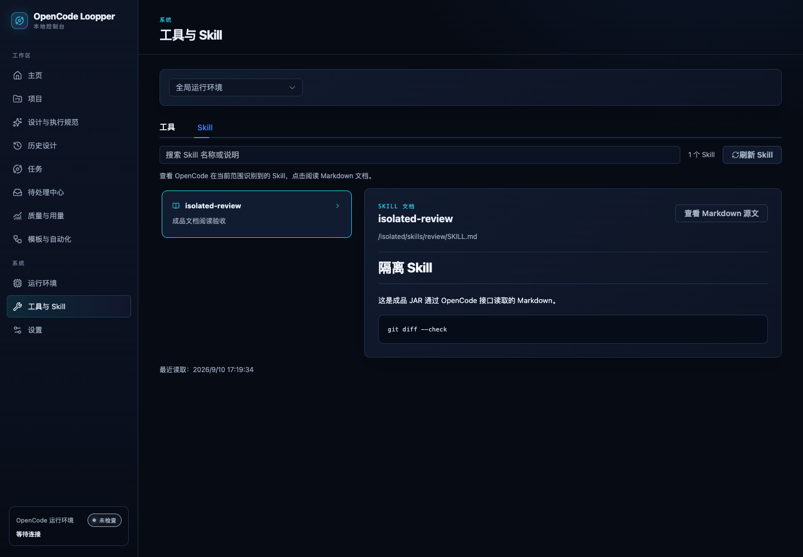
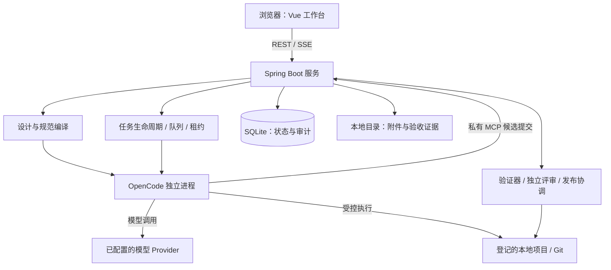

# OpenCode Loopper

[](https://github.com/wangyufengsky/opencode-loopper/actions/workflows/ci.yml)
[](https://github.com/wangyufengsky/opencode-loopper/releases/latest)
[](pom.xml)
[](LICENSE)

**把需求、设计、代码执行、验收和交付，放进一个可追溯的本地 AI 编程工作台。**

OpenCode Loopper 在本机运行，以你已有的项目目录、Git 仓库和 OpenCode 为基础。你用自然语言描述目标，在界面中确认设计和执行范围；Loopper 将它编译为分阶段规范，调度 OpenCode 实施，再用可运行的验证规则和独立评审检查结果。遇到问题，可以查看证据、回答问题、继续修正或从保留的基线恢复。

> 当前版本：`0.4.7`。默认访问 **http://127.0.0.1:8080/**，打开即进入主页。面向单机本地使用，不是多租户远程执行平台。


*实际应用截图。主页采用与工作台一致的深色界面，配合生成的轨道主题插画，提供设计、项目、任务、工具等入口；图中页面布局适用于本版本。*

[下载最新版本](https://github.com/wangyufengsky/opencode-loopper/releases/latest) · [快速开始](#快速开始) · [首次任务手册](#首次任务手册) · [配置与运维](docs/operations.md) · [问题反馈](https://github.com/wangyufengsky/opencode-loopper/issues)

## 目录

- [它能帮助你做什么](#它能帮助你做什么)
- [界面导览](#界面导览)
- [快速开始](#快速开始)
- [首次任务手册](#首次任务手册)
- [日常使用手册](#日常使用手册)
- [设计规范与验收](#设计规范与验收)
- [技术栈与系统结构](#技术栈与系统结构)
- [配置安全与数据](#配置安全与数据)
- [开发与验证](#开发与验证)
- [常见问题](#常见问题)
- [文档索引与许可](#文档索引与许可)

## 它能帮助你做什么

当你希望 AI 修改本地项目，同时需要清楚知道“准备改哪里、由什么证明完成、失败后如何继续”时，可以使用 Loopper。

| 你的目标 | Loopper 提供的工作方式 |
| --- | --- |
| 给现有项目增加功能或修复问题 | 讨论需求，确认阶段、负责路径与验收条件，再开始执行 |
| 把较大的改动分批推进 | 显式启用大型任务，逐包设计、人工确认和执行，依据上一包真实结果规划下一包 |
| 知道 AI 当前在做什么 | 查看阶段、尝试、会话输出、工具活动、Todo 和实际用量 |
| 避免把“模型说完成”当成完成 | 运行确定性验证，并由需求评审员与风险评审员独立检查同一批证据 |
| 处理失败、等待或中断 | 在待处理中心回答问题，查看停止原因，继续当前任务或派生恢复任务 |
| 检查本地 AI 的能力 | 浏览 MCP 工具以及当前 OpenCode 发现的 Skill，打开 Markdown 文档 |
| 重复执行已确认的流程 | 选择内置模板任务，填写项目、分支和日期后手动执行 |

它也支持只读代码评审，以及具有明确文件、结构或数据断言的文档和数据任务。实际可执行范围取决于项目、OpenCode、模型与本机工具链；模型 Provider 的认证和费用由你使用的 OpenCode 配置决定。


设计确认、执行成功和 Git 发布是不同步骤。新建任务先等待开始，不会仅因确认设计就占用项目目录或启动代码修改。

## 界面导览

| 页面 | 主要用途 | 建议何时使用 |
| --- | --- | --- |
| **主页** `/` | 统一入口与工作流程导航 | 启动后从这里进入对应工作区 |
| **项目** `/projects` | 登记本地目录、查看技术栈、预览与应用项目公约 | 第一次接入项目，或项目结构变化后 |
| **设计与执行规范** `/designer` | 描述需求、添加附件、确认任务设置与分阶段设计 | 开始一项新工作 |
| **历史设计** `/designs` | 查阅已确认的设计上下文 | 回看设计依据 |
| **任务** `/tasks` | 开始执行、查看进度、验证与评审、处理结果 | 设计确认后及执行过程中 |
| **待处理中心** `/inbox` | 集中处理问题、权限和需要人工决定的阻断 | 任务等待你的输入时 |
| **质量与用量** `/insights` | 查看质量、执行与用量统计 | 回顾任务效果和消耗 |
| **模板任务** `/template-tasks` | 代码审查、项目贡献排名与个人周报 | 需要重复运行报告任务时 |
| **运行环境** `/runtime` | 查看 Loopper/OpenCode 版本、连接与受管进程状态 | 首次启动或连接异常时 |
| **工具与 Skill** `/tools` | 在“工具”和“Skill”之间切换 | 检查可用工具和技能文档 |
| **设置** `/settings` | 配置模型、执行上限、重试及发布网络 | 按项目调整运行参数 |

### 工具与 Skill

“工具”标签展示 MCP 服务及其工具说明；“Skill”标签展示当前 OpenCode 发现的技能。选择项目后可以按名称或说明搜索，点击条目打开文档，并在 **预览 / Markdown 源文** 之间切换。



*实际页面截图，来自独立验收环境中的示例 Skill。你看到的列表由本机 OpenCode 和所选项目决定。*

Skill 正文按需加载，来自 OpenCode 返回的文档内容；原文件的 frontmatter 是否包含在正文中取决于 OpenCode 的响应。浏览文档不会执行该 Skill，也不会把文档中的指令自动应用到当前项目。连接失败或接口不可用时，页面会显示原因和重试入口。

## 快速开始

### 1. 准备运行环境

| 依赖 | 要求 | 用途 |
| --- | --- | --- |
| Java | JDK 21 | 运行完整 JAR |
| Git | 可从终端调用；模板任务需要 2.40+ | 项目分支、差异与发布 |
| OpenCode CLI | 已安装并完成模型认证 | 实际模型会话与工具执行；当前集成依据 1.18.x 接口验证 |
| Chrome / Chromium | 使用浏览器验收时安装 | `BROWSER` 验证器 |

运行 Release JAR **不需要 Maven、Node.js 或 npm**。前端已打包进 JAR，SQLite 无需独立安装。默认发行包不包含 JDK，也不包含模型服务或模型额度。

先在终端检查 `java -version`、`git --version` 和 `opencode --version`。请先完成 OpenCode 自身的 Provider 配置，确保所选模型能在你的环境中使用。

### 2. 下载并校验

从 [GitHub Releases](https://github.com/wangyufengsky/opencode-loopper/releases/latest) 下载以下文件，将 JAR 和所需启动脚本放在同一个目录：

| 文件 | 内容 |
| --- | --- |
| `opencode-loopper-0.4.7.jar` | 后端、前端页面与 SQLite JDBC |
| `start-linux.sh` | Linux 启动脚本 |
| `start-windows.bat` | Windows 启动脚本 |
| `SHA256SUMS` | JAR 与两个脚本的 SHA-256 |

如果下载了清单中的全部三个文件，Linux 可运行 `sha256sum -c SHA256SUMS`，macOS 可运行 `shasum -a 256 -c SHA256SUMS`。只下载部分文件时，对应缺失项会报错；请逐一比对已下载文件的哈希。Windows PowerShell 可运行：

```powershell
Get-FileHash .\opencode-loopper-0.4.7.jar -Algorithm SHA256
Get-Content .\SHA256SUMS
```

### 3. 启动

**Linux**：脚本默认寻找 `/opt/jdk-21`；JDK 位于其他目录时，显式设置 `LOOPPER_JAVA_HOME`。

```bash
export LOOPPER_JAVA_HOME=/你的/JDK21/目录
chmod +x start-linux.sh
./start-linux.sh
```

**Windows PowerShell**：准备好 `JAVA_HOME` 或 `PATH` 中的 JDK 21，然后运行：

```powershell
.\start-windows.bat
```

也可以在资源管理器双击该脚本。需要明确指定 JDK 时，在运行前设置 `$env:LOOPPER_JAVA_HOME = 'C:\你的\JDK21目录'`。

**macOS，或直接运行 JAR**：在 `java` 指向 JDK 21 的终端执行：

```bash
java -jar opencode-loopper-0.4.7.jar
```

启动后访问 **http://127.0.0.1:8080/**。默认使用 `managed` 模式，由 Loopper 启动一个独立 OpenCode 子进程，不需要你预先运行 `opencode serve`。已有外部 OpenCode 的连接方法见 [运行模式与启动配置](docs/operations.md#opencode-运行模式)。

默认数据目录是 `./data`。建议在首次正式使用前设置一个固定的 `LOOPPER_DATA_DIR`，并保持启动位置和配置稳定，避免误以为历史数据丢失。内置 JDK 的六平台压缩包仅按需手动生成，不属于默认 Release 资产。

## 首次任务手册

下面以“给已有项目添加健康检查接口，并补充测试”为例。

### 1. 确认连接与模型

进入 **运行环境**，确认 Loopper 版本、OpenCode 连接和内部 MCP 就绪状态。进入 **设置** 检查模型；如果刚调整 Provider 配置，刷新模型列表后再选择。

Loopper 与模型服务分别配置：Loopper 能启动，不代表模型已认证；OpenCode 健康，也不代表某个 Provider 调用一定成功。

### 2. 登记本地项目

进入 **项目**，选择或输入真实的绝对路径。Loopper 会识别 Git 与项目清单，建立技术栈信息。

- 有可用 Git HEAD 的项目，在登记目录内使用任务分支执行。IDE、OpenCode 和验证器看到同一目录与分支。
- 无可用 Git HEAD 的项目使用直接模式，在原目录修改，并保留用于差异验证的私有基线。
- 登记项目本身不会让 AI 修改业务代码。“AI 更新 Loopper 公约”会先生成预览，确认后才写入受管理的 `AGENTS.md` 区块。

同一项目的写任务通过队列和租约协调。任务执行期间，请勿从 IDE 或终端随意切换它占用的分支。

### 3. 描述目标与验收要求

进入 **设计与执行规范**，选中项目，输入清楚的目标、约束和验证方式，例如：

```text
为当前服务增加 GET /health 接口，返回 JSON：{"status":"ok"}。
沿用现有 Web 框架，不引入新依赖，不修改鉴权规则。
补充接口测试，验证状态码 200、Content-Type 和响应字段。
完成后给出变更说明和实际测试结果。
```

已有接口说明、截图或样例文件可以通过拖放或“添加上下文文件”加入。文件先暂存，需要随非空文字一起发送；发送失败会保留输入。

支持严格 UTF-8 文本与源码、JSON、CSV、PDF、常见图片，以及无宏 DOCX/XLSX/PPTX。每条最多 10 个文件、单文件 20 MiB、每会话累计 50 MiB；超出提取限制的文件会明确拒绝，不会静默截断后冒充完整上下文。

### 4. 检查任务设置与设计

确认识别出的任务类型、主要制品和技术栈。多模块项目存在歧义时，选择对应组件；回答需求讨论中的问题，再检查阶段目标、负责路径和验收条件。

普通软件任务默认一个工作包，包含 1–6 个阶段。只有确实需要分批设计和交付时，才在任务画像冻结前启用 **大型任务**：它采用 2–6 个工作包，每包 1–3 个阶段，并依据前一包完成后的真实事实继续设计。

**全自动模式默认关闭。** 单独授权后可自动推进允许的设计步骤；大型任务仍需要人工确认包设计和开始包执行。执行期权限、异常恢复、结果确认和 Git 发布保留各自的人工边界。

### 5. 确认设计，然后开始执行

确认设计并创建任务后，页面进入任务详情，任务处于 **等待开始**。这时尚未入队、申请工作区租约或切换任务分支。

点击 **开始执行** 才进入正式执行流程。如果源项目有未提交或未跟踪文件，界面会要求先逐文件处理；请核对内容后选择合适的提交、暂存或移除操作。目录准备完成后，Loopper 按依赖顺序执行各阶段。

### 6. 查看证据与处理结果

在任务详情查看当前阶段、尝试记录、会话输出和验证结果。模型 Todo 用于了解实施活动，不能替代阶段或任务的真实完成状态。

确定性验证通过后，需求评审员与风险评审员独立检查同一批冻结证据。自动通过要求两者都明确通过。任务完成执行后仍需你检查结果，并选择发布、继续优化或其他可用动作。

如果验证失败，先查看失败命令和输出。如果页面等待问题或权限，去 **待处理中心** 处理；如果无法安全继续，使用页面提供的恢复动作。不要仅因等待较久就另外启动一个可能写入同一项目的会话。

## 日常使用手册

### 查看与恢复任务

任务详情保留阶段、每次尝试、OpenCode 会话、验证器结果、评审与状态变迁。正文和较大的证据按需展开，方便先判断当前状态，再定位原因。

| 看到的情况 | 建议操作 |
| --- | --- |
| 等待开始 | 核对设计与项目后，点击开始执行 |
| 等待问题或权限 | 阅读具体请求，在待处理中心或任务页面回答 |
| 验证失败但可继续 | 查看失败证据，按页面动作继续当前任务 |
| 需要继承已有修改 | 派生恢复任务，核对继承内容，再单独开始 |
| 需要从基线重做 | 使用对应恢复方式，核对新任务范围与基线 |
| 停止尚未确认 | 查看运行环境和停止原因，等待或重试明确的停止动作 |
| 执行成功，等待处理 | 查看差异、测试和双评审，决定发布或继续优化 |

恢复任务不会因为创建就立即执行。远端会话是否已停止必须有证明；状态未知时保留阻断与租约，避免两个写入者重叠。归档用于整理列表，不等于删除源码、分支或证据。

### 提交与发布代码

对于 Git 任务，确认结果后进入发布流程，核对变更和工单信息。系统可在任务分支生成本地提交，有远端时按流程普通推送；没有远端时可保留本地提交。

PR/MR 入口可打开预填的托管平台页面，最终创建或合并仍由相应确认流程完成。执行阶段的 OpenCode 权限不会因为设计已确认就自动扩大为提交、推送或发布权限。分支恢复和工作区交接由服务端协调，请按界面状态操作。

### 模板任务

模板任务是项目内置、可反复手动执行的公共任务。首批提供代码审查和项目人员贡献周报。项目、分支使用可搜索下拉框，默认主分支；日期使用日期选择框，默认最近七天，统一北京时间，包含起止当天。结束日期不能早于开始日期。

模板采集要求 Git 2.40+，以便在独立 bare 快照中按提交读取文件属性，而不依赖原目录的 index 或未提交文件；对应能力见 [Git 2.40 的 check-attr 文档](https://git-scm.com/docs/git-check-attr/2.40.0)。

点击“开始执行”后，系统在独立目录同步并冻结 Git 证据，分批分析、生成 Markdown 报告，再进行独立双评审。代码审查输出一个报告；贡献周报输出总报告、每人的个人报告和内置评分排名。评分标准、原始量、去噪依据及等级理由随报告保留，详情页可预览和下载。可以选填故事统计配置，只有实际分析会话计入执行者 AI 工作量。

旧模板编辑和自动化触发已停用，历史记录保留。当前只支持手动发起。执行、恢复和评分的精确定义见 [功能合同](docs/seven-feature-contract.md)。

### 观察用量与质量

质量与用量页面及任务详情显示服务端已取得的 Token、会话和质量数据。未取得的用量或成本应视为未知；界面不会用占位零值证明“没有消耗”。成本取决于 Provider 提供的信息及定价配置，不能以页面统计代替 Provider 账单。

## 设计规范与验收

LoopSpec 是 Loopper 的可执行任务合同，描述目标、阶段依赖、交付物、路径范围、模型与重试限制，以及验证规则。普通用户可以通过设计界面形成它，不需要手写内部记录 ID 或协议 JSON。新规范使用 v2，历史规范按冻结版本恢复。

| 验证类型 | 能检查什么 |
| --- | --- |
| `PROCESS` | 指定命令的实际执行结果，例如聚焦测试或构建 |
| `FILE_EXISTS` / `FILE_NOT_EXISTS` | 文件存在提示，以及禁止文件是否不存在；两者的阻断语义不同 |
| `GIT_DIFF` | 实际变更与允许路径、删除保护是否一致 |
| `HTTP_STATUS` / `JSON_PATH` | 本机 HTTP 响应状态与 JSON 内容 |
| `FILE_CONTENT` / `FILE_HASH` | 文件内容或摘要是否符合预期 |
| `JUNIT_XML` | 测试报告中的真实用例与失败信息 |
| `BROWSER` | 页面交互与浏览器证据 |
| `DATABASE_QUERY` | 受控的 SQLite 查询结果 |
| `DOCUMENT_STRUCTURE` | 文档结构与所需内容 |
| `TABULAR_DATA` | 表格或数据交付的断言 |

构建成功、文件存在或模型报告完成，都不单独证明业务目标已实现。Java 生产代码变更保持聚焦测试要求；文档和数据任务使用适合制品的断言，不机械套用软件测试流程。验收、Recovery、权限与自动化的精确定义见 [功能合同](docs/seven-feature-contract.md)。

## 技术栈与系统结构

Loopper 使用单个 Spring Boot 应用提供 API、事件流、MCP 接口和 Vue 静态页面。OpenCode 是独立进程，负责模型会话与工具执行；Loopper 负责合同、生命周期、执行协调和证据。



| 层次 | 主要技术 | 作用 |
| --- | --- | --- |
| 后端 | Java 21、Spring Boot 4.1.0 | API、调度、生命周期与本地运行时 |
| 持久化 | MyBatis Starter 4.0.0、SQLite JDBC 3.47.1.0、Flyway 12.0.0 | SQL 映射、WAL 数据库与版本化迁移 |
| AI / 协议 | OpenCode HTTP、MCP、Spring AI 2.0.0 | 角色会话、工具接入与结构化候选 |
| 前端 | Vue 3.5、TypeScript 5.7、Vite 6.4、Pinia 3 | SPA、类型约束、构建与状态管理 |
| 界面与文档 | Element Plus 2.14、Iconify/Lucide、ECharts 5、Mermaid 11、DOMPurify | 组件、图标、图表与安全 Markdown 展示 |
| 文档处理 | Apache POI 5.5、PDFBox 3、CommonMark、Commons CSV | Office、PDF、Markdown 与表格内容处理 |
| 行为验证 | JUnit、Vitest、Playwright、Chrome/Chromium | 后端、组件与浏览器测试 |
| 构建与发布 | Maven Wrapper、固定 Node 22.14.0 / npm 10.9.2、GitHub Actions | 完整 JAR、三平台 CI 与校验清单 |

具体依赖版本以 [pom.xml](pom.xml) 与 [前端锁文件](frontend/package-lock.json) 为准。源码主要分布在 `src/main/java/io/opencode/loopper/`、`frontend/src/`，数据库迁移位于 `src/main/resources/db/migration/`。

服务端决定状态、权限、规范编译和最终接受；模型候选、MCP 调用成功、浏览器展示和 Todo 不产生业务成功事实。更深入的职责与事务边界见 [架构合同](docs/architecture.md) 和 [代码设计合同](docs/code-design-contract.md)。

## 配置安全与数据

常见配置可在 **设置** 中调整，页面标明立即生效、下一次会话/任务生效或重启生效。保存配置不会自动重启服务。启动配置优先级为 **显式环境变量 → 页面保存值 → 脚本默认值**。

| 环境变量 | 用途 |
| --- | --- |
| `LOOPPER_DATA_DIR` | 指定固定的数据与证据目录 |
| `SERVER_PORT` | 修改本机 HTTP 端口，默认 8080 |
| `LOOPPER_OPENCODE_MODE` | 默认 `managed`；`http` 连接已有实例；`auto` 为兼容复用/启动模式 |
| `OPENCODE_EXECUTABLE` | OpenCode 可执行文件的明确路径 |
| `OPENCODE_BASE_URL` | `http/auto` 模式的 loopback 地址 |
| `OPENCODE_MODEL` | 可选的 `provider/model` 默认模型 |
| `LOOPPER_CHROME_EXECUTABLE` | 浏览器验证使用的 Chrome/Chromium 路径 |
| `LOOPPER_OPEN_BROWSER` | 控制启动脚本是否自动打开浏览器 |

完整变量、Basic Auth、发布网络和各平台启动差异见 [配置与运维手册](docs/operations.md)。

- **网络**：Loopper、OpenCode 控制接口与验证器网络保持 loopback。模型 Provider 仍可能通过外网接收提示与项目上下文；本地运行不等于模型离线运行。
- **文件**：执行路径检查真实目录边界和符号链接。进程使用参数数组启动，不进行 shell 插值，但这不是操作系统沙箱。
- **凭据**：密码与 MCP Token 通过环境或内存使用，不应写入数据库、日志或交付证据。
- **备份**：先正常停止 Loopper，再整体复制 `LOOPPER_DATA_DIR`，包含 SQLite 及相关文件、附件与证据。登记的源项目需要单独备份，并保留可用的路径和 Git 历史。
- **升级**：先校验下载资产，备份数据与项目，再由操作者停止旧实例并启动新 JAR。数据库按 Flyway 迁移；不要手改历史迁移或通过修改 SQLite 绕过恢复状态。

## 开发与验证

从源码构建需要 JDK 21、Git、Python 3.12+，以及可访问的 Maven/npm 依赖仓库或完整缓存。Python 用于离线打包回归，macOS/Linux 使用 `python3`，Windows 使用 `python`；运行已下载的 JAR 不需要它。Maven 会准备固定的前端构建工具链。

```bash
git clone https://github.com/wangyufengsky/opencode-loopper.git
cd opencode-loopper
./mvnw clean verify
java -jar target/opencode-loopper-0.4.7.jar
```

Windows PowerShell 将 Maven 命令替换为 `.\mvnw.cmd clean verify`。完整构建将前端静态资源装入 JAR，开发 profile 的输出不能当成成品交付。

需要前后端热开发时，先准备本机 npm，再使用 macOS/Linux 的 `./scripts/dev.sh` 或 Windows 的 `.\scripts\dev.ps1`。IntelliJ IDEA 可选择仓库提供的 **Loopper Full Stack** 运行配置。

提交前的正式门禁为：

```bash
./scripts/verify.sh
```

该门禁检查项目文档与版本引用，运行 Java 测试、前端类型检查与 Vitest，构建 Vue，并生成完整 JAR。路由和交互的浏览器端到端测试按变更影响另行执行，不能把单元测试或模拟服务通过当成真实 Provider 验收。

GitHub CI 在 Linux、macOS、Windows 上构建验证。与 Maven 版本一致的新 `v<version>` 标签触发 Release，重新构建并上传 JAR、两个启动脚本和 `SHA256SUMS`。正式标签不能移动或复用。开发约定、聚焦测试、版本同步和可选平台包详见 [开发与交付](docs/development.md)。

## 常见问题

**运行 JAR 后没有模型可选？** 先检查 OpenCode 的 Provider 认证与模型配置，再检查运行环境连接，最后刷新模型列表。Loopper 不附带模型账户。

**已经有 OpenCode 服务，还会启动一个吗？** 默认 `managed` 会启动独立实例。要复用已有服务，显式使用 `http` 并指定 loopback 地址和相应认证；Loopper 不会停止这个外部实例。

**Skill 列表为空或加载失败？** 确认 OpenCode 已发现对应技能，检查所选项目与连接状态。如果外部 OpenCode 不支持 `/skill` 接口，需先调整其兼容版本。空列表不表示本机其他应用的技能也不存在。

**任务已创建，为什么没有执行？** 创建后先等待开始。点击开始执行才进入队列并准备目录；如有未提交文件或权限问题，先处理页面显示的阻断。

**测试通过，为什么仍等待处理？** 确定性验证、需求与风险双评审、人工结果处置是不同步骤。请检查当前等待原因，不要只看某条历史成功日志。

**换了 JAR，页面看起来还是旧版？** 先在运行环境确认活动后端返回的 Loopper 版本，再核对实际启动路径和端口。新文件存在或刷新浏览器不能证明旧 JVM 已被替换。

**浏览器验收提示找不到 Chrome？** 安装本机 Chrome/Chromium，必要时设置 `LOOPPER_CHROME_EXECUTABLE`。JAR 不捆绑浏览器。

**能否在内网使用？** 可以运行已下载并校验的完整 JAR；Git 远端、OpenCode 和模型 Provider 仍需在该环境可达。首次源码构建还需要 Maven/npm 依赖。不要将“无需前端运行时”理解为“不需要模型服务”。

**如何反馈问题？** 在 [Issues](https://github.com/wangyufengsky/opencode-loopper/issues) 提供版本、系统、复现步骤、当前等待原因以及脱敏后的错误或测试输出。不要附带 API Key、密码、MCP Token 或包含敏感项目内容的完整数据库。

## 文档索引与许可

| 文档 | 适合查阅的内容 |
| --- | --- |
| [配置与运维](docs/operations.md) | 环境变量、OpenCode 模式、平台启动、备份与安全 |
| [开发与交付](docs/development.md) | 本地开发、测试、版本、JAR 与可选平台包 |
| [架构合同](docs/architecture.md) | 状态、事务、租约、恢复与发布 |
| [设计合同](docs/design-contract.md) | Designer、人工确认、工作包与 UI 行为 |
| [AI 角色合同](docs/ai-role-contracts.md) | 模型角色职责、候选与权威来源 |
| [OpenCode 合同](docs/opencode-contract.md) | Session、MCP、权限与运行时 |
| [功能合同](docs/seven-feature-contract.md) | 验证器、恢复、人工交互、自动化与洞察 |
| [主页视觉设计](docs/design/home/README.md) | 生图提示、设计参考与落地方式 |
| [交付记录](docs/deliveries/) | 各版本实际测试、产物与已知验证边界 |
| [历史索引](docs/history/README.md) | 旧设计与历史变更，不能替代当前合同 |

项目采用 [Apache License 2.0](LICENSE)。欢迎通过 Issue 描述使用场景、报告问题或讨论改进；贡献代码前请阅读 [开发公约](AGENTS.md)。
