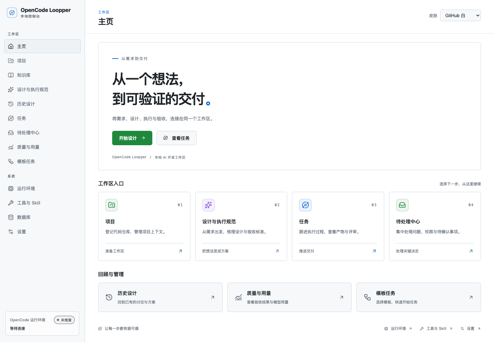
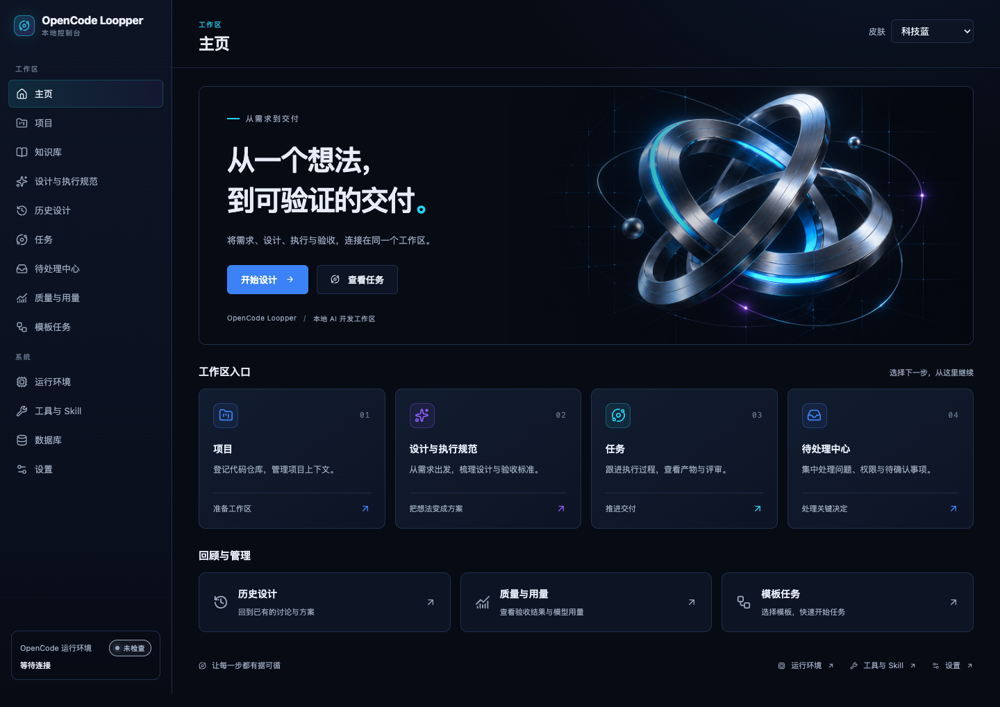

# 0.4.59 可配置皮肤交付

## 范围

按“完整盘点 → 配置机制 → 科技蓝迁移 → GitHub 白 → 回归交付”的顺序实现。改造前逐文件清单与验收目标见[实施计划](../design/skins-plan.md)，接口与新增皮肤方式见[配置说明](../design/skins.md)。

- 集中配置配色、字体、常用圆角、阴影、渐变装饰、按钮状态和首页图片呈现；页面使用变量，新增皮肤只新增配置并注册。配置随应用构建生效，不增加后端配置接口或数据库迁移。
- 保留科技蓝原始色阶与外观，新增 GitHub Primer 风格的 GitHub 白。主页右上角选择，立即全站生效；浏览器保存、刷新/深层链接恢复、同源标签同步、非法值和存储拒绝兜底。
- 主题在应用挂载前恢复，html 全局标记覆盖 body 弹层。CodeMirror 切换保持实例、文档与光标；Mermaid 使用主题快照串行渲染、全局唯一 ID 和过期结果保护。
- 双皮肤视觉验收发现原减少动态效果规则的非零 transition-duration 会干扰 Mermaid 的 SVG 尺寸测量；改为零后消除图形周围的大块空白，并加入真实浏览器回归。
- 同步前端开发规则、设计合同和 README；修正既有 app-shell 测试的过期模板空态文案断言。

## 验证

- 改造前主页 5 项浏览器基线通过，保存 1440/1280/390 宽度截图。
- 类型检查与主题/编辑器/Markdown/主页聚焦回归：4 个文件，19 项通过。覆盖第三套配置、持久化、跨标签、浅色文本对比度、编辑器状态保留、图形重绘与过期结果、安全清理。
- 主题、主页和外壳浏览器回归：15 项全部通过，包括两套皮肤 × 三种宽度、控件、弹层、代码、真实 Mermaid 与减少动态效果。首次失败来自新增夹具的过宽 API 拦截、运行时模板编译，以及过期/不准确的测试断言；失败截图和 trace 保存在证据目录，修正后集中重跑通过。
- 科技蓝 1440/1280 截图与改造前逐像素对比：差异只在新增选择器所在标题栏，其余区域相同。窄屏因新增选择器自然增高，布局无横向溢出。
- 使用当前业务数据只读巡检 13 个实际页面，GitHub 白均生效，无页面脚本错误或横向溢出。
- `./scripts/verify.sh` 完整门禁通过，耗时 16 分 52 秒；Java 2138 项，失败 0、错误 0、跳过 3；前端 80 个文件、517 项全部通过，同时完成固定工具链构建与 Node 工具回归。
- 1734 个源码/构建文件与候选快照哈希一致；JAR 首页含两套主题和首屏初始化，135 个静态资源齐全，浏览器测试夹具未进入产物。
- 正式服务浏览器验证通过：默认科技蓝，GitHub 白切换/刷新保持，已有任务列表与详情、知识库历史可见，切回科技蓝成功；页面脚本错误 0，业务写请求 0。

本次浏览器验证在 macOS 的本机 Chrome 完成，未执行其他浏览器/操作系统验收或真实 Provider 生成调用。皮肤选择仅保存于当前浏览器同源存储，不跨设备同步。

## 产物与运行

- JAR：`target/opencode-loopper-0.4.59.jar`，320059006 字节。
- SHA-256：`3f049d2947697a4bf45380bec81573dffbde6db1795159c2f0522b152e0e0a22`。
- 原目标实例已由 PID 4963 / managed OpenCode 5016 更新；两者退出已验证，未停止其他服务。
- 新 JVM PID：16684；managed OpenCode PID：16740；实际接口版本 `0.4.59`，健康 UP、OpenCode AVAILABLE、内部 MCP CONNECTED。
- 地址：`http://127.0.0.1:53156/`。
- 活动 JAR：`/Users/wangyufeng/IdeaProjects/opencode-loopper/data/test-services/0.4.15-20260912-191210/opencode-loopper-0.4.59.jar`，与交付 JAR 哈希一致。
- 完整数据备份：`/Users/wangyufeng/IdeaProjects/opencode-loopper/data/test-services/0.4.15-20260912-191210/backups/before-0.4.59-20260922-153328/data`。逐文件哈希与符号链接清单校验一致，备份数据库 quick_check 为 ok。
- 更新前后 3 个项目、7 个任务、80 个执行会话、9 个知识会话、14 个知识回合及其他业务表计数一致；任务状态、知识历史哈希、设置与启动覆盖配置保持。
- 构建前旧 JAR/启动器保留于 `data/deliveries/0.4.59/prebuild/`，活动旧 JAR 位于 target 外，未被 clean 清理。
- 详细构建/运行证据：`data/deliveries/0.4.59/`；主题浏览器、只读页面巡检和初始失败证据：`data/deliveries/skins/`。

本次仅本地交付与本地提交，没有推送、标签、Release 或远端部署。

## 正式服务截图

