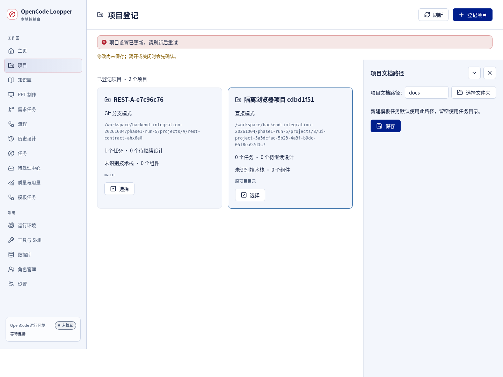
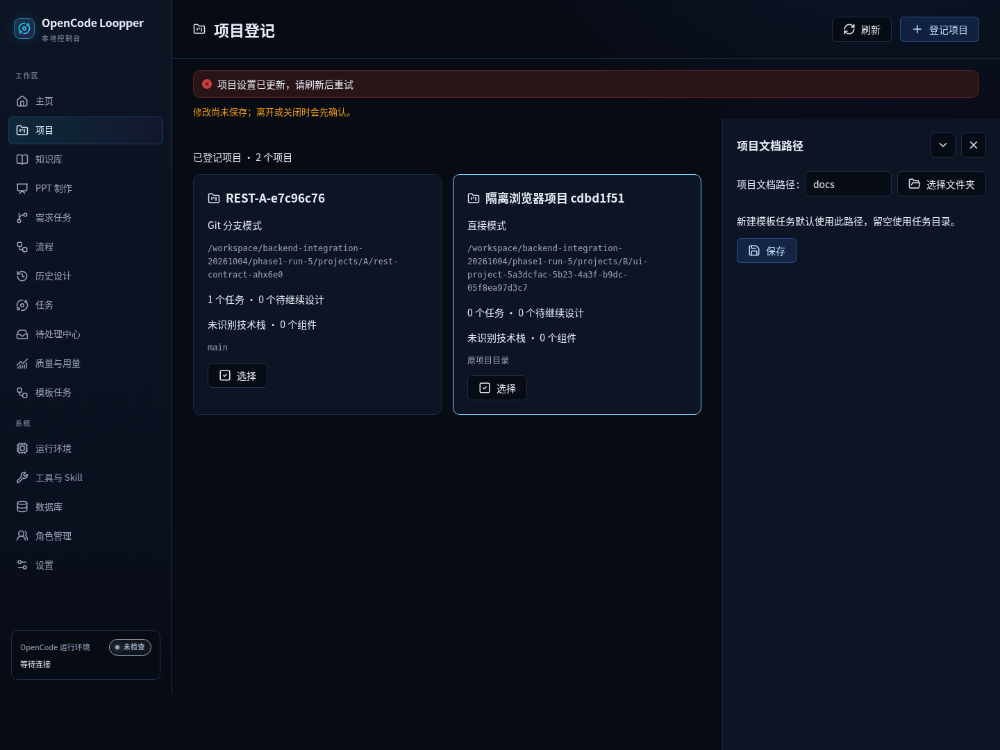
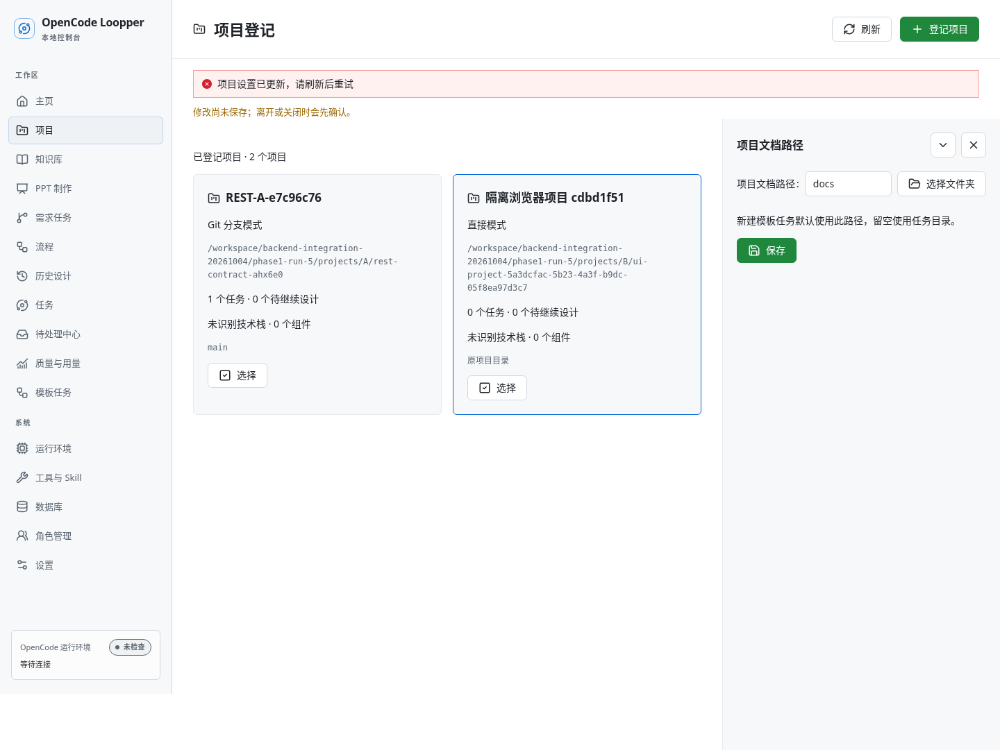
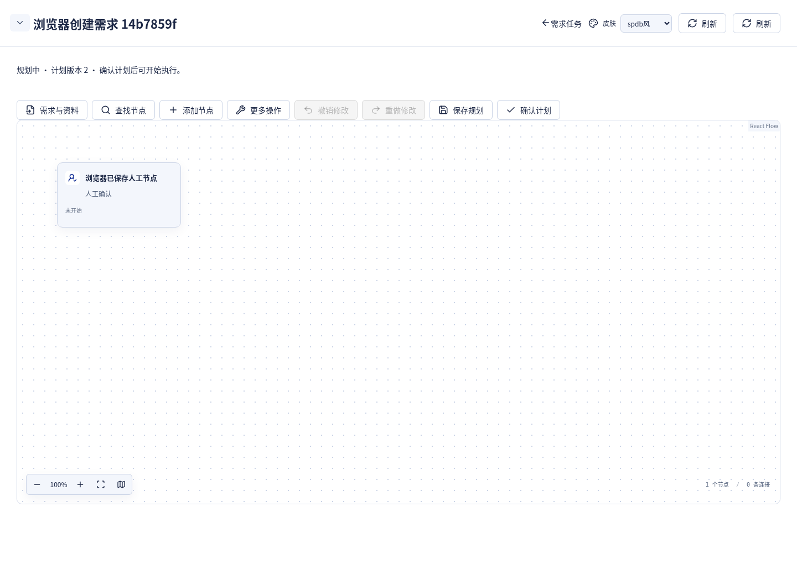
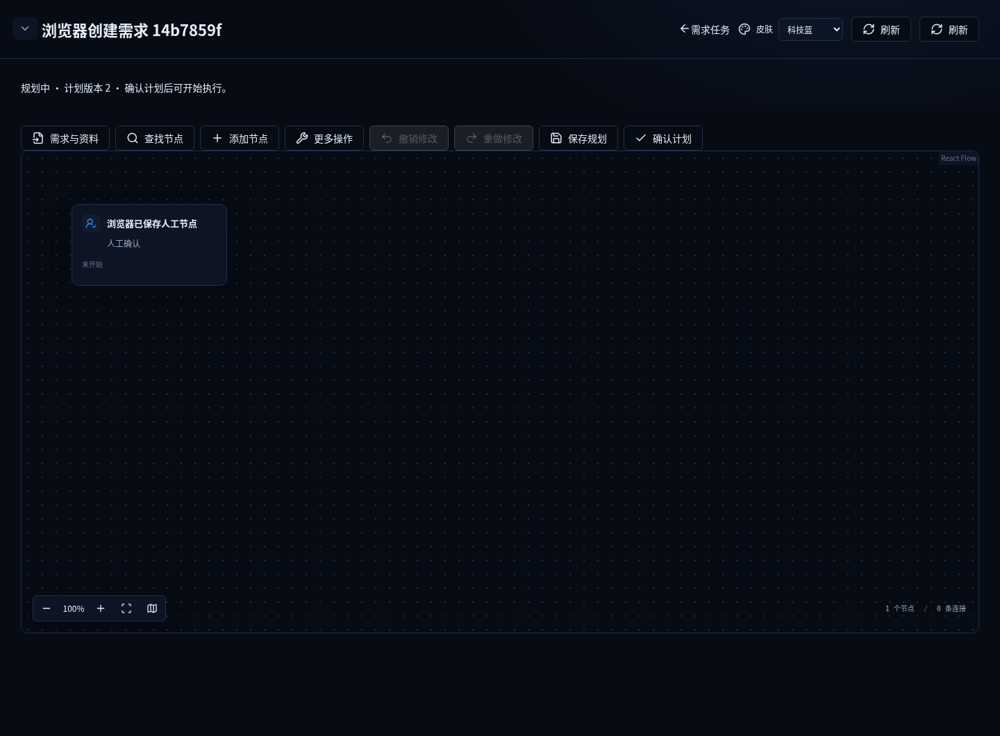
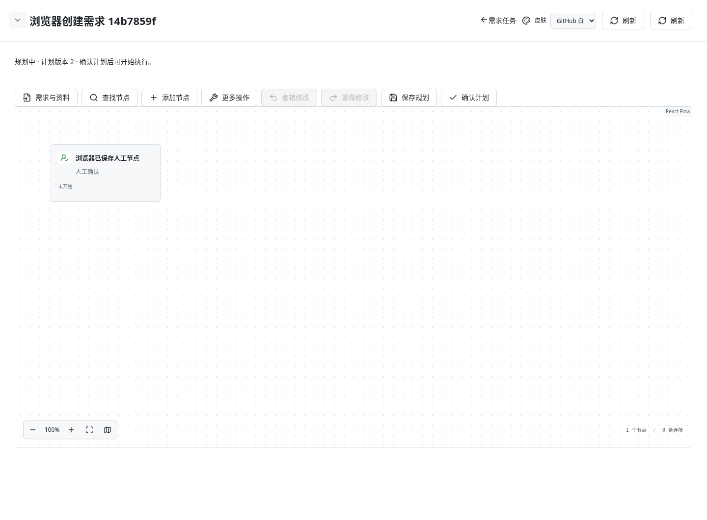
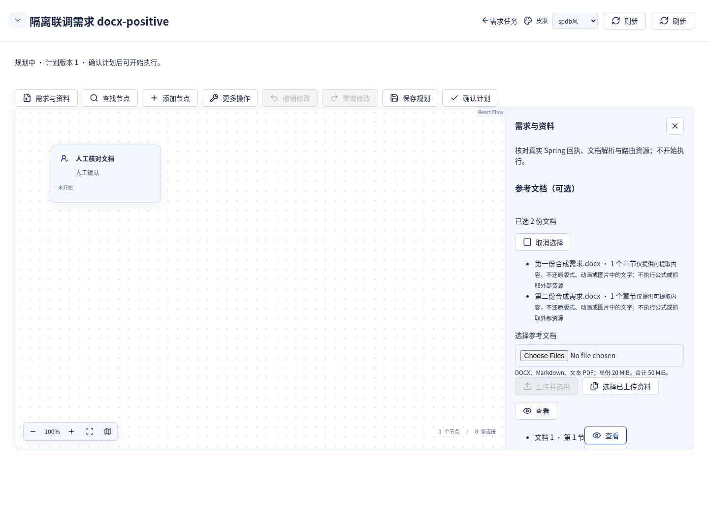
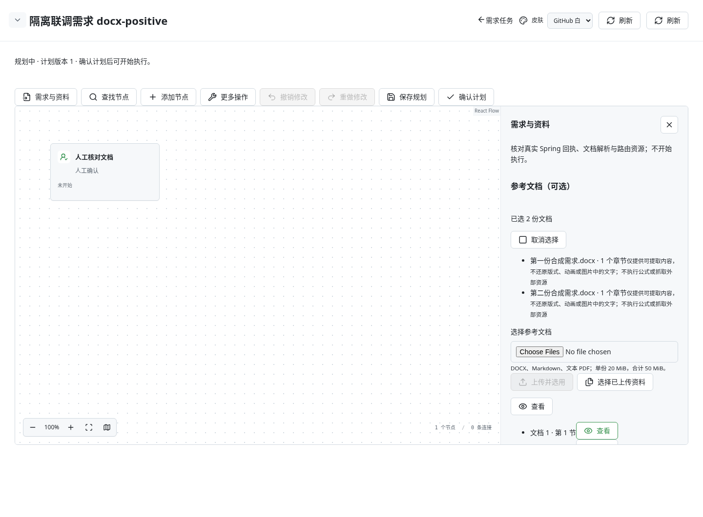
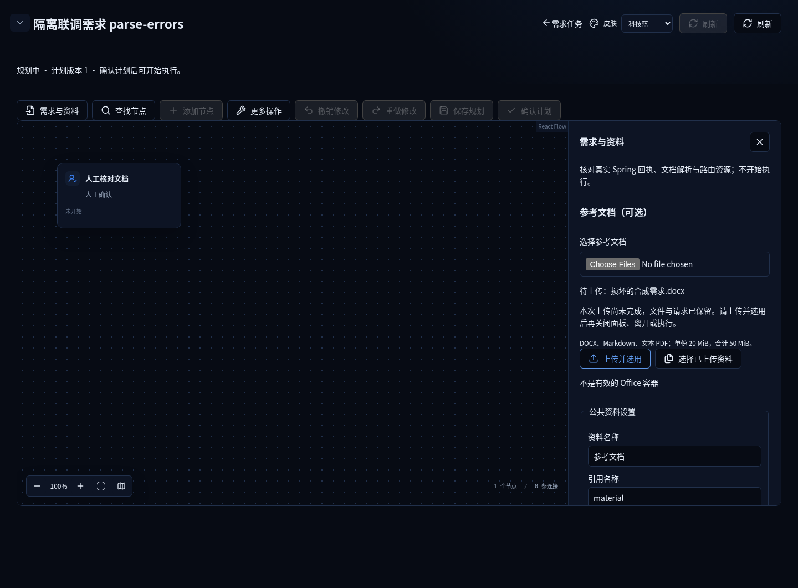
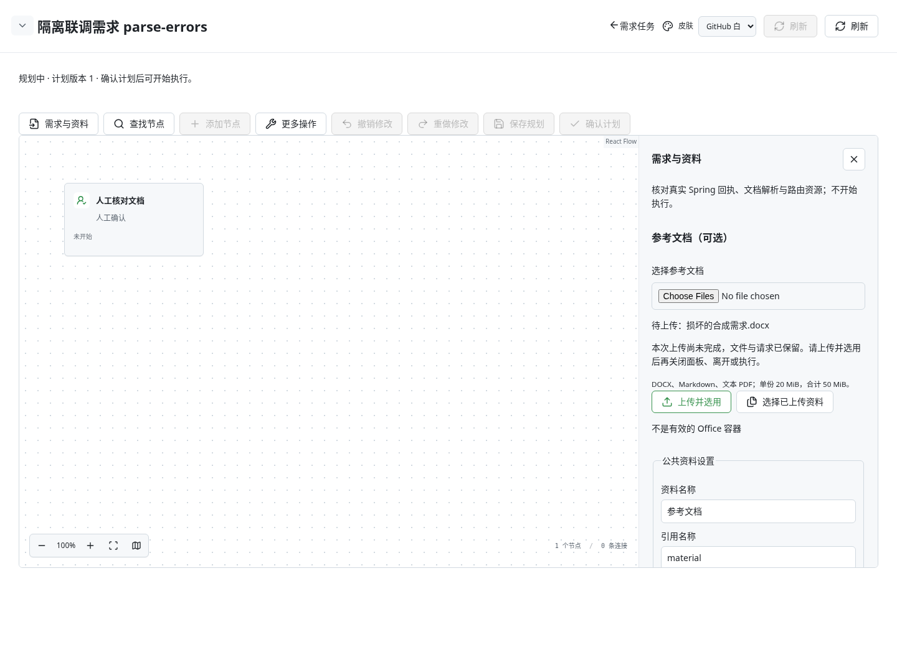

# 真实 React＋Spring 隔离联调截图

以下 12 张 PNG 来自实际 Chromium、生产 React 构建、真实 Spring 0.4.91 和独立 SQLite；业务对象、附件与正文均为**合成模拟数据**，模型为确定性 `fake/model`，不是真实模型结果。没有 API 拦截或 UI mock。冻结测试源码：`60759aeb19dd909a0303139ca44877c920ef2950`。

原 5 项浏览器用例一次执行 **5 PASS、0 FAIL、0 SKIP、0 RETRY**。三套皮肤仅改变外观；截图不单独证明请求身份、文件字节、隐藏的滚动正文、服务端订阅数量或 GC。相关严格断言及首错见 [B 审查](../B-browser-upload.md)，整体结果与未测边界见 [联调报告](../2026-10-04-followup.md)。组员逐张查看全部 12 图，组长另查看三套皮肤的代表状态。仅桌面范围。

## 项目设置：真实 CAS 冲突与草稿保留

| 浦发 | 科技蓝 | GitHub 白 |
| --- | --- | --- |
|  |  |  |

## 需求规划：保存后的人工节点

| 浦发 | 科技蓝 | GitHub 白 |
| --- | --- | --- |
|  |  |  |

## DOCX：真实解析与两份附件的原顺序

| 浦发 | 科技蓝 | GitHub 白 |
| --- | --- | --- |
|  |  |  |

## 损坏 DOCX：权威错误可见，文件仍保留

| 浦发 | 科技蓝 | GitHub 白 |
| --- | --- | --- |
|  |  |  |

同一用例随后显式重新选择有效 DOCX 并成功提交。截图记录的是首次错误状态，没有以成功图覆盖错误；下半部滚动正文未全部入镜，不代表内容完整性证据。
