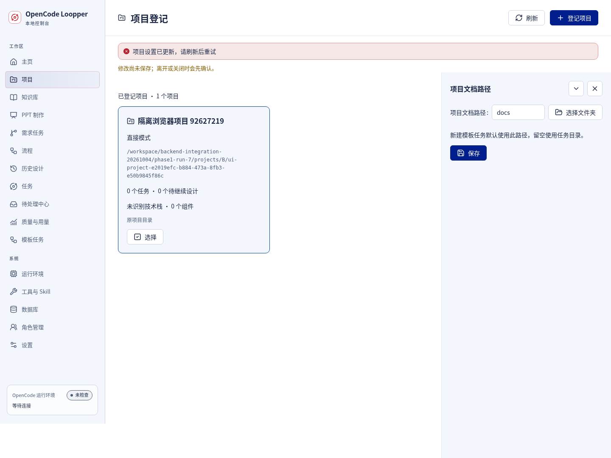
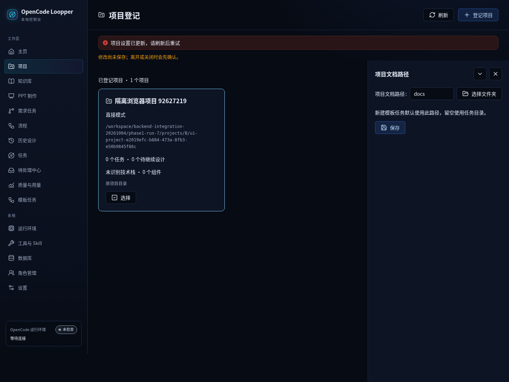
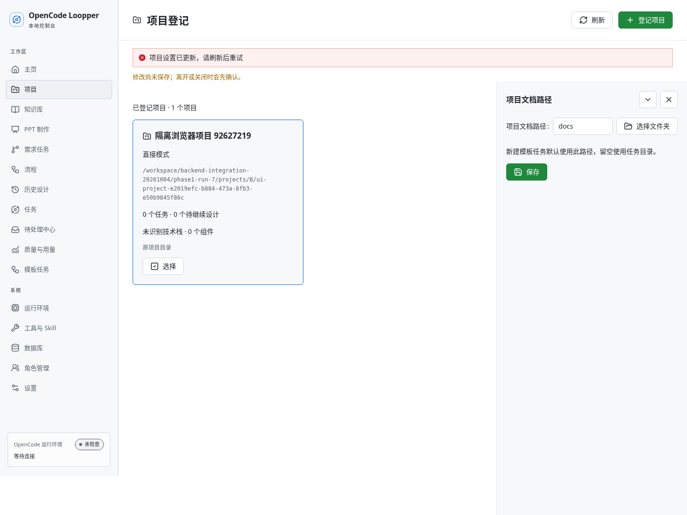
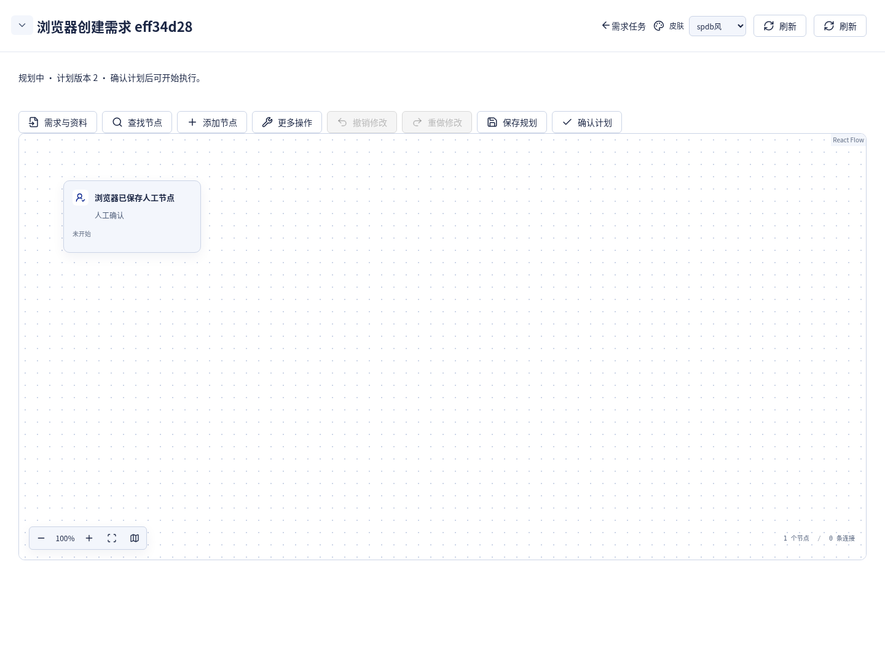
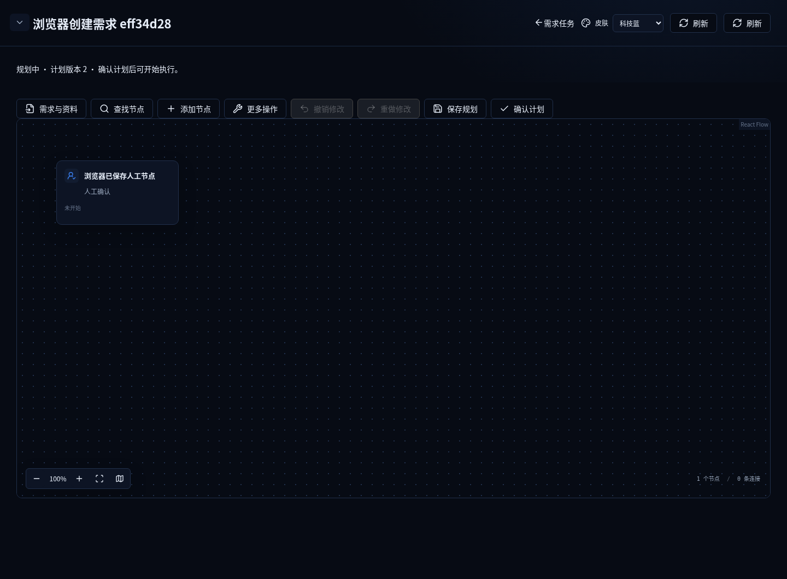
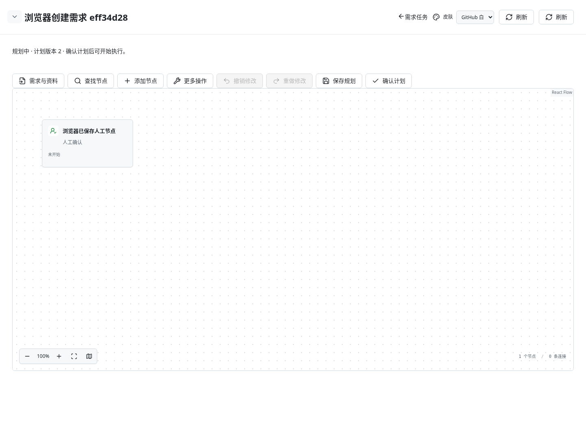
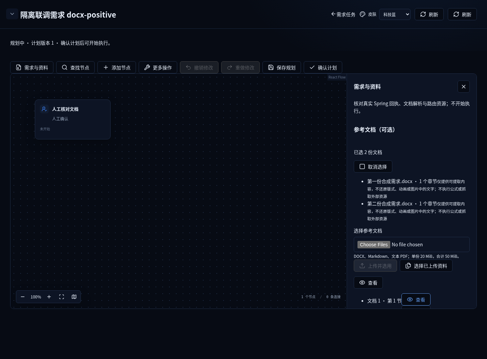
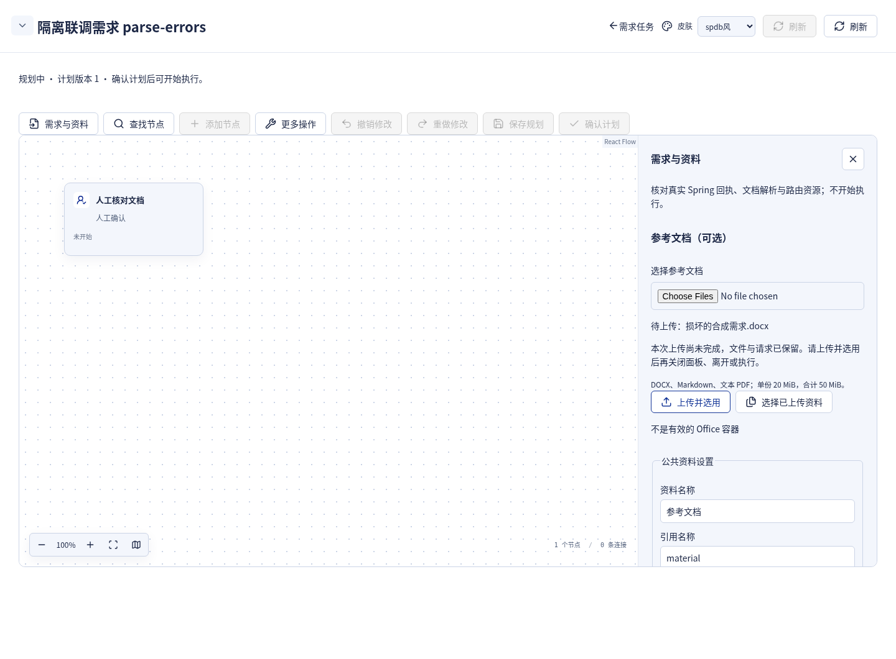

# 修后0.4.92候选：真实React＋Spring联调截图

以下12张PNG来自实际桌面Chromium、生产React构建、真实Spring 0.4.92 classpath与独立SQLite。**业务对象、附件、正文均为合成模拟数据；模型为确定性fake/model，不是真实模型结果。** 无API拦截或mock UI。

冻结版本`bd48f137ec900563b700e60361161e5df70f22fa`，原5生产浏览器一次5 PASS、0 FAIL/SKIP/FLAKY/RETRY。主报告见[本轮完整结果与未测边界](../../2026-10-04-followup16.md)。完整Java/JAR仍未通过，这些截图不代表正式0.4.92 JAR、全后端或真实模型验收。仅桌面范围，原0.4.91的12图仍在[历史索引](../README.md)。

## 项目设置：权威CAS冲突，保留草稿

| 浦发 | 科技蓝 | GitHub白 |
| --- | --- | --- |
|  |  |  |

## 需求规划：显式保存后的人工节点，未开始执行

| 浦发 | 科技蓝 | GitHub白 |
| --- | --- | --- |
|  |  |  |

## DOCX：实际解析，原附件顺序与身份

| 浦发 | 科技蓝 | GitHub白 |
| --- | --- | --- |
|  |  |  |

## 损坏DOCX：错误与File保留，后续显式重选恢复

| 浦发 | 科技蓝 | GitHub白 |
| --- | --- | --- |
|  |  |  |

图片记录实际首次错误状态；原同一测试随后显式选择有效DOCX并成功上传。下半部滚动内容未完全入镜；完整字节、回执、SSE/轮询和资源清理以对应严格断言与raw证据为准。B逐张查看12图，组长另查看三皮肤代表状态。图片不单独证明服务端停止、跨刷新恢复或全部GC对象释放。
