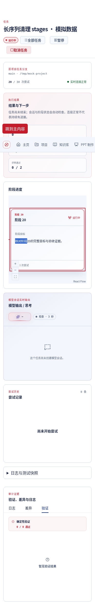
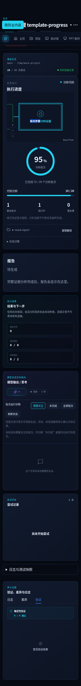
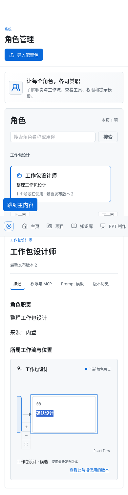

# 锁定 XYFlow 尺寸观察器的清理修复

本轮基于 `5df03685498e7dcd9428dd46da956c69edab8ca7`，只处理同一 renderer 上两个尺寸观察器的最终释放。在 `feat/react-canvas-migration` 本地实施；不改变画布交互、API、DTO、业务命令或订阅所有权，不修原始 11 项历史失败，不发布。

## 根因与证据的边界

`@xyflow/react@12.12.0` 的 [useResizeHandler](https://github.com/xyflow/xyflow/blob/%40xyflow%2Freact%4012.12.0/packages/react/src/hooks/useResizeHandler.ts) 在 setup 创建局部观察器并观察 renderer，cleanup 却重新读取 `domNode.current` 后才调用 `unobserve`。真实 Chromium 的 CDP 断点证明，普通任务实际 SPA 退出时，该 ref 已经为 `null`；setup 与 cleanup 的 observer 身份一致，原目标已从 DOM 断开。因此清理分支确实被跳过，不是仅凭计数推测。

同一 renderer 的第二个观察器来自 `@xyflow/system@0.0.83` 的 [XYPanZoom](https://github.com/xyflow/xyflow/blob/%40xyflow%2Fsystem%400.0.83/packages/system/src/xypanzoom/XYPanZoom.ts)。它缓存视口尺寸；上游刻意不在内部 `destroy()` 中 disconnect，因为 `update({ userSelectionActive: true })` 也调用该函数暂停缩放。React 的 `ZoomPane` 卸载又调用返回实例的 `destroy()`。这两个生命周期原来共用函数，最终卸载也没有释放缓存观察器。只修改 React hook 不能满足严格清零要求。

旧严格探针持有 observer 和 Element 的强引用，能证明有没有显式释放，不能单独证明生产堆泄漏。本轮另用只保留 WeakMap/WeakRef 和数字身份的探针：原版实际退出后，两个 observer 与同一个 detached renderer 仍可解引用；关闭 Debugger、释放远程对象组后，三次 Chromium GC 采样中仍存活。这是可复现的退出后对象证据，**没有取得堆 retaining path，也没有证明无界增长或所有浏览器的 GC 行为**。显式资源清理门槛不依赖 GC 是否及时执行。

原版诊断直接读当前词法 ref，不修改依赖变量或代为清理。见 [CDP／弱引用诊断](../../../frontend/e2e/react-renderer-ro-diagnostic.spec.ts) 及其 [探针](../../../frontend/e2e/fixtures/rendererRODiagnostic.ts)。测试环境里的透明原生观察器包装仅用于取证，不进入产品运行时代码。

补丁后相同诊断的首次退出快照中，两种 owner 都已 disconnect，活动目标均为空。本次三次 GC 采样中，React hook observer 已被回收，detached renderer 和已经 disconnect 的 extent observer 仍存活；因此不能将“原版目标仍存活”直接归因为这两个观察器，也不能宣称本补丁证明所有对象立即被 GC。此修复解决的是已经由 ref 和调用身份直接证实的观察关系释放缺陷。其他堆保留路径没有调查结论，不以 GC 采样取代严格卸载门槛。

## 最小补丁与安装契约

官方 registry tarball 的 SHA-512 均与锁文件 integrity 相同；两个包的 `package.json`、ESM `.js`、ESM `.mjs` 和 UMD/CJS `.js` 均与当时安装内容逐字节一致。官方固定 tag 的 TypeScript 源码与构建产物中的相关逻辑一致。

| 锁定包 | 官方原始 ESM 两入口 SHA-256 | 官方原始 UMD/CJS SHA-256 |
| --- | --- | --- |
| `@xyflow/react@12.12.0` | `f3dbde0ca152903c841ca95fe40360fea3f4cee9589adcfd01d3a9bc08b4c955` | `c418896c3d0cc63498e724df7ed9698532c58523c04d30ebcd3ff7fa0bf3ecff` |
| `@xyflow/system@0.0.83` | `ba3932f6ceab1529c9f3587695b43bdae84e31d356eb153473df5f5c38e6bd5c` | `9b497bee5404b095145a776b23f18cb7649f886a68c7a9c5aedea81eba1f5ac5` |

React hook 的 cleanup 无条件调用 setup 所创建观察器的 `disconnect()`，保留原 window resize 监听移除。system 只把返回实例的最终 `destroy` 包装为原暂停函数加局部 extent observer 的 `disconnect()`；内部选择暂停仍调用原函数，继续观察尺寸，不改变公共签名。React 的 UMD/CJS 包内嵌 system，因此同文件还必须修复这个内嵌副本；独立审查在安装前发现并补齐了这一遗漏。总计六个运行入口、七处小片段，没有整库 fork、全局 ResizeObserver 修补、广播鼠标释放、删除其他实例监听或运行时私有状态修改。

仓库[补丁器](../../../scripts/patch-xyflow-react.mjs)使用 Node 内置模块，不引入新的安装工具。所有目标在写入前统一检查：版本、官方 resolved URL、lock integrity、包元数据哈希、公开运行入口集合、每个入口完整原始／结果 SHA-256、唯一替换位置。未知源码、升级、部分应用或不匹配必须报错；已正确应用可以重复检查。完整的前后片段和哈希见 [React manifest](../../../scripts/patches/xyflow-react-12.12.0-resize-cleanup.json) 和 [system manifest](../../../scripts/patches/xyflow-system-0.0.83-resize-cleanup.json)。写入先暂存全部入口、再次验证原内容，再替换并校验结果；捕获到的失败尝试回滚，不写其他工作区的链接依赖树。脚本不提供跨进程安装锁或进程崩溃时的原子事务保证；不并行操作同一依赖树，异常中断留下的混合状态会被拒绝，须重新干净安装。

`frontend/package.json` 的 `postinstall` 自动应用，`prebuild` 强制校验；锁文件只新增根包 `hasInstallScript`，没有升级依赖。`npm ci --ignore-scripts` 不构成有效安装，未应用的补丁会被 build 前置检查拒绝。升级这两个包时必须重新审查官方源与全部打包入口；不能仅改哈希来跳过拒绝，只有上游已正确释放两种 owner 且全部严格回归通过，才能撤掉相应补丁。

本轮将原 `node_modules` 整体移到仓库外保留，再从空目录执行 `npm ci --no-audit --no-fund --cache /workspace/npm-react-migration-cache`：安装 420 包、postinstall 自动应用全部入口，随后 `patch:check` 通过，重复 `patch:apply` 返回 `changed=false`。独立审查者另行重算六个安装结果哈希，与 manifest 全部一致。没有依赖手工编辑安装目录或现存 Vite 缓存来获得修复。

复现时先停止已有开发服务器，再执行 `npm ci` 并重新启动。`patch:check` 校验安装文件，不代表旧浏览器已经加载的新版本；不要把热改安装目录或沿用旧 Vite 预构建缓存当作验收。这里没有修改网络、代理、凭据或浏览器策略。

机制[专项测试](../../../scripts/tests/xyflow-react-patch.test.mjs)验证不匹配拒绝、所有入口预检、结果哈希、幂等、模拟末入口写入失败后的回滚，以及实际 ESM/CJS 加载；其行为测试不能代替[真实 React Flow 根测试](../../../frontend/src/react/diagrams/ReactFlowResizeCleanup.spec.tsx)和浏览器验收。实际生命周期覆盖 React ESM、React CJS/UMD 及 system ESM；system 独立 UMD 本轮有加载、源码作用域及哈希核查，没有另加实际生命周期测试。

## 独立评审与验收

通过真实 `followup_task` 复用原三名 `gpt-6.1-sol / xhigh`，没有新增或更换组员。`/root/react_flow_workflow` 编写补丁；`/root/react_legacy_canvas` 独立核查真实 React Flow 根卸载、StrictMode、重复挂载、双实例、测量与 system 暂停语义；`/root/react_ppt_canvas` 独立核查真实浏览器退出、ref 与对象身份、观察器及 RAF 归属。Astra 组长核验官方原件、集成、干净重装和最终回归。

独立复核的实际发现与处理：

- legacy 审查者发现 React UMD 内联 system 的遗漏，作者补上同文件第二片段；新增实际 CJS ReactFlow 的 StrictMode 根卸载测试，先验证真实节点、边与观察目标，再验证卸载首快照清零。
- workflow 组员交叉审查测试，指出 StrictMode 退休 observer 的断言可能空跑；现在明确要求两类退休 owner 各存在一个且都已 disconnect，同时当前实例两类 owner 各一个。
- 同一非测试作者还发现 RAF 回调 WeakMap 沿用旧归属。探针改为每次注册重新取得当前实例证据，失效或未知必须纳入严格门槛；不能沿用曾经连接的表格状态排除新帧。

### RAF 与观察器的验收口径

原始 `pendingFrames` 和分配栈完整保留。新增 [CDP 归属探针](../../../frontend/e2e/fixtures/canvasRAFProvenance.ts)只在候选注册处读取真实调用帧的 `syncPosition` 与 Table 实例，核对回调身份、`vnode.el === refs.tableWrapper`、真实 DOM 目标、页面位置和源码摘要。只有本次注册明确属于目的页表格的帧才另记为外部实例；名称相同、过去属于表格或来源未知均不足以排除。画布／未知 RAF 仍严格为 `[]`，没有等待或取消 RAF 来取得清零。

RO 账本与 `observers === []` 断言没有放宽。真实负控会创建本测试的 renderer 与原生 observer，observe 后移除 DOM，在任何 disconnect 之前取快照，必须仍记录 detached target 并阻断门槛；随后只清理本测试自己创建的 observer。未知 RAF、伪装名字及失效的旧表格归属也有负控。CDP 只释放自身断点／会话，不替产品释放任何资源。

### 各类画布的证据范围

| 类别与真实入口 | 手势／资源所有者 | 本轮实际证据与边界 |
| --- | --- | --- |
| WorkflowCanvasReact；流程创建／编辑、需求规划／执行／调整、另存模板预览 | 原应用 Pointer owner；React Flow 持 renderer 与节点测量 RO | 新增实际 workflow React 根 RO 清零；原 Immediate、真实创建页／需求／预览退出与业务合同回归重跑。没有为每个候选、弹窗状态新增独立 RO 浏览器账本。 |
| StageRail → StageDiagram；普通 `/tasks/:id` | 既有只读 viewport owner；两个已修复 renderer RO owner | 实际根普通／StrictMode／三轮、真实路由活动平移三轮、三皮肤窄屏、长流程键盘与测量。首次退出的监听、画布／未知 RAF、capture、RO 均须为空。 |
| TemplateTaskProgressPanel → TemplateStepDiagram；模板 `/tasks/:id` 及阶段详情 | 每个只读 root 自身 owner | 同上；浏览器账本同时包括模板流程与阶段详情的 renderer，不能只清除其中一个。 |
| RoleWorkflowDiagram → RoleDiagram；`/roles` 详情 | 每个只读 root 自身 owner | 同上；保留双实例与文字选择，重复进入不重置资源账本。 |
| PptCanvasView；`/ppt/:id` | 既有 React 自由对象指针、capture、RO；Vue 持命令与订阅 | 原 PPT Immediate 与实际拖动／resize 活动退出各三轮随本轮重跑；生产代码未改。不把 readonly 图结果冒称 PPT 证明；无背景 pinch 的新实现。 |
| MermaidDiagram／MarkdownDocument；旧 Designer 和共享文档宿主页 | React SVG 与安全渲染服务；Vue 懒加载 observer | 原 StrictMode／迟到渲染单测及 Designer 三轮真实退出随本轮重跑。其他宿主页未逐一增加严格卸载 E2E，仍保留此前边界。 |
| PPT 制品图片、历史预览、缩略导航 | 静态图片／按钮；无持续拖拽 owner | 随 PPT 既有回归检查；没有虚构静态图的活动 pan 清理，真实文件解析未验证。 |

更完整的入口和共享 Mermaid 宿主页清单见 [上一轮分类表](README.md#所有画布类别的验收清单)。原业务语义、默认模型归属、幂等／未知回执、草稿冲突、上传恢复和兼容回退保护未在本轮修改；其单测与所选真实 React 浏览器回归仍是本轮门禁的一部分。

### 首次退出的实际指标

最终冻结版本的 14 项只读浏览器全部通过。独立审查者逐项核对了 20 份不可变首快照：三皮肤普通退出 9 份、三类图活动 pan 各三轮共 9 份、触摸退出 2 份。root、会话监听、实例 wheel、capture、活动 RO 目标及画布／未知 RAF 全部为 0。RO 历史账本没有清空，所有已退休 owner 都有实际 disconnect，活动目标仍为 `[]`。

| 活动平移入口 | 第一轮活动 renderer RO | 第二轮 | 第三轮 | 原 `5df03685` 对照 |
| --- | --- | --- | --- | --- |
| 普通任务阶段 | 0 | 0 | 0 | 2 / 4 / 6，失败 |
| 模板流程及阶段详情 | 0 | 0 | 0 | 4 / 8 / 12，失败 |
| 角色流程 | 0 | 0 | 0 | 2 / 4 / 6，失败 |

三轮的根身份分别不同；包括节点测量在内的历史 observer 数依次是阶段／角色 3、6、9，模板 6、12、18，**历史记录增加不等于活跃观察增加**。每轮先证明 105px/20px 真实平移，活动快照至首次退出快照没有额外 move/up/cancel/window blur。触摸剩余单指活动退出同样如此；touchCancel 用例以取消后的快照为基准，没有再发额外清理输入。任务 SSE 只关闭对应旧作用域一次，角色页不关闭全局订阅，无新增 mutation/error。

20 份中有 14 份原始 `pendingFrames` 非空，共 28 个目的页表格帧，全部具有本次注册取得的真实 Table、callback、target、refs、连接状态和源码摘要证据；画布／未知帧为 0。没有把 raw RAF 写成全部为 0，也没有删除表格帧。PPT 两种手势各三轮共 6 份、Designer 三轮共 3 份首快照的对应原始资源全部为 0；未产生迟到保存，也没有关闭无关全局 accounting 订阅。

### 最终冻结版本的执行结果

最终验证使用干净重装后的依赖，Node `24.19.0`、npm `11.9.0`、Debian 13 Chromium `151.0.7922.173`。以下为本次重新执行结果，未沿用修改前的通过数；子集不重复加总。

| 门禁 | 通过 | 失败／跳过 | 范围 |
| --- | --- | --- | --- |
| Chromium 相关整批 | **204 / 204**，49 个文件 | 0 / 0 | Workflow、React、PPT、Designer discussion；8.3 分钟 |
| 上述整批中的原失败只读图专项 | **14 / 14** | 0 / 0 | 原 `5df03685` 的 14 项失败全部转绿 |
| 上述整批中的新诊断及负控 | **4 / 4** | 0 / 0 | 真实 ref／弱引用、未知 RAF、detached RO、失效的旧 Table 归属 |
| 全量 Vitest | **1305 / 1305**，192 个文件 | 0 / 0 | 包含新增 18 项实际 ReactFlow／XYPanZoom 生命周期测试 |
| 类型检查、生产构建 | 均通过 | 无失败 | build 前置补丁校验通过；保留第三方 PURE 注释及大 chunk 警告 |
| tooling | **31 / 31** | 0 / 0 | 包含 24 项补丁机制测试，不另外累加 |
| accounting | **13 / 13** | 0 / 0 | 原统计与语义保护回归 |
| 干净安装与重入 | `npm ci` 安装 420 包；六入口自动应用并核验 | 无失败 | 再次 apply 为 `changed=false` |

当前 Chromium 完整清单是 **304 项、70 个文件**；其余 **100 项、21 个文件本轮未跑**，其中包含此前已独立复现的 **11 项原始基线失败**。它们保持失败记录，不算修复或通过；详细分类仍见[基线验收记录](../../design/react-canvas-validation.md)。本轮没有独立 lint 命令可运行，也未执行 Java／Maven 门禁。

失败过程同样保留：未打补丁的实际根专项为 16 项中 13 失败、3 通过，额外实际 CJS 根用例也失败。首次补丁浏览器批次为 17 项中 11 通过、6 失败（3 项 CDP resume 协议错误、2 项严格快照之后的探针健康输入问题、1 项诊断 data URL 被浏览器策略拒绝）；随后两次探针五项批次均为 4 通过、1 失败，分别定位到未启用账本期间的 CDP 暂停，以及负控过早启用账本纳入新页面资源。限定探针到同一归属窗口、使用已有模拟页面、不修改浏览器策略后，五项批次全部通过，再运行上述最终 204 项。最初扩展 CDP 诊断还因读取已优化消失的词法变量失败，调整取证断点后通过。tooling 首次在默认受限执行中有两个文件组失败；按正常工具权限重跑相同命令后 31 项通过，原输出未提供可进一步认定的底层错误，不把它冒称产品回归或自行改变权限设置。

复现命令（先停止本工作区开发服务器；保留需要保留的旧依赖目录，再执行）：

```sh
cd frontend
npm ci --no-audit --no-fund
npm run patch:check
npm run test:patches
npm test
npm run typecheck
npm run build
npm run test:tooling
npm run test:accounting
PLAYWRIGHT_CHROME_EXECUTABLE=/usr/bin/chromium npm run test:e2e -- 'workflow-|react-|ppt.spec.ts|designer-discussion' --workers=1
```

浏览器命令使用项目既有 Playwright webServer 与模拟 API 夹具；环境中的 Chromium 路径按实际配置提供。CDP 专项只适用于 Chromium，不代表 Firefox、Safari 或实体触屏设备已验证。最终原始日志、逐实例快照、官方原件校验和两份独立审查保存在本 Cloud 的 `/workspace/react-canvas-ro-patch/`，没有加入仓库；补丁、测试源码与本说明足以从锁定安装重做验证。

既有 48 张交付 PNG 全部保持字节不变，其中 React 迁移图片 42 张、前一期图片 6 张；这不是仓库内所有图片的总数。本轮重新拍摄并查看了以下三张 Chromium 实际渲染＋模拟数据的 390px 图片，SHA-256 与仓库已有图片逐张完全相同，因此不重复提交相同图片。既有固定导航和“跳到主内容”的浮层状态保留，没有宣称整页不存在遮挡；当前焦点卡和控制可见。图片不能代替退出清理证据。

| spdb 阶段图 · 模拟数据 | tech-blue 模板图 · 模拟数据 | github-white 角色图 · 模拟数据 |
| --- | --- | --- |
|  |  |  |

真实 Java 后端、模型、文件解析、其他浏览器和实体输入设备不在本次验证范围内。
