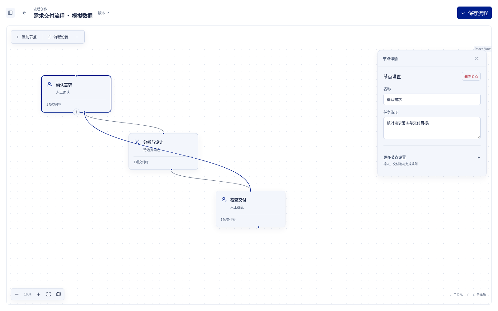
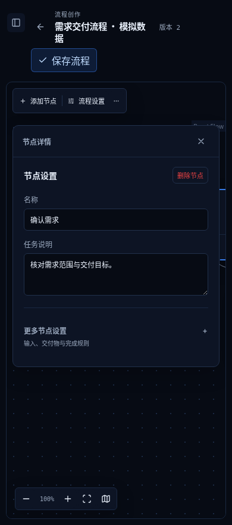

# React 画布迁移：截图与最终验收入口

运行代码与最终依赖补丁基线为 `a6059db4b7cb36d0ca214604e662e5e1097c054c`；本索引只补充查看入口，不改变已验收代码。工作分支为 `feat/react-canvas-migration`，尚未合并主分支。

所有图片均为 **Chromium 实际浏览器截图＋模拟 API 数据**，保留原始 PNG。下方按类别展示代表图，点击可查看原图；三套皮肤、完整 42 张迁移截图及采集基线分别保存在[交叉审查图集](../react-canvas-cross-review/README.md)、[工作流手势图集](../react-canvas-cross-review/README.md#pointer-手势替换后的实际截图)和[只读图图集](../react-canvas-all-cleanup/resize-observer-patch.md)。历史图集中的失败计数属于对应阶段，**当前结论以最终补丁审查为准**。

## 最终结论与验证边界

- [最终依赖补丁与清理审查](../react-canvas-all-cleanup/resize-observer-patch.md)：锁定版本、官方原始完整性及 SHA-256、六入口七处修复、独立复核、严格卸载快照、负控、干净 `npm ci` 复现命令。
- 已通过：**204 项相关 Chromium、1305 项全量单测、类型检查、生产构建、31 项 tooling、13 项 accounting**；原先失败的 14 项只读图退出专项已全部转绿，包含在 204 项内，不重复累加。
- 全站 E2E 共 304 项，其余 **100 项本轮未跑，包含原有 11 项历史失败**；[历史失败清单](../react-canvas-cross-review/known-baseline-failures.md)保持独立记录。真实后端、模型、文件解析、其他浏览器及实体输入设备未验证，不能称全站全绿。
- 观察关系已释放，不等于所有堆对象已回收：GC 采样中已断开的 extent observer 与 renderer 仍存活，其他保留路径没有调查结论。原始目的页表格 RAF 按实际实例归属保留，没有删除其他组件资源。
- [所有画布入口与共享 Mermaid 覆盖](../react-canvas-cross-review/README.md#完整入口与真实渲染链)、[迁移边界和回退条件](../../design/react-canvas-migration.md)。Vue 仍持有路由与业务命令，当前交付不代表全站已替换为 React。

## 三皮肤：流程创作默认画布与选中节点

| 皮肤 | 默认画布 · 模拟数据 | 选中节点 · 模拟数据 |
| --- | --- | --- |
| spdb |  |  |
| tech-blue |  |  |
| github-white |  |  |

以上为交叉审查阶段保留的视觉图。后续工作流原生手势已改为实例 Pointer Events；最新手势状态见下面两图，不能从静态图片推断生命周期清理。

| 当前工作流桌面连接 · spdb · 模拟数据 | 当前工作流 390px 拖动 · tech-blue · 模拟数据 |
| --- | --- |
|  |  |

## 所有画布类别的代表状态

| 类别与入口 | 实际截图 · 模拟数据 |
| --- | --- |
| 新建空白画布 `/workflows/new` |  |
| 需求规划 `/requirements/:id` |  |
| 需求执行 `/requirements/:id` |  |
| 内置流程只读预览 |  |
| 候选计划预览 |  |
| 另存模板预览 · 390px |  |
| 普通任务阶段 `/tasks/:id` · 390px |  |
| 模板步骤及阶段详情 `/tasks/:id` · 390px |  |
| 角色流程 `/roles` · 390px |  |
| PPT 自由对象、当前制品及缩略导航 `/ppt/:id` |  |
| PPT 选中对象 |  |
| PPT 窄屏 · 390px |  |
| 旧 Designer／共享 Mermaid 的代表入口 |  |

只读图三张代表图在最终补丁回归中重新采集、逐张 SHA-256 比对及实看，与仓库原图字节一致；其余图保留各阶段真实采集时间与基线，没有冒称全部于最终提交重拍。PPT 制品是模拟 SVG fixture；共享 Mermaid 的其他宿主页、历史图片预览与全部文档语法未逐项穷尽截图。窄屏原有详情浮层和固定导航状态保留，图片不代替行为验收。
