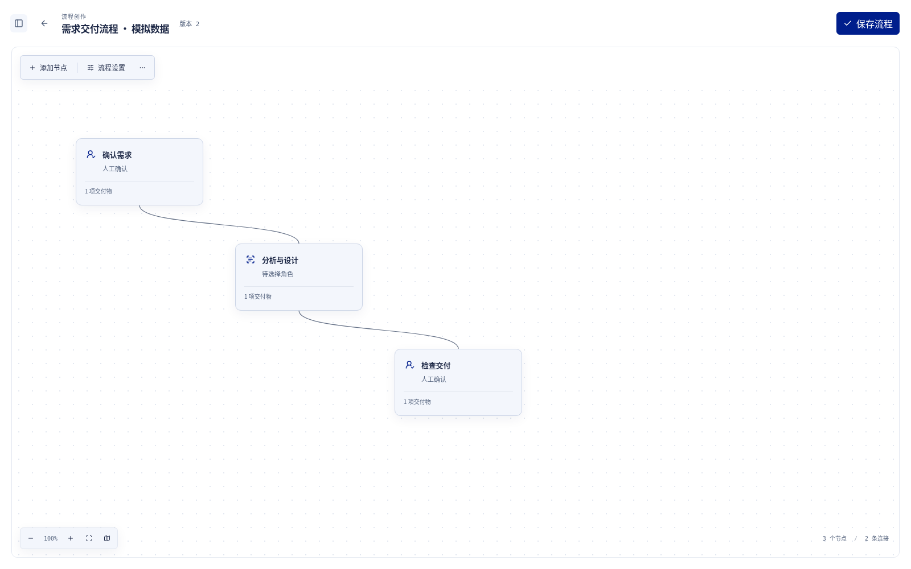
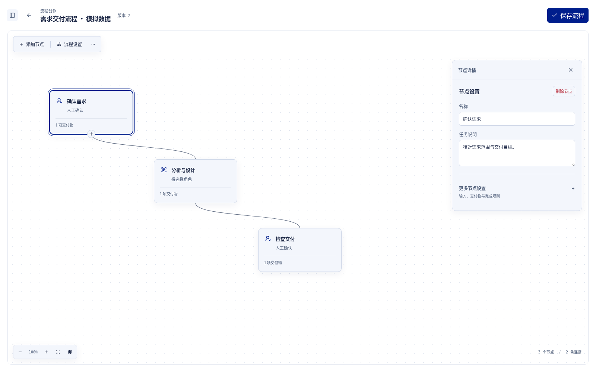
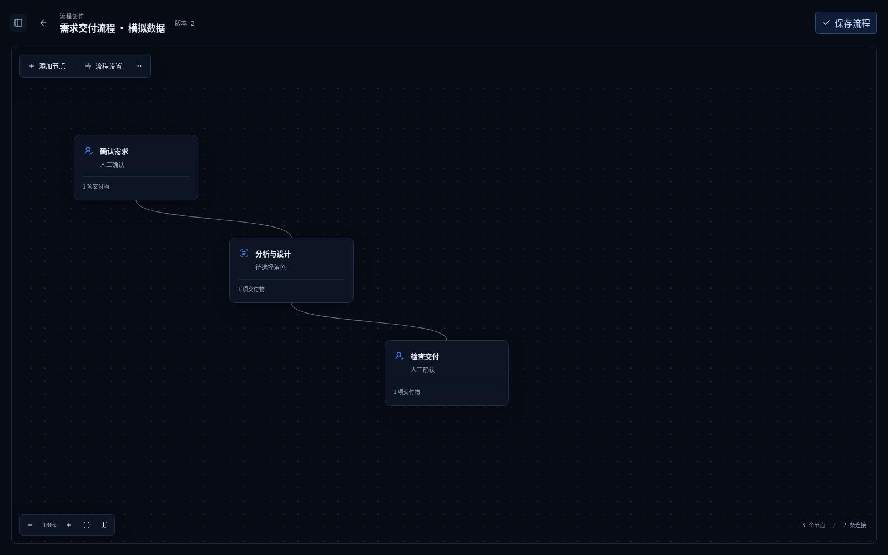
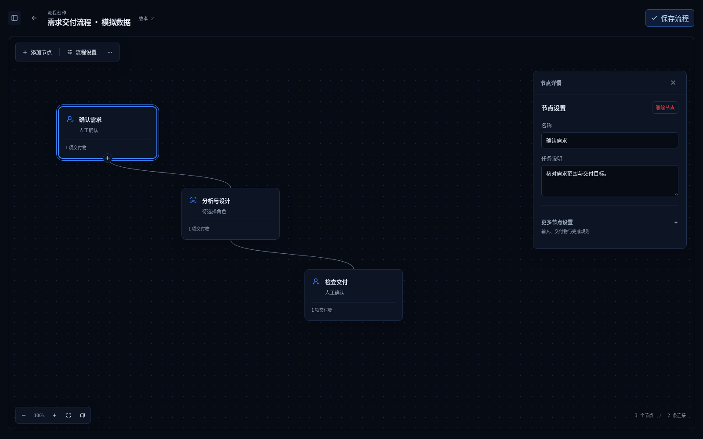
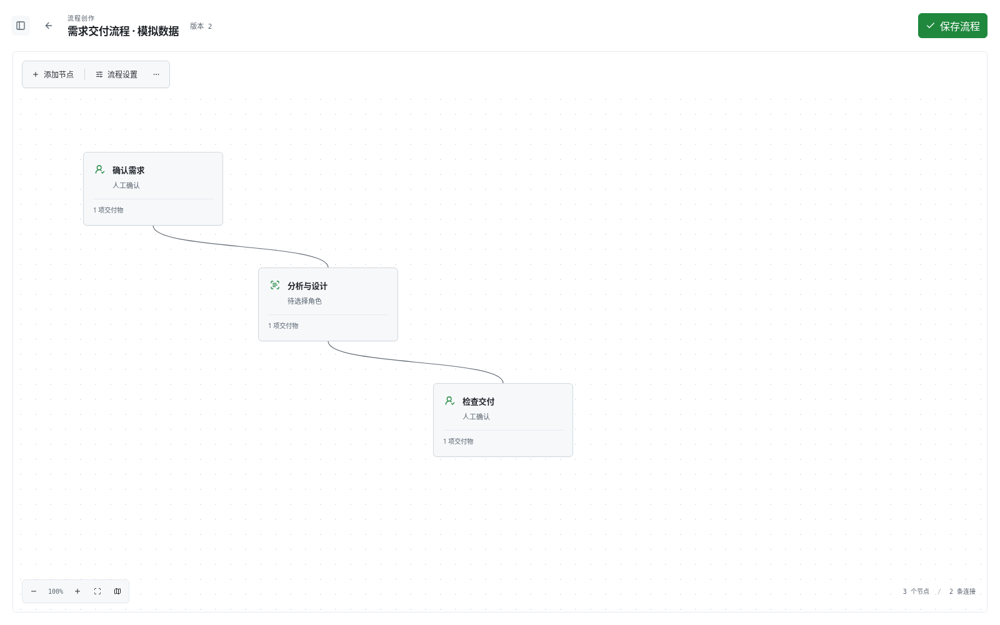
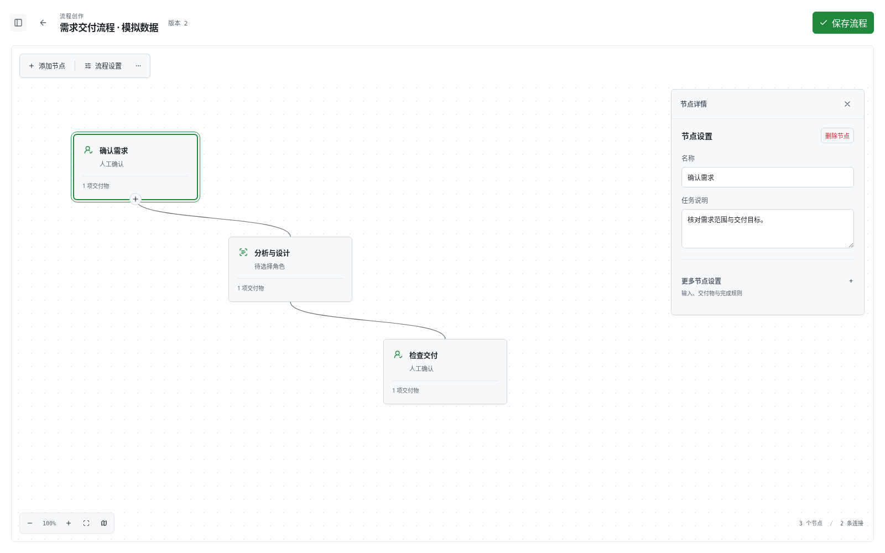

# 第一阶段前端改版：画布与节点详情

保留原有流程图核心，让默认页面以宽阔、简洁的画布为主。选中节点后显示该节点的操作与设置；切换节点时详情随之更新，点击空白、关闭面板或按 Escape 回到简洁画布。存在未保存内容或待确认上传时，仍保留相应保护和恢复入口。

以下六张图片均为 **Chromium 实际渲染的浏览器截图，使用明确标注的模拟数据**，不是设计稿。截图尺寸为 1600 × 1000；点击图片可查看原图。三套皮肤采用同一流程和同一组节点，便于比较默认画布与选中节点的状态。

| 皮肤 | 默认画布 · 模拟数据 | 选中节点 · 模拟数据 |
| --- | --- | --- |
| **spdb 风** |  |  |
| **科技蓝** |  |  |
| **GitHub 白** |  |  |

## 改版范围与入口

- 流程创作、需求规划和需求执行：默认收起详情，节点与连线按选择展示操作；重复点击不重置面板，平移和缩放不误取消选择。
- 添加节点、流程设置、需求资料与模型保留明确入口；搜索定位、验证、排列、另存模板和后续计划等辅助操作移入“更多工具”。
- 流程库、需求列表、新建需求及模板预览同步调整；PPT 工作室采用同样的画布优先、按选择展示操作原则。本页六张图片专门展示流程创作画布。
- 键盘选择、Escape、关闭返焦、草稿保护、默认模型初始化及未知上传回执的原请求重试均保留。

## 已完成的本地验证

截图对应已验证代码提交 [`2cba0236719647858014e6d05ebdc4ba6e006377`](https://github.com/wangyufengsky/opencode-loopper/commit/2cba0236719647858014e6d05ebdc4ba6e006377)。本次图片交付只增加六张截图和本说明，不改变该提交的运行时代码。

| 验证 | 结果 |
| --- | --- |
| 全量前端单元测试 | 173 个文件、1083 项通过 |
| Chromium 工作流场景 | 100 项通过，包含需求规划与执行 |
| Chromium PPT 场景 | 12 项通过 |
| Chromium 主页、外壳、皮肤场景 | 20 项通过 |
| TypeScript、生产构建、工具检查 | 通过；工具检查 7 项 |
| 两位独立审查者复测 | 默认模型、上传恢复、三皮肤新增文字对比度等修复通过 |

浏览器验证覆盖三套皮肤、1600px 桌面与 390px 窄屏，以及既有 1440/1280px 皮肤用例；包括空白、选择、重复点击、切换、取消、拖动、连线、键盘导航、保存重开和恢复入口。新增普通文字的对比度已复测，未宣称整站历史界面均符合 WCAG。

## 验证界限

- 浏览器接口使用 HTTP 模拟夹具。以上结果**不代表真实 Java 后端、真实模型或真实远端发布已验证**；没有付费模型调用。
- 本阶段不生成 JAR、不升级版本，不部署或合并 main；旧 Designer、任务等页面未全部重新设计。
- 本地构建仍提示部分 chunk 大于 500 kB；项目没有独立 lint script，未声称 ESLint 通过；未做读屏软件人工验收。
- 表中的测试结果来自上述代码提交的本地验证，不能替代 GitHub CI 状态。当前 CI 只监听 main 推送和 PR；单独推送本分支不会自动触发该工作流。
