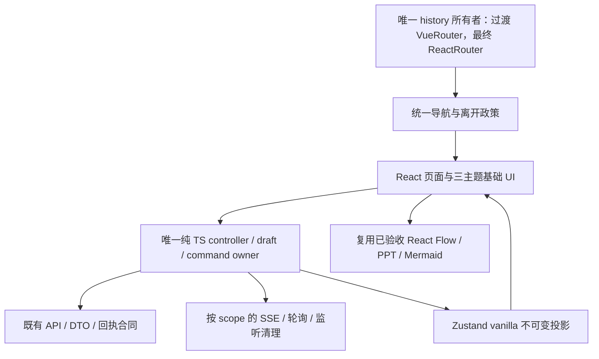

# 全站 React 迁移：第二阶段规划与设计审查

**W0取证及W1有限范围已冻结；W2/W3已有限验收；项目经理批准的W4 Task、Inbox、Recovery已完成本地有限验收。W5及后续未批准。** 设计发布授权已执行完毕，没有新增push/PR/merge/deploy授权。当前可看[桌面五类页×三皮肤28图与单HTML](prototype/desktop-v2/README.md)、[W0固定证据](evidence/w0/README.md)、[W1实现与验证](evidence/w1/README.md)、[W2生产迁移与验证](evidence/w2/README.md)、[W3生产迁移与验证](evidence/w3/README.md)及[W4生产迁移、27张三皮肤图与验证](evidence/w4/README.md)。原[29图](prototype/README.md)保留历史。

**结论：先按现代产品设计翻新壳、导航和信息层级，再按模块迁移页面与业务所有者，最后彻底移除 Vue。** 保留第一阶段已验证的 React Flow、PPT、Mermaid 画布，以及API／DTO和纯TypeScript协议；主要基础UI选择Ant Design，产品设计不会照搬库默认样式。临时路由／状态适配器只服务过渡，不作为最终交付。

规划及设计已交付；项目经理实际预览五类页面与三皮肤代表状态，候选方向原则认可。本轮在设计基线 `008542f0bf02dc1c1b76f1e75429aab8452b797d` 执行 W0 取证，**W0取证冻结、W1有限基础工程通过；W3已验收、W4本地有限验收完成；W5+未批准**。第一阶段基线 `a3c692d38925206883f2b0a1255479108cfd439e`，独立分支 `feat/react-full-migration`，工作区 `/workspace/opencode-loopper-react-full`。第一阶段成果及原29图保留。W1已正式锁定Ant 6.6.5；新增隔离基础组件、纯TS owner和测试入口，没有修改既有页面、history owner、Vue/Pinia入口或已验收画布。main、网络和凭据未改。桌面原型与真实React/Ant测试入口分别验收。用户已撤回所有窄屏要求；旧窄屏方案/图/断言只保留历史，当前桌面与统一语义规范见下方新增入口。

## 1. 可审查报告入口

| 文件 | 内容与责任人 |
| --- | --- |
| 本文 | 组长统一范围、所有权、波次、回退、门禁与项目经理决策 |
| [最新桌面修订](desktop-redesign.md) | 简洁主体、按选择披露、低密度主页、五类旧→新及动效，覆盖旧窄屏与常驻详情方案 |
| [统一词汇／图标／动作](semantic-ui-contract.md) | 全站本地Lucide registry、中文/a11y语义、公共API、合法变体及后续扫描/行为门槛 |
| [当前桌面原型＋图索引](prototype/desktop-v2/README.md) | 最新五类页×三皮肤；自包含HTML、实际模拟截图，生产未实现 |
| [窄屏退出范围](desktop-scope-exclusions.md) | 按旧测试子分支保留并标OUT_OF_SCOPE，桌面业务/键盘/资源断言继续 |
| [W0最终实测](evidence/w0/README.md) | 独立提交3c848261；28组25红/3绿，原11前后、原身份恢复与后续准入 |
| [核心 UI 与全站盘点](core-ui-inventory.md) | legacy：31 路由、页面／共享组件、系统与任务能力、Vue 残留与状态动作 |
| [工作流与设计协议](workflow-protocol-design.md) | workflow：流程、需求、Designer、文档／源码模板、API 与恢复边界 |
| [PPT 与全站验证设计](validation-and-ppt-design.md) | PPT：PPT／知识业务风险、测试分类、原 11 失败根因证据与最终验收矩阵 |
| [UI 栈与代表页面规范](ui-stack-and-page-spec.md) | 组长：正式依赖、主题、公共控件与正式集成要求 |
| [产品翻新与动效](product-redesign.md) | 组长：首页／列表／表单／详情／设置 before→after、组件层次、操作密度、动效与独立呈现门槛 |
| [W0红测与证据准入](w0-evidence-ledger.md) | workflow：B1–B9的源码事实／待复现风险／未修复状态及生产前门槛 |
| [Automations兼容映射](automations-compatibility-map.md) | legacy：真实现行消费者、历史读写边界、退役写接口与归档／整合缺项 |
| [控制器与接口设计](controller-interfaces.md) | 组长：snapshot、operation、draft、navigation与资源的接口草案及交接门槛 |
| [独立交叉审查](independent-review.md) | 三名原成员的非作者审查范围、发现、修正与证明边界 |
| [历史单文件](prototype/review-single.html)／[原29图索引](prototype/README.md) | 旧候选历史证据原样保留；窄屏已退出当前范围，当前方案使用desktop-v2 |
| [完整静态源码索引](source-inventory.json) | 组长：所有 187 SFC、路由、状态模块、依赖引用与锁文件候选残留；词法索引不是行为证明 |

涉及的源码链接均相对本报告指向当前基线；开发后行号可能移动。原型是独立模拟设计，不是正式React/Ant/API验收。第一阶段验证历史见[最终补丁审查](../../deliveries/react-canvas-all-cleanup/resize-observer-patch.md)。

## 2. 原团队的真实复用与分工

平台 `list_agents` 先确认三名原组员仍存在；三次 `followup_task` 成功后，再次返回三人均 running。没有 spawn 新成员，没有改变既有模型参数。原[启动记录](../react-canvas-validation.md#实施与审查)明确三次创建显式传入 `model=gpt-6.1-sol`、`reasoning_effort=xhigh`。当前协作工具只返回名字和状态，**没有实时模型／effort 读取字段**，因此身份复用是本轮实时工具证据，模型配置来自原创建记录，不能把成员自述当作实时平台字段。

组长模型切换为 GPT-6.1 Sol 极高由项目经理实际 UI 操作与委派确认；本工具面同样没有读取组长采样配置的接口。各组员在续接时确认原身份和上述证据边界。

| 实际 canonical 任务 | 本轮独占文档 | 当前规划分工 | 后续实现模块边界 |
| --- | --- | --- | --- |
| `/root/react_flow_workflow` | workflow-protocol-design.md | 工作流、需求、Designer、文档／源码模板协议 | 9 个独立 route view，见下表；workflow command/controller、Designer owner、document/source store 的行为迁移 |
| `/root/react_legacy_canvas` | core-ui-inventory.md | 全路由、核心系统、Task、Vue 残留 | 14 个独立 route view；task/template store、Task stream；其功能专用组件 |
| `/root/react_ppt_canvas` | validation-and-ppt-design.md | PPT、全站测试与原 11 失败 | 4 个独立 route view；PPT/knowledge store 和订阅、Markdown/CodeMirror 的 React 宿主；保留画布内部 |
| 组长 | README、UI 规范、机器索引 | UI／状态／导航接口、依赖选择、集成与验收 | root/router、tokens、共享 UI 原语、全局 accounting owner、统一导航／scope 接口、构建和去 Vue 门禁 |

共享基础文件、package/lock/Vite/tsconfig/main/App 等只由组长集成修改。跨模块需求用 typed props/controller 接口交接，不越权同时改同一个 store 或组件。后续独立审查轮换：workflow 审 Task，legacy 审 PPT/Knowledge，PPT 审 Workflow/Designer；作者自测不算独立评审。若每波容量失衡，项目经理可调整顺序，文件所有权先明确移交后再动；不通过增员改变用户指定团队。

## 3. 基线规模和完整路由责任表

规划/W0 静态基线实数：**31 路由记录＝28 组件挂载记录＋3 redirect；27 个独立路由 SFC；28 个物理 views 文件；frontend/src 内187个SFC／21,892行；6个Pinia store；35个Vue相关锁文件条目。** W2 新增一个过渡 SFC bridge，将 14 条普通路由的实际 component 改接真实 React 页面；旧 views 与依赖仍保留，当前变化见 [W2报告](evidence/w2/README.md)。e2e另有SkinsPreview.vue夹具，最终也必须删除。WorkflowEditor同时被new与id路由使用；另一个物理view是当前不再被路由挂载的AutomationsView。不能把28条挂载记录当28个独立页面，也不能把画布已React当全页已迁移。

路由权威：[router/index.ts](../../../frontend/src/router/index.ts#L1)。每项输入／输出、状态、动作、权限、深链和测试详见核心／协议／PPT报告及静态索引。以下表是统一开发分配，所有现有路径、query 和条件重定向先保持。

| 路径 | 页面／作用 | 开发归属 | 波次 |
| --- | --- | --- | --- |
| `/` | Home | legacy | W2 |
| `/projects` | Projects（含项目内设置与活动） | legacy | W2 |
| `/ppt` | PPT list | PPT | W2 |
| `/ppt/:id` | PPT studio／属性／预览／历史 | PPT | W3 |
| `/knowledge/history` | Knowledge history | PPT | W2 |
| `/knowledge/:conversationId?` | Knowledge 会话、检索与证据 | PPT | W3 |
| `/designer` | 历史 Designer；designerEntry 条件 guard | workflow | W5 |
| `/requirements` | Requirement list | workflow | W2 |
| `/requirements/new` | 新建需求：名称／说明／项目／流程四字段；创建与原身份回执恢复 | workflow | W5 |
| `/requirements/:id` | 规划／候选／调整／执行／发布／恢复 | workflow | W5 |
| `/workflows` | Workflow library | workflow | W2 |
| `/workflows/new` | WorkflowEditor 新建 | workflow | W5 |
| `/workflows/:id` | 同一 WorkflowEditor 编辑／内置只读 | workflow | W5 |
| `/designs` | Designer history | workflow | W2 |
| `/tasks` | Tasks list | legacy | W2 |
| `/inbox` | 当前待处理动作中心 | legacy | W4 |
| `/insights` | 质量／用量读取、过滤及 drill-down | legacy | W2 |
| `/automations` | redirect `/template-tasks`，不复活旧页面 | 组长＋legacy 合同映射 | W0/W6 |
| `/template-tasks` | 模板选择／正式创建／批次与快照 | legacy | W3 |
| `/template-tasks/document-runs/:id` | 文档模板 run | workflow | W3 |
| `/template-tasks/source-runs/:id` | 源码模板 run | workflow | W3 |
| `/tasks/:id` | Task 生命周期／输出／问题／制品／阶段图 | legacy | W4 |
| `/tasks/:id/recovery` | RecoveryStudio 原失败上下文／三模式创建／lineage／原child导航 | legacy | W4 |
| `/tasks/:id/design` | Task 冻结设计历史 | legacy | W4 |
| `/runtime` | 运行环境／启动重启 owner 校验 | legacy | W2 |
| `/tools` | 工具、MCP、Skills 与许可投影 | legacy | W2 |
| `/databases` | 数据库配置、探测与诊断 | legacy | W2 |
| `/settings` | 设置、模型与高级参数 | legacy | W2 |
| `/settings/roles` | redirect `/roles` | 组长 | W6 |
| `/roles` | 角色、版本、绑定、导入验证及流程图 | legacy | W2 |
| `/:pathMatch(.*)*` | fallback redirect `/` | 组长 | W6 |

“W2”不代表所有系统页低风险：Projects 的路径／凭据／应用动作、Runtime 的 local-UI 标识、Database 的探测、Roles 的绑定／发布都必须走原领域合同；只是先于复杂流式编辑迁移。角色图等已 React 的内层保持不动。

## 4. 状态和协议：一个权威所有者

不是把每个 Vue `ref/watch` 翻译成一组 useEffect。先区分 server snapshot、local draft、command receipt、UI projection、resource scope；服务端仍决定成功、许可、状态、版本和最终接受。

| 领域 | 现有所有者与保留合同 | 最终 owner |
| --- | --- | --- |
| Task／项目运行投影 | taskStore 与 [taskEventSubscription](../../../frontend/src/stores/taskEventSubscription.ts#L5)；generation、独立 overview/audit 合并计时器、stop | 纯 TS task controller + vanilla snapshot；App／Task route 按原范围持 lease |
| 模板任务 | templateTaskStore；正式 start 同原请求 key、catalog 与版本 | 纯 TS template controller，按钮不产生第二命令 |
| 文档／源码 run | documentTemplateStore／sourceTemplateStore；multipart、原 Pending 和已接受后读取 | 原协议迁入纯 TS controller，不改变 DTO/缓存键或 File 身份 |
| PPT | pptStore 的 revision／epoch、pending、草稿、自动保存、SSE | 纯 TS PPT controller；复用 JSX geometry/canvas，最终去 Pinia 字节但保留 store 行为 |
| Knowledge | knowledgeStore 的 scope/epoch、pending key、历史 cursor、stream | 纯 TS Knowledge controller，不丢同源导航记忆 |
| Workflow／需求 | 原 Vue page 的 draft／history／command；[acknowledgedOperation](../../../frontend/src/domain/acknowledgedOperation.ts) 已纯 TS | 页面 controller；command.ts 的 Vue ref 外壳分离，TS receipt 引擎保持 |
| Designer／Recovery／角色／设置 | 当前 page-local states 与 guards；原能力投影、版本、草稿 | 各 page controller，与同一 API client/DTO 协作；不新造客户端权限事实 |
| 皮肤／导航／全局 accounting | [themes/state](../../../frontend/src/themes/state.ts#L1)、App/Sidebar、[StoryAccountingDialog](../../../frontend/src/components/StoryAccountingDialog.vue#L145) | App kernel 只创建一次全局 owner；React projection 只订阅，不发重复写命令 |

规范接口在开发 W1 前冻结：`ApiScope`（identity/epoch）、`CommandReceipt`（pending/unknown/accepted/readback/terminal）、`DraftOwner`（baseline/version/dirty/File）、`NavigationPort`（location/navigate/replace/back/block）、`ResourceScope`（listener/timer/RAF/observer/capture/subscription 的实例登记与 disposer）。它们是设计名称，不代表当前已经有这些文件。各 controller 以可注入 api/storage/time/window 建立，不在 module import 自动启动订阅。

业务写入只从显式用户动作或既有自动保存 owner 发起；不从 render、主题变化、root effect 重放、router loader 或缓存刷新触发写入。unknown 按原 key/payload 恢复，accepted 后只重读，不重新 mutation；AbortController 取消客户端读不证明服务器写已停止。File 只在原拥有者／显式缓存内存里保留，不能用全 store JSON persist 序列化。409 不清草稿；迟到写／读取先核 scope 与版本；默认模型仍按原 server/control 投影。

纯 TS factories 可用 Zustand vanilla 储存 snapshot，未要求新增 Immer 或通用自动 persist。React snapshot 必须稳定、不可变；UI only 状态只留 React 本地。过渡 Pinia adapter 和 React selector 指向同一个 controller；**不同时保留两份会写入的 store 实现**。

## 5. 路由隔离与最终 Vue 退场设计

过渡时 Vue Router 继续是唯一 browser history owner。一个临时 ReactRouteBridge 可以呈现整页 React，只传 `NavigationPort`、route params/query 和 owner snapshot；业务状态从 controller 投影。它在真正得到安全离开许可后才卸载 React root，不因功能开关或皮肤变化热换活动页。

所有页面完成并通过各自 gate 后，W6 在一个 app bootstrap 中创建 React root 与 Data router，替换全部 route records／redirect／条件 guard。过渡桥、Pinia wrappers、Legacy.vue、Vue runtime preference UI 随之删除；最终页面直接渲染现有 React 画布，不再逐画布 createRoot／flushSync island。独立 root 生命周期测试继续通过单独 React 根 fixture 验证。

最终 no-Vue 不是 regex 绿灯：所有 .vue 和 Vue 执行入口、dependency tree、测试 mount/mock、动态 import、Vite/compiler/tsconfig/ambient 声明均消失，且逐路由真实功能通过。允许历史文档解释迁移；没有运行／测试代码白名单。外部项目技术栈等业务数据的文字不等于本应用执行框架，保持其 DTO，不借文本清理破坏业务协议；其代码不能加载 Vue。

## 6. 开发波次及可验证里程碑

P0（规划盘点）→D0（设计）及补充已交付；W0真实证据已由项目经理认可为完成候选并冻结。W1–W3已有限验收，W4本地有限验收完成。冻结84项W0原红测按对应波次保留断言并转向真实React路径；不扩展W0，不把剩余W5的41红测算通过。W5–W7仍待项目经理门禁。

| 波次 | 前置依赖与实现范围 | 退出门槛／负责人 |
| --- | --- | --- |
| W0 合同与债务基线 | 先结清[B1–B9红测／证据](w0-evidence-ledger.md)、[Automations兼容映射](automations-compatibility-map.md)与原11根因／保留断言；统一PM已决定离开合同，逐项复现静态风险 | 取证已冻结，非全部业务已通过；每项有红测与后续绿测／根因证据、原断言等价消费者、原数据兼容及独立审查；对应波次保留并修复红证据，不skip/drop；组长集成、原三人交叉审 |
| W1 基础 UI 与 owner | Ant tokens、UiButton/Form/Dialog/Table、导航 port、snapshot/controller模式、全局accounting；五类翻新代表页的正式React样例与有用途的CSS动效；纯读scope／receipt contract | 三皮肤、键盘焦点、reduced-motion、pending关闭、输入与草稿保留、双实例/StrictMode；冻结共享接口与实测包体预算；组长主责、原三人复核 |
| W2 列表／核心系统 | 依分工迁移 Home/Projects/Runtime/Tools/Database/Settings/Roles、列表与历史/Insights | 对应每个 route 首进/深链/refresh/back/empty/error、全部原动作输入输出与权限；相关 unit/Chromium；不以只读列表覆盖隐藏写入弹窗 |
| W3 文档／知识／PPT | template/Document/Source run、Knowledge会话、PPT页面owner与配套编辑组件 | 原 key/File/multipart/accepted读取/cursor/409/epoch/自动保存/SSE清理；保持已验收 React 内层；对应 store contract + 实页 E2E |
| W4 Task 生命周期 | Task detail、Inbox、Recovery、冻结设计历史；状态可用动作、问题/Todo/输出与制品 | 开始/停止/继续/重试/回答/差异恢复各契约；旧任务迟到隔离、订阅/计时器清理、当前告警与审计；legacy 主责、workflow 独立审 |
| W5 高风险创作 | Workflow editor、Requirement new/detail、Designer历史讨论、调整／候选／上传／发布 | 幂等/unknown/跨需求迟到/草稿/File/nav守卫、默认模型/视口历史；Designer多rev/SSE/附件冻结；workflow 主责、PPT 独立审 |
| W6 根切换与去 Vue | 全部 route ready；原子替换 root/history，移除桥/Legacy/Pinia/Vue/Element/iconsVue/vueuse/compiler插件、测试与HTML夹具；迁移 noVue tooling | 全31路由映射、3redirect及条件guard、所有能力关联；npm tree/lock/源码/入口/fixture无Vue执行面；组长主责、legacy 独立检查 |
| W7 干净最终验收 | 运行代码与锁文件冻结；无node_modules/dist的新验证工作区 | npm ci→typecheck→build→tooling→全部unit→全站E2E及新增矩阵、实际截图；问题修复后受影响验证重新执行，不能引用旧图和旧数；组长集成、跨作者签字 |

每波形成可本地回退的 checkpoint 与变更清单，不承诺没有依据的日历时限。主要不确定项是 21.8k 行 SFC 中的 page-local 协议拆分、148 份 Vue 组件／混合主夹具及另外 10 份 Vue/Pinia 状态测试的语义迁移、Designer/Task/Knowledge 的生命周期耦合，以及 Ant 在本应用中的实测包体和可访问性。三人并行速度不能替代正确的依赖顺序。

## 7. 回退边界

过渡开关只对新 route 实例生效；dirty/File/pending/unknown/autosave 时不得热卸载、清 key、重发或把 File 序列化后丢失。未知写入期间不能用“回退到旧页”作为恢复手段，必须先按endpoint真实能力，以原身份核对或显式幂等恢复达到安全状态；无此能力则保留阻断，不能自动重发。

W2–W5 的故障回退是下一次安全导航选择已验收视图，或回到前一个完整本地 checkpoint；同一 app/controller 的持久协议不变，不拆出第二 backend schema。W6 去 Vue 后**不保留运行时代码里的 Vue fallback**；可操作回退为整个构建回退到前一完整 checkpoint，经无活跃阻断操作证明后再启动。不会自动部署，也不会从应用内动态下载旧 Vue 包。需恢复 unknown 操作时，先使用原 pending 存储协议恢复，不能盲重发。

## 8. 最终验证门槛与交付证明

完整矩阵、测试迁移与原 11 根因证据见 [PPT／验证报告](validation-and-ppt-design.md)。最低验收要求：

1. 新 worktree／验证目录不含 node_modules、dist，基于固定 commit 和 lock 执行正常 `npm ci`，证明 XYFlow 两包六入口补丁自动复现、重入无写、源码不符明确失败。不能用旧预构建缓存或忽略 scripts 的安装当干净证明。
2. 普通 `tsc -b`、React-only Vite production build、tooling/accounting 与全部 frontend unit 通过；新增代码／依赖按正式 Node/npm 与 Cloud工具链验证。没有 lint 配置时如实记录；若本阶段引入 lint，冻结规则后不能关闭规则换绿。
3. 全站 E2E 以全发现清单运行：设计基线304项／70文件，W0新增redirect负控后当前发现**305项／70文件**，再加后续新增路由/行为矩阵；没有只跑204子集的豁免。原11失败必须根因处理且关联业务断言通过；发现实际bug就修本次明确授权的前端债务，环境问题改可复现夹具，过时预期按当前合同迁移但保留行为目的。
4. 每个实际挂载 route 及3redirect、Designer条件入口逐一验证：直接URL、refresh、back/forward、query、id更新、loading/empty/error、权限、全部按钮菜单与表单动作；共享组件在真实页出现。验证操控真实 React DOM，不靠 marker或旧Vue夹具。
5. File、未知回执、幂等key、accepted只重读、409/乱序、scope迟到、dirty/autosave与默认模型，按模块协议矩阵全部通过。键盘/焦点、三皮肤1440/1280桌面（窄屏已退出）、长表格/流程、读屏语义、脱网可达性有明确证据。
6. 持续手势／modal／CodeMirror／Chart／SSE／轮询的 root卸载、route离开与多轮重入：监听、订阅、计时器、canvas RAF、capture、活动observer严格立即清零，不依赖自然mouseup，不误删他人资源。目的页资源按实际实例身份保留，未知资源 fail closed。显式清理与GC／堆保留路径分别记录。
7. 正式 dependency tree、lock packages、source/transitive import graph、main/index.html、test/mock/setup、HTML夹具、build/type工具没有 Vue/Pinia/RouterVue/Element/IconifyVue/VueUse/compiler/Volar残留；所有`.vue`组件删除。历史文档可有解释文字，不能把可执行代码或fixture放进白名单。
8. 真浏览器截图＋模拟数据按 route类别／皮肤／桌面尺寸／pending/error/selected状态保存到仓库可审查docs，固定源码与图片hash。不能称真实后端、模型或文件解析已通过，除非有对应独立验证；本任务不做付费模型测试。

第一阶段已通过204相关Chromium、1305unit、typecheck/build/tooling等，余100 E2E包含原11历史失败仍未跑；这些是基线事实，不是第二阶段执行结果。已断开observer与renderer仍存活的GC采样限制继续保留，不能在新报告中抹成全堆释放。

最终交付清单应有：准确commit、原组件→React页面／controller／测试的映射、无Vue树与全routes动态验收证据、全部通过/失败/未跑数、清洁安装与锁定补丁证据、真实截图、未验证backend/模型/文件解析边界及剩余风险。发布/PR/合并/部署另需对应授权。

## 9. 项目经理门禁与已确定策略

普通组件／token／接口取舍已在设计中作出，不再回问用户。项目经理审查并决定：

- **阶段门禁：**W0冻结、W1–W3有限通过、W4本地有限验收完成；W5及后续页面波次未批准。W1新增失败单列，不能用W0既知红测遮蔽，也不能以W0全绿作为禁止实现W1的循环条件。
- **离开策略已决定，勿再回问普通取舍：**pending／unknown写入默认阻离开，直到用原身份核对或恢复到安全状态；accepted后只读／限定已知receipt目标交接。普通dirty／未发送File只能明确confirm后放弃，不自动重发write或换幂等身份。SPA硬阻断与beforeunload提示限制分别披露；无持久化／by-request能力不承诺跨刷新完整恢复。已实施波次的实际恢复入口与测试见对应证据报告；未迁页面不计通过，原型查询只是模拟。详见[设计合同](controller-interfaces.md#3-草稿file与视图的交接)。
- **W0仍是生产前门禁：**[B1–B9计划](w0-evidence-ledger.md)保留设计时源码风险，[运行证据](evidence/w0/README.md)单列实测分类与原11根因；W0取证当时未修生产，W2–W4按原合同迁移和修复，当前余41红仍独立保留，不用文档或截图当绿测。其它[核心基线差异](core-ui-inventory.md#现存基线差异和待验证合同)沿用同一门槛。
- **Automations真实退役边界：**旧view不可达，后端旧写入口明确报LEGACY_AUTOMATION_RETIRED；历史GET／导出仍存在；规划时TemplateTasks没有等价消费者，本轮W3补显式历史归档read/export并有真实React消费者验收。保留redirect、原数据和仍适用读取／安全断言；不复活已退役写入，不因去Vue删历史能力。规划[兼容与归档映射](automations-compatibility-map.md)保留；当前合法消费者、九GET和两导出见[W3专项](evidence/w3/knowledge-catalog-history.md)。
- **验证交付边界：**如果最后仍无法运行真实后端，允许交付“全React前端及模拟API契约验收”，同时保留真实后端/模型/解析未验证标签；不能批准“全部真实功能已验证”的表述。此项不要求现在测试付费模型。

这些是项目经理的阶段审查议题；当前W4本地实施／有限验证见专项报告，W5及发布仍需项目经理门禁。

## 10. 0717a4a规划提交的历史完成与检查

- 独立worktree／分支从指定a3c692d创建；正常只读远端核对仍为第一阶段分支a3c692d、main为3fe0fc459fa21e196ce64655da11f3c3402929c6，第二阶段远端分支尚不存在。原第一阶段worktree仍干净；没有推送本分支。
- 三名原任务均由真实followup续接，分工文档已归还。PPT对总波次／数量交叉审查、legacy对全报告／五页设计交叉审查、workflow对原型／协议边界与最终图片交叉审查。已修各审查指出的波次重复、基线能力误述、原型筛选／草稿和焦点问题；非作者审查不等于正式实现测试。
- 源码实数复核、107个本地文档链接／行号／标题anchor检查无误；项目说明检查`node scripts/check-project.mjs`通过，原型两个JS的`node --check`通过。测试仅收集现有1305unit／304E2E清单，不执行生产测试体。
- 独立原型最终**65项Chromium检查通过／0失败，29张真实截图＋模拟数据**；45个页面×皮肤×尺寸组合、20项原型交互／证据检查，源码和所有PNG哈希／bytes吻合，0外部请求／0pageerror。完整边界见[原型证据](prototype/README.md)。
- 本轮改动仅docs/design/react-full-migration文档、独立原型和设计截图；未修改生产source、package/lock、pom、入口、测试、凭据或网络。新worktree仍无node_modules/dist，没有安装候选UI／状态／路由框架。截图使用原worktree已安装正式Playwright，不重用旧画布图当新设计证据。
- **未运行本轮生产unit、全站E2E、typecheck/build/tooling测试体、干净npm ci、真实后端／模型／文件解析。**这些是开发后W7硬门禁，不在规划阶段冒称完成。第一阶段通过与未跑结果继续作为历史基线，原11失败未修／未计通过，GC采样边界未抹掉。

## 11. 008542f0设计补充的历史记录

优先打开[单文件审查版](prototype/review-single.html)：原CSS／JS原样内联，五类页、三皮肤、现有互动不变，没有外部资源请求。原[多文件原型与29图](prototype/README.md)、capture及evidence保留；单文件证明见[设计补充记录](design-gate-supplement.md)。该提交时父侧实际预览尚未验证；**之后项目经理已实际预览并原则认可候选方向**，正式 React/Ant 尚未验收。

设计补充当时只修文档及现有原型，无生产修改／业务修复。设计发布授权已执行完毕，不能延用到本轮 W0 或未来生产实现。用户通知仍由项目经理处理，不直接发 Slack／Space。

## 12. W0 本地行为证据

当前结果、分类总数、请求身份、原11前后证据、Automations具体兼容落点、非作者复核与 W1 建议统一见[W0验收台账](evidence/w0/README.md)。W0取证提交3c848261当时生产与依赖保持008542f0原样；随后W1基础授权单独实施。W0确认的页面问题继续保留红测与最小修复建议，W2归属合同在本波次保留原断言迁到React并复验；W3+仍不提前实施。

## 当前W1本地交付

正式基础组件、纯TS契约、单一owner和独立React/Ant测试入口见[W1证据](evidence/w1/README.md)。下面原规划中“未安装/未运行”的结论仅代表对应历史阶段，不覆盖当前W1实测。桌面原型最终205/0、28图，与原29图分别保存；窄屏本轮范围外，桌面混合业务断言保留。

## 当前 W3 本地交付

模板目录及源码／文档运行、Knowledge 新建／已有会话、PPT Studio和明确进入的历史Automations只读归档，见[W3本地报告与实际生产截图](evidence/w3/README.md)。原型、W0／W1／W2报告保留各自时点记录；当前续接结论以W4报告为准。没有新的推送授权，W5及后续仍待项目经理放行。

## 当前 W4 本地交付

实际 Task详情、冻结设计历史、Inbox、Recovery 四路由及页内审批/处置/发布接入，见[W4本地报告](evidence/w4/README.md)及[三皮肤桌面27图](evidence/w4/screenshots/README.md)。四项B8.2原红转绿；W0仍41项W5失败。最终unit2016/2057通过、41失败，W4真实production browser29/29与44退出首样通过，W1–W3分别回归；准确计数/未测边界见本波报告。W5尚未实施/批准，不发布、不提前history接管或去Vue。
