# W1 本地基础工程与独立验收

**当前仅W1基础工程，未实施W2+页面替换，未发布。** 固定起点为本地W0提交 `3c848261bfaa603a10fa06652fbbca8e82c3e3b8`；分支 `feat/react-full-migration`。W0已由项目经理认可为完成候选并冻结，其[28组／111子测试分类](../w0/README.md)和84项正确红测完整保留，由对应后续页面波次修复，不删除、skip或降低断言。

新版[桌面五类页×三皮肤28图](../../prototype/desktop-v2/README.md)与[自包含HTML](../../prototype/desktop-v2/review-single.html)是独立设计模拟。它们205项通过的结果与本文真实React/Ant路径分别记账，不能互相替代。窄屏不在本轮范围，既有混合测试的桌面业务和资源合同仍保留。

| 最终验收项 | 本轮结果 |
| --- | --- |
| W1新增单测 | 69通过／0失败／0跳过；纯TS 39、组件20、主题／语义8、所有权2 |
| 真实React/Ant浏览器 | 41通过／0失败；18个同步卸载首样严格清零；11张实际截图 |
| 桌面设计原型 | 205通过／0失败；28张实际截图；单文件与原多文件渲染一致 |
| 全量单测 | 1485项：1401通过＋84失败，退出码1；失败全部是冻结W0合同红测 |
| 类型与构建 | 全站及React-only typecheck、生产及隔离预览build均通过 |
| 工具与重装 | tooling 31、accounting 13通过；干净npm ci成功；原XYFlow补丁6项可靠应用 |
| 全站产品E2E | 本轮仅成功收集305项／70文件，未重跑；W0历史20项为19通过／1失败，其中5项窄屏已改列本轮范围外 |
| 未跑／未证明 | 无现成lint配置，未新增linter；真实后端、模型、解析、生产router/SSE及跨刷新恢复未验证 |

建议作为 **W1完成候选** 交项目经理复核。W0红证据不被改写成全绿，W2及后续页面迁移仍等待新的阶段门禁。

## 实施与复核分工

恰好复用原三名开发员，未增员或改变模型。原创建回执显式指定 `gpt-6.1-sol / xhigh`，见[原团队记录](../../../react-canvas-validation.md)；当前 `list_agents` 仅回读名称与运行状态，不提供实时模型配置字段，不冒称再次验证了模型。

| 任务 | 实际修改范围 | 非作者复核 |
| --- | --- | --- |
| 组长 `/root` | package/lock、主题/provider、中央registry、本地图标子集生成、隔离预览入口、集成与验收文档 | A检查registry/provider/theme；C实际浏览器及源码复核 |
| A `/root/react_flow_workflow` | 受控Ant基础组件及相邻React测试；桌面原型三个源文件 | B检查组件、焦点与提示；C真实浏览器；A独立检查B的协议 |
| B `/root/react_legacy_canvas` | 纯TS receipt/navigation/resource/controller契约及测试；统一语义设计表和窄屏退出清单 | A独立协议复验；C源码与真实React集成 |
| C `/root/react_ppt_canvas` | 非作者设计／W1浏览器验证脚本、结果、实际截图及复核报告 | 不把C的验证脚本或截图当成生产实现 |

最终独立报告：[纯TS及组长基础层](contracts-independent-review.md)、[受控组件](components-independent-review.md)、[真实React/Ant浏览器](w1-review-ppt.md)。作者自测、中间候选结果、工具权限错误和最终结果分别记录。

## 正式依赖、入口与包体

新增唯一基础UI依赖 **`antd: "6.6.5"`**，npm官方registry，MIT，公开peer为React/ReactDOM≥18，与既有锁定19.3.0兼容。新增63个锁定条目，原有条目版本变化0、删除0。没有安装第二套UI、Zustand或React Router，也没有升级既有React/XYFlow。

- [package](../../../../../frontend/package.json)／[lock](../../../../../frontend/package-lock.json)固定版本与SRI。
- 使用Ant公开 [ConfigProvider](https://ant.design/components/config-provider/)、[App](https://ant.design/components/app/) 和 [Modal](https://ant.design/components/modal/)；当前页面、旧VueRouter、Pinia、入口及已验收画布均未导入新foundation。
- [独立预览入口](../../../../../frontend/e2e/w1/preview.tsx)及React-only Vite配置只用于基础组件／协议验收，标注模拟内容，无代理、后端、产品路由或history接管。包体统计只代表此独立组件测试入口，不能当成全站最终包体。
- 中央[语义表](../../../../../frontend/src/foundation/semantic-registry-data.json)与设计表深度一致，120对象、173动作、31路由元数据。页面只能传semantic key；本地Lucide统一输出、装饰图标aria-hidden，不远程取图，不把表中语义元数据当权限。
- [图标生成器](../../../../../scripts/generate-foundation-icons.mjs)从锁定 `@iconify-json/lucide` 生成恰好78个所需glyph，保留包版本、SRI及完整icons.json SHA，`--check`必须精确相等。升级或新增映射后失配明确失败，需要显式生成并审查，不静默fallback。运行时不打入整套图标JSON。
- 本地图标许可说明保存在[Lucide／Feather完整通知](licenses/lucide-LICENSE.txt)，来源为[Lucide官方LICENSE](https://github.com/lucide-icons/lucide/blob/main/LICENSE)，本轮取证日期2026-10-03；包含ISC及其Feather来源的MIT通知。文件SHA-256为`b495047bd93a9b06913511076f504daba17d5bbeb3e0650f3bb53a4220329c57`。最终分发需携带这些许可通知，不把文档保存等同于已经验证生产分发包。
- 三皮肤使用原SkinDefinition、公开Ant明暗算法和scoped原主按钮三态变量。皮肤不改变对象/动作，也不按key重建子树；减少动效只控制呈现与本实例媒体监听。

包体>500KB警告如实保留，未放宽门槛。W2接入实际页面时需明确路由拆包和只读组件懒加载，不能用此W1测试入口替代全站预算。

## 公共UI与所有权合同

[components.tsx](../../../../../frontend/src/foundation/components.tsx)提供8类受控组件：动作按钮、shell、上下文面板、确认对话框、可选择列表／表格、字段和受控披露。它们不创建store、history、命令身份或API订阅。

- 默认主体无详情栏，选中才显示；隐藏保留挂载字段，业务owner才能放弃草稿。关闭面板、返回、取消编辑、取消服务端任务是不同动作，不共享任意bypass。
- availability与closePolicy是明确可辨识联合类型。禁用和阻断要求原因；普通dirty/File需要确认；SENDING/UNKNOWN优先BLOCK，确认弹窗已开时的新pending仍可阻断。
- Ant对话框使用本FoundationProvider宿主、焦点陷阱和默认“留在当前页面”，无body回退。所有图标按钮有统一中文可访问名与提示；触发器消失时回本实例主内容，不抢其他root或退休页面的焦点。
- keyboard、焦点、选择、关闭、展开及减少动效由真实组件和浏览器测试验证；无窄屏补充工作。

纯TS代码在 [contracts/](../../../../../frontend/src/foundation/contracts/)：

| 接口 | 可证明的合同 | 后续实际adapter责任 |
| --- | --- | --- |
| OperationOwner | 捕获原endpoint/method/body/key/commandId/实际版本和File引用；显式execute/恢复，accepted只读；普通retire阻pending/unknown | 每个接口真实能力、错误分类、权威回执及CAS，不虚构GET/by-request/version |
| SnapshotController | 唯一投影／read lease owner，登记属于本identity的operation；最后view detach只释放read资源，不丢operation或File | 领域快照、冲突、同scope读取乱序和版本 guard；并非通用版本调度器 |
| NavigationGate | 只把显式意图委托给注入的唯一history owner；dirty confirm后复查revision/新pending/scope；accepted精确交接须真实navigate返回成功 | 既有VueRouter适配、深链、NavigationFailure、硬刷新提示等，W1没有接入生产守卫 |
| ResourceScope | 实例own/release幂等；先失效token再逐个清理，错误不阻剩余释放；禁止迟到投影 | 提供真正的SSE、RAF、timer、RO、capture、listener disposer；容器不能替外部库自动清理 |

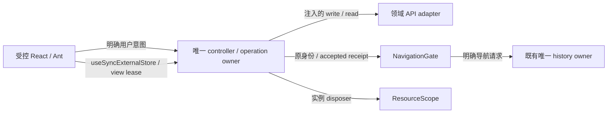

render、effect重放、切主题、订阅、入页不执行write。StrictMode可重复取得／释放read lease，不重复命令。强制视图丢失时scope失效、原身份／迟到accepted回执保留在旧operation，不污染新scope；这不是跨刷新持久化或原API自动重新激活。

## 本轮独立审查发现与修复

1. **成功写入后的异常回执。** 初版先captureDto再置accepted，静态确认非plain/循环回执异常会落入UNKNOWN；这是新primitive缺陷，不是W0问题。修复先记录accepted事实，未验证DTO不传reader、不签发handoff、不重复write；仅有真实lookup能力时允许显式原身份读取，否则BLOCKED并保留身份。三项新增负控覆盖无lookup、有lookup与bad lookup。未声称运行过不存在的修前红测。
2. **触发器失联后的焦点回退。** 非作者发现旧restoreFocus仅考虑explicit/captured。修复仅退到本实例主内容，卸载后不全局寻找焦点；保留原触发器仍存在时的正常返回。
3. **图标按钮提示。** 非作者发现仅有aria-name无enabled提示。补统一semanticName的title，禁用仍用真实原因，不在各页面分叉文案。
4. 集成期间所有权扫描测试自身出现括号和jsdom URL/path夹具错误，以及设计／runtime三处元数据未同步；修正测试路径与完整中央表同步，保持深度相等断言。不是旧业务行为失败。
5. **动态减少动效导致字段重挂。** 非作者真实浏览器复现输入焦点由INPUT变ASIDE；锁定Ant `MotionWrapper` 在motion首次true→false时改变provider树。保留公开motion token稳定，减少动效用0s duration及scoped CSS，新增真实Ant字段DOM、焦点、草稿和选区保持负控，不修改库内部或放宽焦点断言。
6. **Modal首尾Tab逃逸。** 非作者真实浏览器确认已配置公开focusable.trap仍短暂落BODY，不是合法sentinel。使用公开modalRender内本实例React键盘捕获补首尾循环，不注册全局监听、不patch依赖；真实Tab／Shift+Tab及动态禁用确认保持严格验收。
7. **嵌套portal与放弃后的回焦。** 真实嵌套Ant负控修前证明inner Tab被outer夺焦，补DOM归属／最近scope判断。浏览器40项中1项证明dirty discard后回到隐藏panel触发器，补不可见目标过滤与afterClose最终回原caller/main；不删除回焦断言。
8. **测试入口语义与结果反馈。** 逐图复核发现ui.retry的“重试读取”绑定了原身份写恢复，属于fixture真实错配；改为receipt.retryOriginal/server和receipt.readOriginal/read，并加强名称、scope及实际副作用配对。恢复成功反馈仅对当前未退休owner更新，不让上次模拟读失败冒充当前错误。没有改已验证OperationOwner或增加业务能力。

## 复验与边界

最终命令、准确通过／失败／未跑计数与源码哈希见[verification.json](verification.json)。原始环境日志、浏览器trace和构建输出在仓库外，未加入提交。

```sh
cd frontend
npm ci --no-audit --no-fund
npm run test:foundation
npm run typecheck:foundation
npm run typecheck
npm run build
npm run build:foundation-preview
npm run test:tooling
npm run test:accounting
npm test -- --maxWorkers=2
```

真实浏览器验证先在一个终端启动 `npx vite --config e2e/w1/vite.config.ts`，另一个终端执行 `npm run test:foundation-browser`；仅本机41784。验证完成关闭自己的预览服务。预览包含显式的测试用等待／未知／错误回执注入，不属于生产UI，也没有外部写入。

普通沙箱clean npm ci在esbuild官方安装脚本执行`spawnSync .../esbuild --version`时报EPERM，按正常工具权限重跑成功；没有改网络/代理/凭据或扩大白名单。生成旧dist已移到仓库外保留，干净重装后重新类型检查／构建／测试。当前Node24.19/npm11.9，未证明正式Node22.14/npm10.9 release/JAR打包。

真实浏览器的原生API注册账本仅在隔离测试上下文中透明记录注册／释放并调用原API，不替生产清理、不释放他人资源、不过滤detached观察目标。同步unmount后的第一采样即要求空；另用脱离DOM但仍被observe的负控证明检测器会失败。React root永久委派的事件与本组件拥有的资源明确区分，RO对象仍存活不等于观察关系仍活跃。

v4浏览器批次后，仅两处测试`closest<HTMLElement>`型别收窄修正了typecheck；运行源码未变，修前／修后测试transpile的JavaScript SHA完全相同。C保留该次真实字节provenance，最终语义／反馈修订由v5浏览器重跑。独立测试、最终类型检查和构建使用最新测试字节，不改旧证据以伪称已执行。

**仍非全站完成：** W0的84合同红测、历史Automations只读消费者缺口和未跑全站E2E单列；Vue/Pinia旧入口刻意保留到后续授权波次。真实后端、付费模型、文件解析、服务端幂等、跨刷新File持久化、实际生产router adapter未验证。资源账本和断开观察关系不等于所有GC对象已经释放，不能宣称全堆清零。

## 真实React/Ant截图

以下11图全部来自最终同一批实际Chromium渲染，**模拟数据、独立W1测试入口、非生产页面**。列表和表格同时出现、测试状态与原身份审计用于合同验证，不是未来主页布局承诺；产品五类页的候选布局请看上方桌面原型。截图及源码SHA在[浏览器证据](../../../../../frontend/e2e/w1/evidence.json)中逐项记录。

| 皮肤 | 默认简洁主体 | 选中后的上下文 |
| --- | --- | --- |
| SPDB | 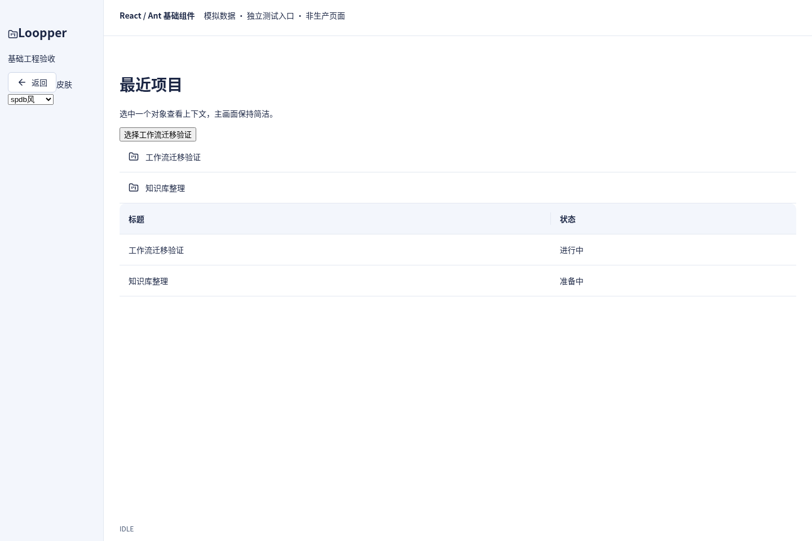 | 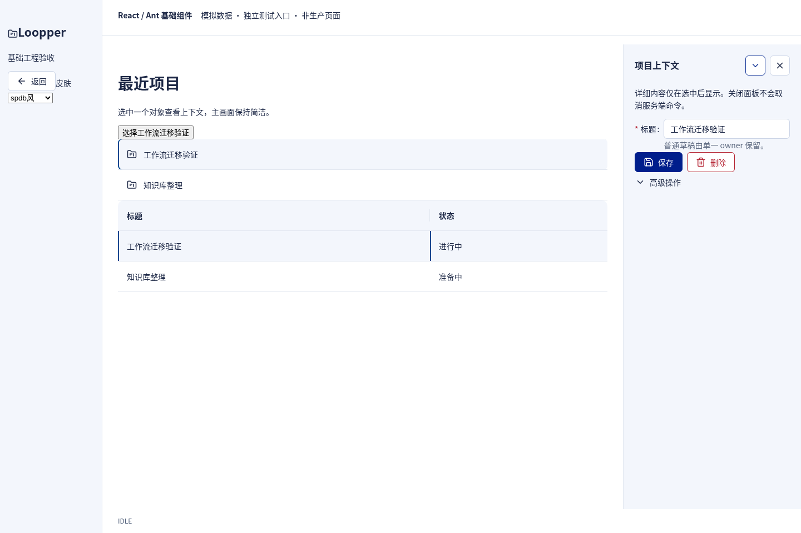 |
| 科技蓝 | 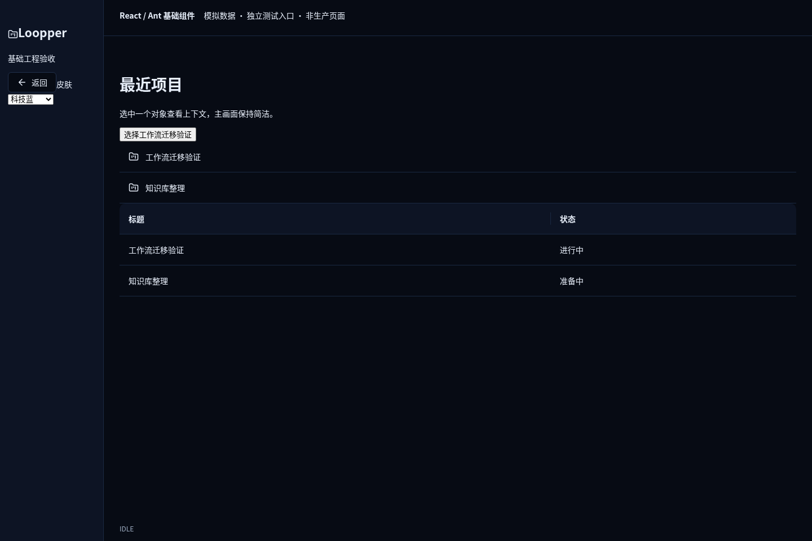 | 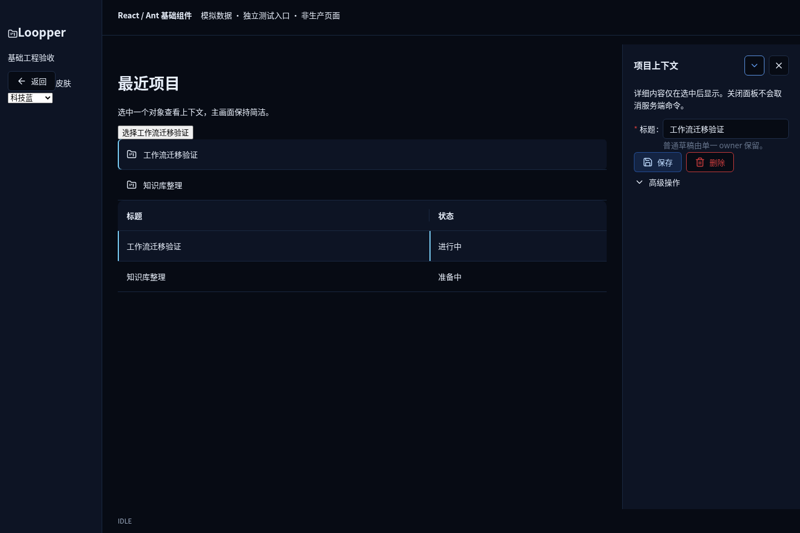 |
| GitHub白 | 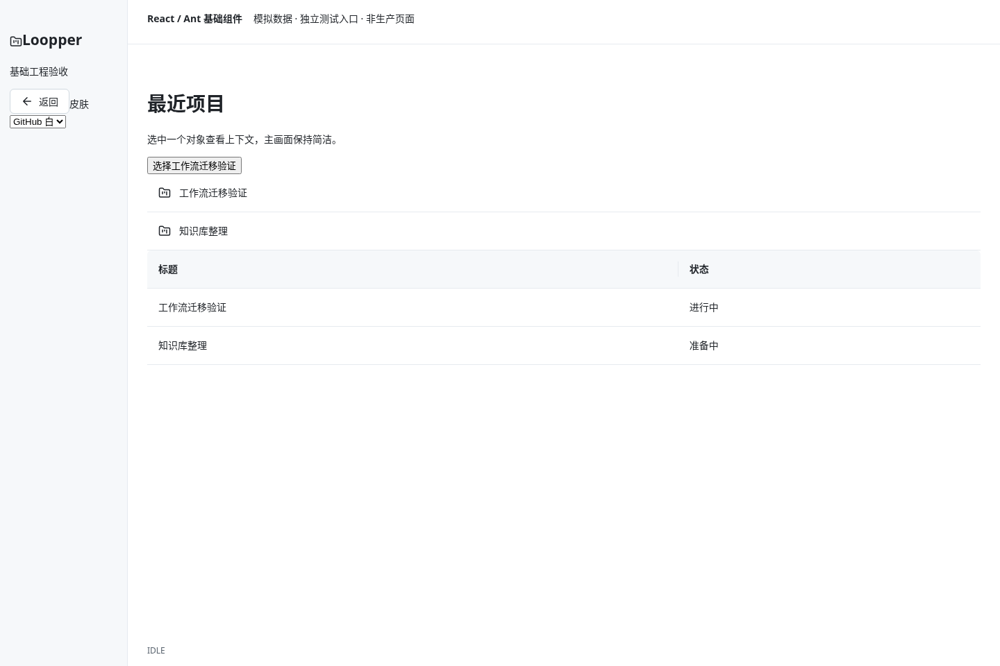 | 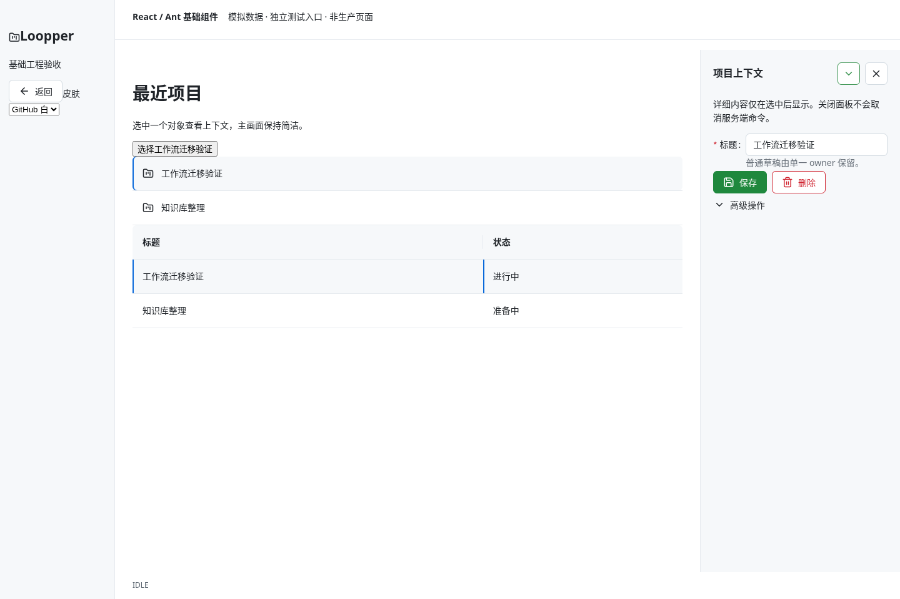 |

| 合同状态 | 最终截图 |
| --- | --- |
| 普通dirty：默认留在当前页面，明确放弃 | 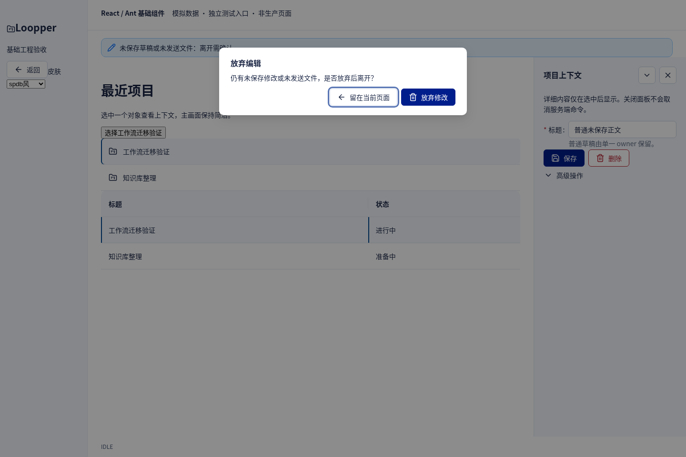 |
| unknown：关键状态始终可见，保原身份显式重试 | 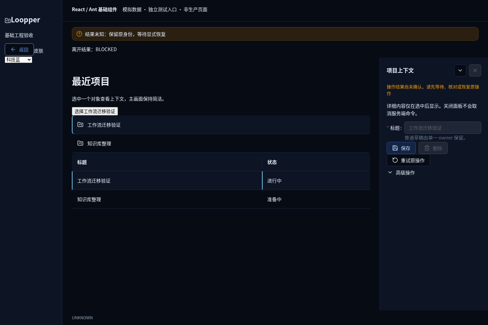 |
| accepted：只读核对成功，旧失败清除 | 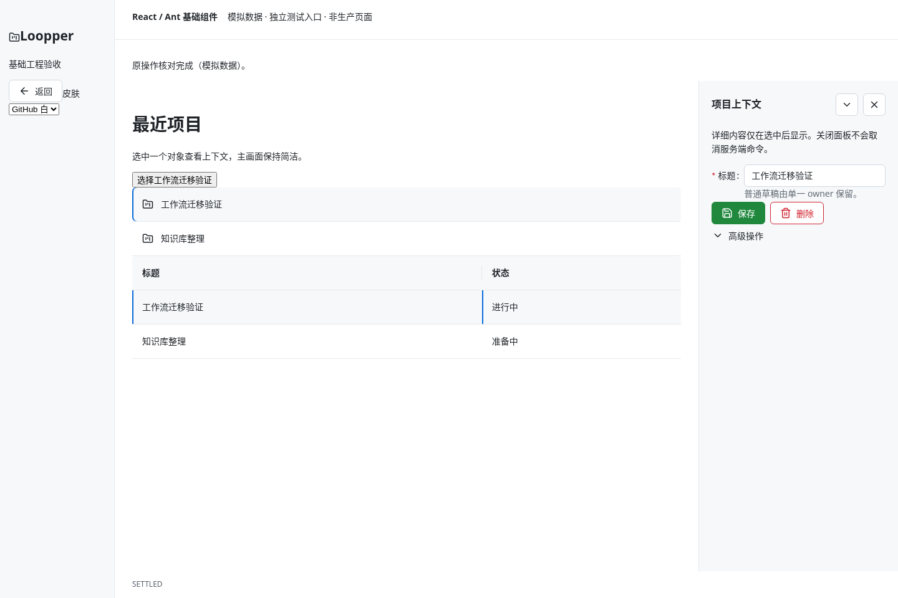 |
| 减少动效：真实字段DOM／焦点保持 | 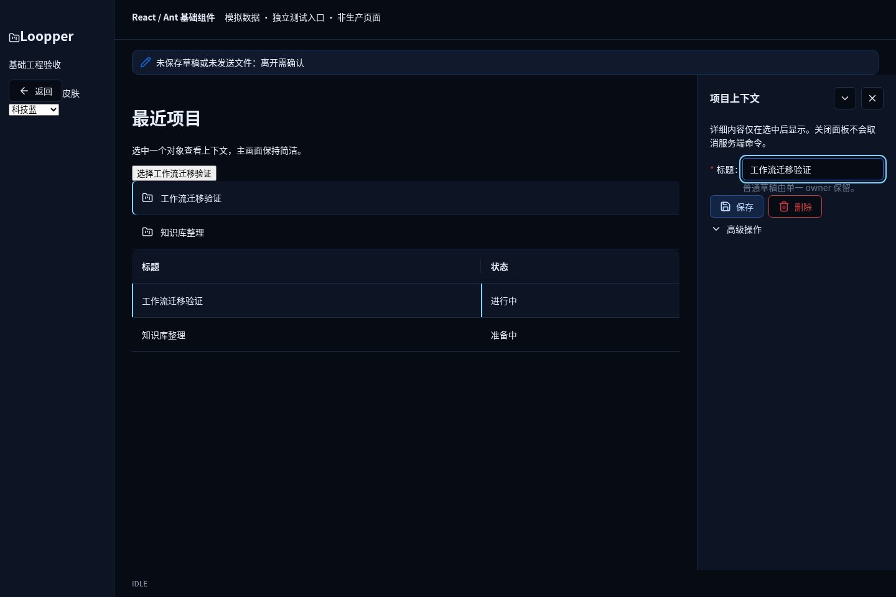 |
| 嵌套确认：内层焦点与动作不影响外层 | 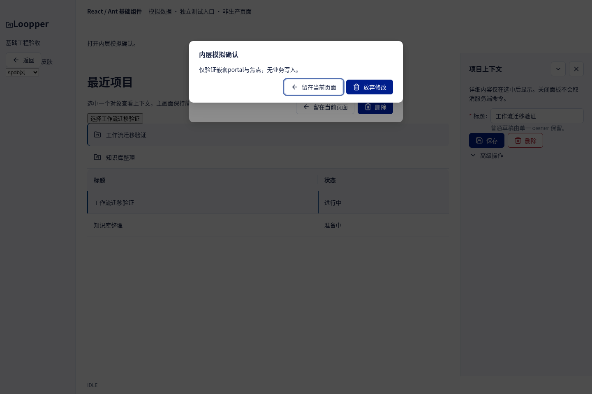 |
