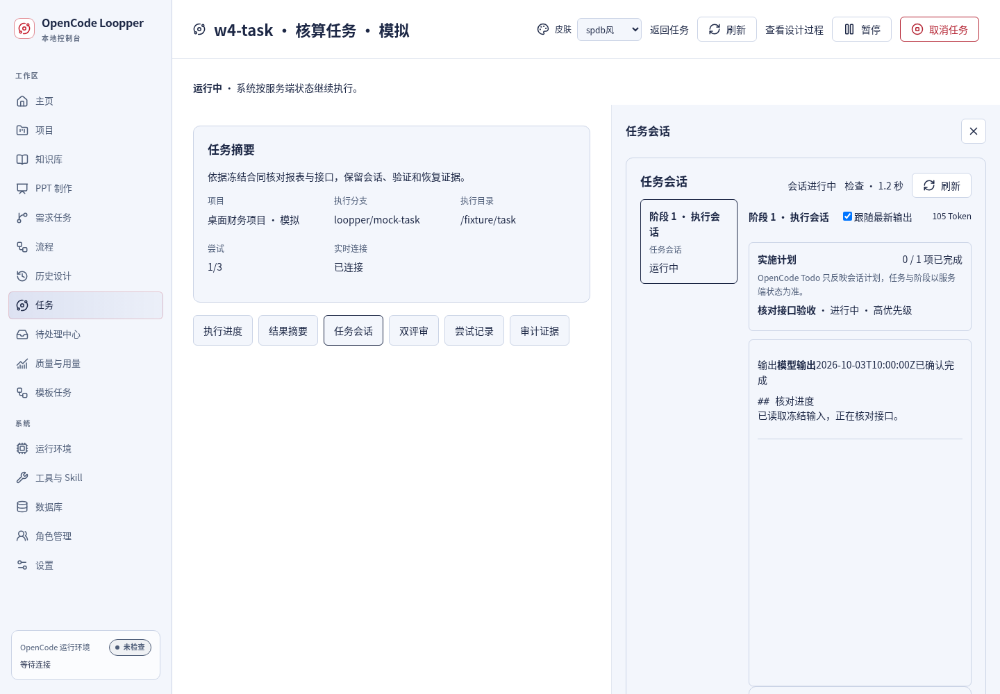
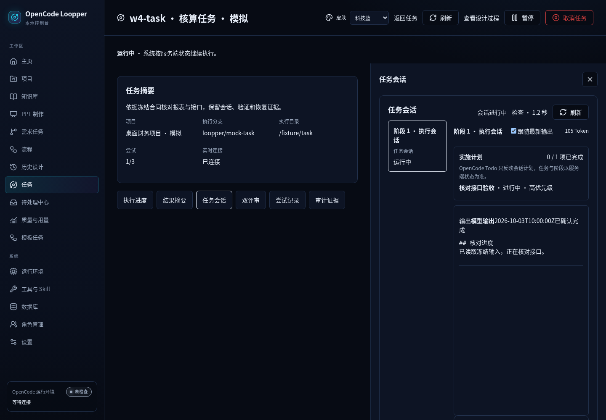
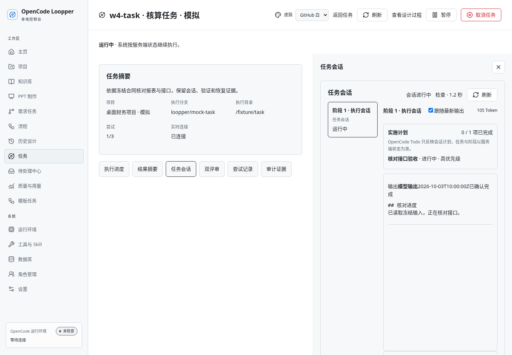

# W7 实际浏览器截图

**桌面限定 · 模拟数据 · 真实React渲染。** 本页不是设计原型，不代表真实Spring/模型执行。187张实际PNG均有尺寸、长度与SHA，见[机器索引](../screenshot-index.json)。其中184张来自最终生产构建；3张共享只读图来自同一冻结源码的实际开发路由。既有截图全部保留，本目录不沿用修改前截图。

统一源码SHA：`d1a38dd1471e5c5d0d23aeafa845c7494d3bc30e2d5875dd37c24e9faded596d`。所有路由/动作覆盖与未测边界见[验收报告](../README.md)，图片只证明捕获时可见的状态。

## 三皮肤默认主体

| 页面/画布 | SPDB | 科技蓝 | GitHub白 |
|---|---|---|---|
| 主页 |  |  |  |
| 项目列表 |  |  |  |
| 任务详情 |  |  |  |
| 设置 |  |  |  |
| Knowledge会话 |  |  |  |
| 模板目录 |  |  |  |
| 工作流画布 |  |  |  |
| 需求规划/执行画布 |  |  |  |
| Designer会话 |  |  |  |
| PPT自由对象画布 |  |  |  |
| 待处理中心 |  |  |  |
| 任务设计图 |  |  |  |

## 选中后上下文与恢复

以下使用真实生产页面，选择/取消和业务保护由对应最终测试验证，不以单张图片代替行为。

| 状态 | SPDB | 科技蓝 | GitHub白 |
|---|---|---|---|
| 工作流选中节点 |  |  |  |
| 需求选中节点 |  |  |  |
| PPT选中对象 |  |  |  |
| Knowledge选中引用 |  |  |  |
| 任务选中上下文 |  |  |  |
| 新建需求UNKNOWN |  |  |  |

## 共享只读画布

三个最终键盘/平移案例代表图。全部三皮肤×三类别的桌面行为共9项已执行；只保存下列3个代表状态，不冒称有9张图。此组使用实际React开发路由。

## 全部图片与审查例外

- [列表、配置、系统：58图](w2/README.md)
- [Knowledge/PPT/模板：33图](w3/README.md)
- [Task/Inbox/Recovery：27图](w4/README.md)
- [工作流/需求/Designer：30图](w5/README.md)
- [全站入口：36图](w6/README.md)
- [共享只读图：3图](readonly/README.md)

两张分段保存截图的顶部重复阻断提示左端被折叠导航按钮局部遮住；下方完整阻断正文与恢复按钮可见且可用。保留为非阻断视觉例外，没有为其改冻结源码或声称像素无瑕。

Designer UNKNOWN图中的部分后续附件行在视口外。File身份/顺序/字节保留由原请求断言证明，不把该图当作字节证据。
