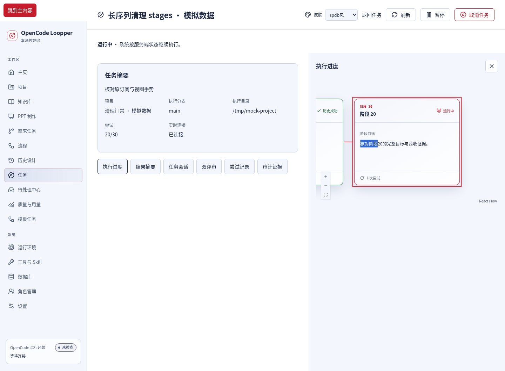
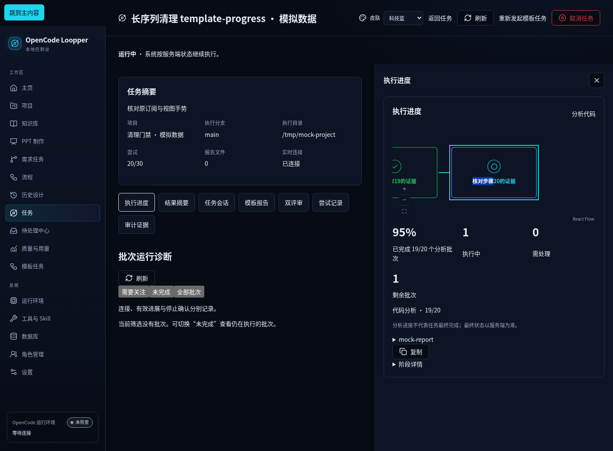
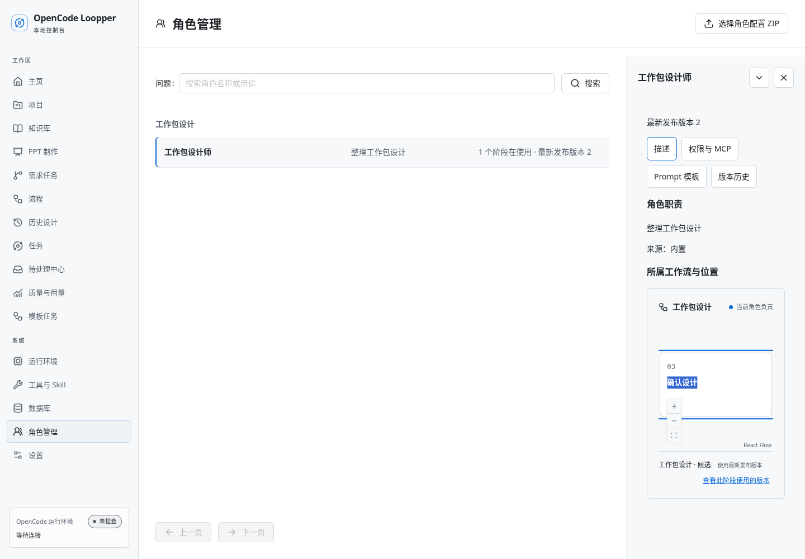

# 共享只读画布 · W7实际浏览器截图

桌面限定，三皮肤，**模拟数据**。图片为实际浏览器渲染，不是设计原型。生产页使用同一冻结源码与构建；readonly目录三个图使用开发构建的实际路由。

[返回总索引](../README.md)

### spdb-stages-1440-keyboard · 模拟数据

### tech-blue-template-progress-1440-keyboard · 模拟数据

### github-white-roles-1440-keyboard · 模拟数据

