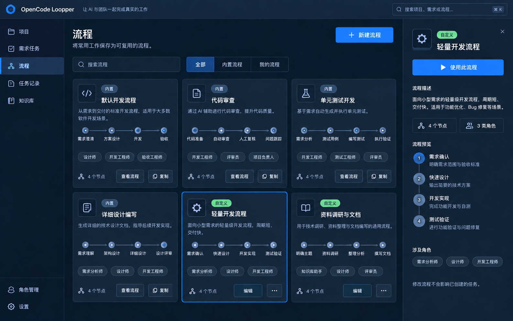
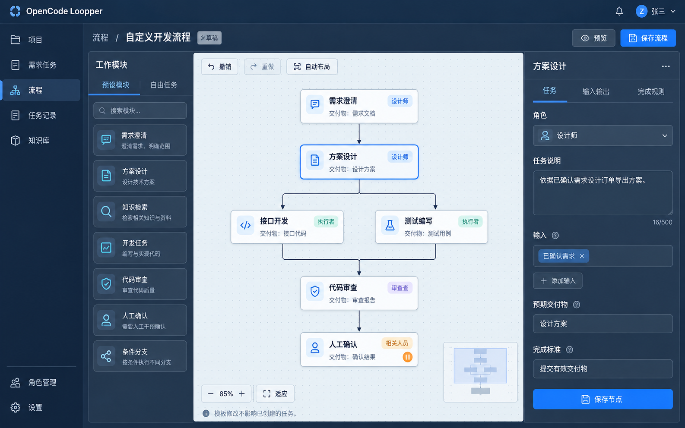
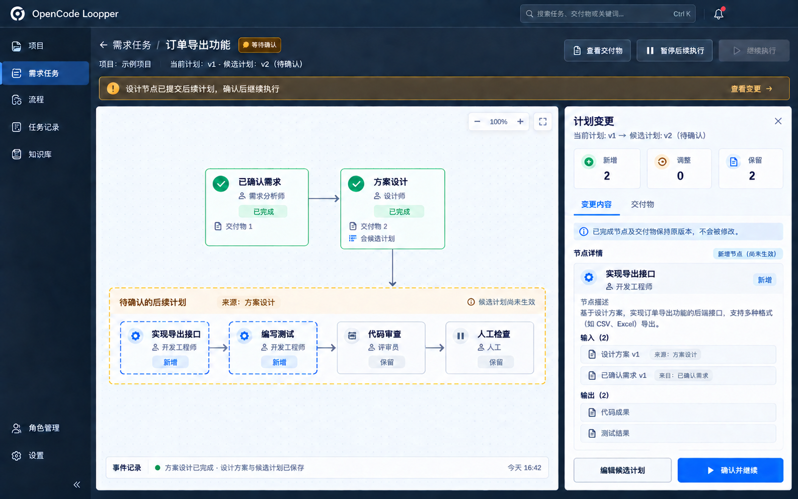

# 流程界面设计

这是第一阶段的生图概念设计，尚未接入产品或浏览器验收。
产品语义以 [流程合同](../../workflow-contract.md) 为准；执行进度见 [持续目标计划](../../deliveries/workflow-goal-plan.md)。

## 已保存效果图

- [流程库](workflow-library.png)：内置/自定义目录、搜索、复制、编辑、使用流程。
- [流程创作](workflow-authoring.png)：左侧模块库、中间流程画布、右侧节点编辑。
- [任务执行与规划确认](workflow-execution-with-design-output.png)：设计节点直接交付候选计划，已完成节点、待确认后续计划、输入血缘及确认操作。
- [完整提示与定向修订](prompts.json)：使用内置 image_gen；没有使用 CLI/API 回退。
- [角色调整修订提示](role-planning-refinement.json)：去除独立流程规划师节点，由设计成果直接形成待确认计划。

## 设计决定

1. 共用画布内核，区分模板创作、需求规划、任务运行和历史只读四种模式。
2. 流程库展示“名称、来源、简述、缩略结构、角色、节点数”，不放与工作选择无关的指标。
3. 内置流程以查看/复制为主；自定义流程提供编辑、复制、删除。删除前说明已有任务保持不变。
4. 节点卡展示任务名称、角色、状态、交付物数量、人工检查点；正文、日志、权限明细不塞进卡片。
5. 节点面板按任务、输入输出、完成规则、运行记录分区；编辑内容与执行证据不混在一个表单。
6. 输入以来源节点、交付物名称和版本呈现，多父输入能被逐项检查。未知/缺失输入在节点内定位。
7. AI 候选区域使用虚线及明确文字，不仅用颜色。当前版本和候选版本分别显示，未确认不能派发。
8. 当前告警保留明确的下一步，未解决阻断不可直接关闭。关闭详情面板不等于忽略确认。
9. 底部事件条只显示最新事实，展开后按需读取历史；模型活动在节点详情中展示。
10. 业务完成标准可自定义，不固定展示双 Judge 或将其隐藏执行。
11. 规划属于工作能力，默认不设置独立流程规划师。设计节点可提交候选计划，待确认区域标出实际来源。

## 交互与适配

- 1440–1920 桌面：导航、模块库/画布、详情；无选中节点时收起详情，优先画布面积。
- 1024：模块库可折叠，详情覆盖独立抽屉但不能遮住必须回答/确认的操作。
- 768 及以下：画布可平移缩放，节点列表/详情作为可切换视图；不要求在窄屏并排三个编辑面板。
- 拖动位置独立保存；连线和字段修改属于业务修订。撤销/重做只作用未应用的编辑，不撤销历史执行。
- 提供缩放、适配、自动布局、节点定位和小地图；键盘可选择、打开详情、取消连线，表单焦点可见。
- 保存/应用显示真实等待、冲突及重试提示；失败保留本地编辑，成功回读服务端版本。
- 颜色、字体、圆角和边框使用现有皮肤语义变量；概念图以蓝色为例，不锁死其他皮肤。
- 保留减少动态效果配置；执行状态不使用定时器模拟，节点顺序/位置变化不能暗示未发生的执行。
- 清晰区分暂停后续派发和立即停止当前节点；待确认期间仍能查看已完成交付物。

## 生图检查与实现差异

首版任务图把候选 v2 当作当前版本；已定向修正为当前 v1、候选 v2（待确认）。
首版流程库自定义卡与详情节点数不一致，且出现默认发布步骤；已修正为四节点且没有默认部署。
用户提出独立规划师不必要后，最终执行图改由设计节点交付候选计划。[早期独立规划节点版本](workflow-execution.png)仅保留设计演变记录，不是实现目标。
生成图中的个别角色文字、图标、示例人数/计数和按钮细节仅作排版示意；实现全部消费实际配置与服务端能力。
实现时删除生成图臆造的全局通知/用户头像等无现有功能支撑的装饰，不新增登录、通知或站外搜索范围。
流程库最终目录必须来自现有真实模板迁移，不把图中示例名称当成已经存在的业务能力。
图片验收只覆盖视觉方向与关键语义，不证明交互、无障碍、真实执行或浏览器兼容。
